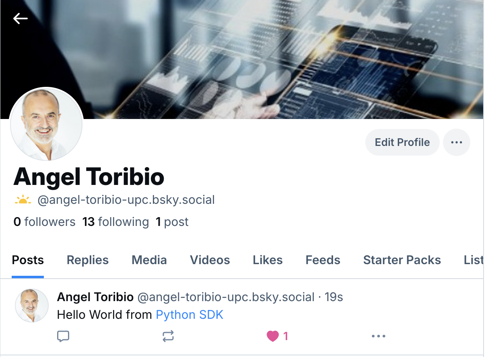

# Lab session #2: Doors in the Cloud
In this Lab session, we are going to discuss the overall structure of a [BlueSky](https://bsky.app/) "post" (popular alternative to Twitter/X) and how to pre-process the text before going into a more interesting analysis in the next Lab session. In particular, we are going to see how tokenization, while being a well-understood problem, can get tricky dealing with BlueSky data. Before this, we need to install A Python Development Environment which will be very helpful for this and future sessions.

* [Pre-lab howemork](#Prelab)
   * [Continue studying AWS](#aws)
   * [Prepare the environment for BlueSky](#blueskyapi)
* [Tasks for Lab session #2](#Tasks)
   * [Task 2.1: Geting Started with NLTK](#NLTK)
   * [Task 2.2: Getting Started with the BlueSky API in Python](#blueskyapi)
   * [Task 2.3: Posts pre-processing](#preproc)

<a name="Prelab"/>

#  Pre-lab homework

<a name="aws"/>

Go to the AWS Academy and log into the course [AWS Academy Cloud Foundations](https://awsacademy.instructure.com/courses/109366). Follow the modules and submit the knowledge checks at the end of each module:
- Module 4 - AWS Cloud Security
- Module 6 - Compute
- Module 7 - Storage

<a name="Homework1"/>

## Prepare the environment for BlueSky
Cloud applications are characterized by an increased focus on user participation and content creation, but also by a profound interaction and interconnection of applications sharing content from different types of services to integrate multiple systems. This scenario is possible, without a doubt,  thanks to the rise of “**Application Programming Interface**” (API). 

An API provides a way for computer systems to interact with each other. There are many types of APIs. Every programming language has a built-in API that it is used to write programs. For instance, you have studied in previous courses that operating systems themselves have APIs used by applications to interact with files or display text on the screen.

Since this course focuses on studying Cloud technologies, we are going to concentrate on APIs built on top of web technologies such the protocol HTTP. We will refer to this type of API as `web API`: an interface used by either web servers and web browsers. Such APIs are extensively used for the development of web applications and work at either the server end or at the client end. 

Web APIs are a fundamental component of nowadays Cloud era. Many cloud applications provide an API that allows developers to integrate their code to interact with them, taking advantage of the services' functionality for their apps.

[BlueSky API](https://docs.bsky.app/docs/get-started) is one example among the vast number of available APIs. [BlueSky API SDK](https://docs.bsky.app/) offers the possibility of using different programming languages for accessing all posts sent by any user, all posts containing a particular term or combination of terms, all posts about a given topic during a date range, and many more features.

If you don't have an account at BlueSky, please create one and save your e-mail and password at a safe place, ideally a **[password manager](https://en.wikipedia.org/wiki/Password_manager)**. [Best password managers for 2025](https://www.pcmag.com/picks/the-best-password-managers).

<a name="Tasks"/>

#  Tasks for Lab session #2

<a name="NLTK"/>

## Task 2.1: Getting Started with NLTK
One of the most popular packages in Python for NLP (Natural Language Processing) is Natural Language Toolkit ([NLTK](http://www.nltk.org). This toolkit provides a friendly interface for many of the basic NLP tasks, as well as lexical resources and linguistic data.

Tokenization is one of the most basic, yet most important, steps in text analysis required for the following task. The purpose of tokenization is to split a stream of text into smaller units called tokens, usually words or phrases. For this purpose we are going to use the [NLTK](http://www.nltk.org) Python Natural Language Processing Toolkit:

```python
_$ import nltk
```
Please, check [https://www.nltk.org/data.html](https://www.nltk.org/data.html) if you have problems installing nltk packages.

A difference between NLTK and many other packages is that this framework also comes with linguistic data for specific tasks. Such data is not included in the default installation, due to its big size, and requires a separate download. Therefore, after importing NLTK, we need to download NLTK Data which includes a lot of corpora, grammars, models, and more resources. You can find the complete nltk data list [here](http://nltk.org/nltk_data/). You can download all nltk resources using `nltk.download('all')`  beware that it takes ~3.5G. For English text, we could use `nltk.download('punkt_tab')` to download the NLTK data package that includes a pre-trained tokenizer for English.

Let’s see the example using the NLTK to tokenize the book [First Contact with TensorFlow](http://www.jorditorres.org/Tensorflow) [`FirstContactWithTensorFlow.txt`](FirstContactWithTensorFlow.txt) available for download at this repository and outputs the ten most common words in the book.

```python
import nltk
from nltk.tokenize import word_tokenize
from collections import Counter
import re
import logging

# Configure logging
logging.basicConfig(level=logging.INFO, format='%(asctime)s - %(levelname)s - %(message)s')
logger = logging.getLogger(__name__)

# Download the tokenizer only if not available
nltk.download('punkt_tab', quiet=True)


def get_tokens(file_path):
    """
    Reads the content of a file, tokenizes the text, and returns the tokens.

    Args:
        file_path (str): The path to the text file.

    Returns:
        list: A list of tokens extracted from the file.
    """
    try:
        logger.info("Attempting to read the file: %s", file_path)
        with open(file_path, 'r', encoding='utf-8') as file:  # Explicit encoding for better compatibility
            text = file.read()
            logger.info("File read successfully. Preprocessing text...")
            text = re.sub(r'[^\w\s]', '', text)  # Remove punctuation
            tokens = word_tokenize(text)
            logger.info("Text tokenized successfully. Number of tokens: %d", len(tokens))
            return tokens
    except FileNotFoundError:
        logger.error("File not found: %s", file_path)
        return []
    except Exception as e:
        logger.error("An unexpected error occurred while processing the file: %s", e)
        return []


def get_most_common_words(tokens, n=10):
    """
    Counts the frequency of tokens and returns the most common ones.

    Args:
        tokens (list): List of tokens.
        n (int): Number of most common words to return.

    Returns:
        list: A list of tuples containing the n most common tokens and their counts.
    """
    try:
        logger.info("Counting token frequencies...")
        count = Counter(tokens)
        most_common = count.most_common(n)
        logger.info("Successfully retrieved the %d most common words.", n)
        return most_common
    except Exception as e:
        logger.error("An unexpected error occurred while counting tokens: %s", e)
        return []


def main():
    """
    Main function to tokenize a file and display the most common words.
    """
    logger.info("Starting the program...")

    # Tokenize the file
    tokens = get_tokens('../FirstContactWithTensorFlow.txt')

    if tokens:
        # Get the 10 most common words
        most_common_words = get_most_common_words(tokens)
        print("The 10 most common words are:")
        for word, freq in most_common_words:
            print(f"'{word}' appears {freq} times.")
    else:
        logger.warning("No tokens found. Please check the file or input.")

    logger.info("Program completed.")


if __name__ == "__main__":
    main()
```
<sub>Please note that we are using the logging module to provide feedback on what is going on with the script as well as writting comments to ease the maintainability of the code. It is also convenient to write error checking sending messages to the log. That would allow us to track code malfunctioning.</sub>

### Task 2.1.1: Word Count 1
Obtain from this repository the file named [`WordCountTensorFlow_1.py`](WordCountTensorFlow_1.py), that computes and prints the 10 most common words in the book. Add one more line to print the total number of words of the book.

**Q211: Copy and paste the output to `README.md`, a file that you will add to your repository.**

### Task 2.1.2: Remove punctuation
We can remove the punctuation, inside get_tokens(), by applying a regular expression:

```python
    lowers = text.lower()
    no_punctuation = re.sub(r'[^\w\s]',' ',lowers)
    tokens = nltk.word_tokenize(no_punctuation)
```
Create a new file named `WordCountTensorFlow_2.py` that computes and prints the 10 most common words without punctuation characters as well as the total number of words remaining.

**Q212: Copy and paste the output to `README.md`, a file that you will add to your repository.**
    
### Task 2.1.3: Stop Words

**Q213a: Why "Tensorflow" is not the most frequent word? Which are the Stop Words?** Include your answers in `README.md`.

When we work with text mining applications, we often hear of the term “Stop Word Removal." We can do it using the same `nltk` package: 

```python
from nltk.corpus import stopwords
nltk.download('stopwords') 

tokens = get_tokens()
# the lambda expression below this comment
# stores stopwords in a variable for eficiency: 
# it avoids retrieving them from ntlk for each iteration
sw = stopwords.words('english')
filtered = [w for w in tokens if not w in sw]
count = Counter(filtered)
```

Create a new file named `WordCountTensorFlow_3.py` holding the code (and the comments) that computes and prints the total number of words remaining and the ten most common words after removing the stop words.

**Q213b: Copy and paste the output to `README.md`.**

Now, it makes more sense, right? "TensorFlow" is the most common word!

<a name="blueskyapi"/>

## Task 2.2: Getting Started with the BlueSky API in Python

In this task, we are going to use the BlueSky API to access BlueSky data in a straightforward way using Python. We are going to focus on the “post” object.

### The BlueSky API

BlueSky API is built on top of a decentralized protocol for large-scale social web applications named [AT Protocol](https://atproto.com/guides/overview). Install the Python package:

```bash
_$ pip install atproto
```
As a good practice we will never hardcode sensitive data into our code. We'll be using [Python dotenv](https://pypi.org/project/python-dotenv/) to keep the values.

```bash
_$ pip install python-dotenv
```

```bash
_$ cat .env
ATP_EMAIL=angel.toribio@upc.edu
ATP_PASSWORD=XXXX---XXXX
```
> **Warning**: these are application settings should always be kept private. Do not push the credentials to the git repository. You can use the environment variables, amongst other methods, to provide the configuration data to the applications.

Now we can write our first Python script to automatically publish a post in our BlueSky personal flow.

```python
import os
import logging
from atproto import Client, client_utils
from dotenv import load_dotenv

# Load environment variables from a .env file
load_dotenv()

# Configure logging
logging.basicConfig(level=logging.INFO)
logger = logging.getLogger(__name__)


def login_to_client():
    """
    Log in to the AT Proto client using environment variables.
    Returns:
        Client: Logged-in AT Proto client instance.
        Profile: Profile object for the logged-in user.
    """
    try:
        email = os.getenv("ATP_EMAIL")
        password = os.getenv("ATP_PASSWORD")
        if not email or not password:
            raise ValueError("Missing ATP_EMAIL or ATP_PASSWORD in environment variables.")

        client = Client()
        profile = client.login(email, password)
        logger.info("Login successful. Welcome, %s!", profile.display_name)
        return client, profile
    except Exception as e:
        logger.error("Failed to log in: %s", e)
        raise


def create_and_post_text(client):
    """
    Build and send a post using the AT Proto client.
    Args:
        client (Client): Logged-in AT Proto client instance.
    """
    try:
        text = client_utils.TextBuilder().text("Hello World from ").link("Python SDK", "https://atproto.blue")
        post = client.send_post(text)
        logger.info("Post sent successfully: %s", post.uri)
        return post
    except Exception as e:
        logger.error("Failed to send post: %s", e)
        raise


def like_post(client, post):
    """
    Like a post using the AT Proto client.
    Args:
        client (Client): Logged-in AT Proto client instance.
        post: Post object to like.
    """
    try:
        client.like(post.uri, post.cid)
        logger.info("Post liked successfully: %s", post.uri)
    except Exception as e:
        logger.error("Failed to like post: %s", e)
        raise


def main():
    """
    Main entry point for the script.
    Handles login, posting, and liking a post.
    """
    try:
        client, profile = login_to_client()
        post = create_and_post_text(client)
        like_post(client, post)
    except Exception as e:
        logger.error("An error occurred: %s", e)


if __name__ == "__main__":
    main()

```



Another relevant thing to know, before we begin, is that we have two classes of APIs: **REST APIs** and **Streaming API**. All **REST APIs** only allow you to go back in time (posts already published). Often these APIs limit the number of posts you can retrieve, not just regarding rate limits as we mentioned, but also regarding a period.

On the other hand, the **Streaming API** looks into the future: we can retrieve all posts matching our filtering criteria as they become available. The Streaming API is useful when we want to filter a particular keyword and download a massive amount of posts about it. On the other hand, REST API is useful when we want to search for posts authored by a specific user, or we want to access our timeline.

Get the file named [`BlueSky_1.py`](BlueSky_1.py) from this repository and execute it. 


**Q221: Is the data printed correctly?** Add your answers to `README.md`.


### Task 2.2.2: Accessing Posts
By default, a request returns 10 Posts. If you want more than 10 Posts per request, you can specify that using the max_results parameter. The maximum Posts per request is 100.

```python
def list_posts(client, handle):
    """
    List posts for the given BlueSky handle.

    Args:
        client (Client): Logged-in AT Proto client instance.
        handle (str): The handle of the user to retrieve posts for.
        limit (int): Number of posts to retrieve.
    """
    try:
        i = 1
        cursor = ''
        while True:
            profile_feed = client.get_author_feed(actor=handle, limit=100, cursor=cursor)
            cursor = profile_feed.cursor
            for feed_view in profile_feed.feed:
                print(f"\n\n{i}--------------------------------{feed_view.post.record.created_at}\n{feed_view.post.record.text}\n\n")
                i+=1
            if cursor is None:
                break
    except Exception as e:
        logger.error("Failed to list posts: %s", e)
        raise

def main():
    """
    Main function to handle login, list posts, create a post, and delete it.
    """
    try:
        # Log in to the client and get the profile info.
        client, profile = login_to_client()

        # List all posts.
        posts = list_posts(client, os.getenv("BLUESKY_USER"))

    except Exception as e:
        logger.error("An unexpected error occurred: %s", e)


if __name__ == "__main__":
    main()

```

Create a file named `BlueSky_2.py` and use the previous API presented to obtain information about the posts of a given handle (i.e. for https://bsky.app/profile/upc.edu the handle is **upc.edu**)

**Q22: Keep track of your executions and comments at   `README.md`.**

<a name="preproc"/>

## Task 2.3: Posts pre-processing
The code used in this Lab session is using part of the work done by [Marco Bonzanini](https://marcobonzanini.com/2015/03/02/mining-twitter-data-with-python-part-1/). As Marco indicates, it is far from perfect, but it’s a good starting point to become aware of the complexity of the problem, and it is reasonably easy to extend.

We are going to focus on looking for the text of a post and breaking it down into words. While tokenization is a well-understood problem with several out-of-the-box solutions from popular libraries, BlueSky data pose some challenges because of the nature of the language used.

Let’s see an example using the NLTK package previously used to tokenize a fictitious post:

```python
from nltk.tokenize import word_tokenize

post = 'RT @JordiTorresBCN: just an example! :D http://JordiTorres.Barcelona #masterMEI'

print(word_tokenize(post))
```
You might notice some peculiarities of BlueSky that a general-purpose English tokenizer such as the one from NLTK can't capture: @-mentions, emoticons, URLs, and #hash-tags stay unrecognized as single tokens. Right?

Using some code borrowed from [Marco Bonzanini](https://marcobonzanini.com/2015/03/02/mining-twitter-data-with-python-part-1/) we could consider these aspects of the language (A former student of this course, [Cédric Bhihe](https://www.linkedin.com/in/cedricbhihe/), suggested [this alternative code](CedricTokenizer.py)).  

```python
import re
 
emoticons_str = r"""
    (?:
        [:=;] # Eyes
        [oO\-]? # Nose (optional)
        [D\)\]\(\]/\\OpP] # Mouth
    )"""
 
regex_str = [
    emoticons_str,
    r'<[^>]+>', # HTML tags
    r'(?:@[\w_]+)', # @-mentions
    r"(?:\#+[\w_]+[\w\'_\-]*[\w_]+)", # hash-tags
    r'http[s]?://(?:[a-z]|[0-9]|[$-_@.&+]|[!*\(\),]|(?:%[0-9a-f][0-9a-f]))+', # URLs
 
    r'(?:(?:\d+,?)+(?:\.?\d+)?)', # numbers
    r"(?:[a-z][a-z'\-_]+[a-z])", # words with - and '
    r'(?:[\w_]+)', # other words
    r'(?:\S)' # anything else
]
    
tokens_re = re.compile(r'('+'|'.join(regex_str)+')', re.VERBOSE | re.IGNORECASE)
emoticon_re = re.compile(r'^'+emoticons_str+'$', re.VERBOSE | re.IGNORECASE)
 
def tokenize(s):
    return tokens_re.findall(s)
 
def preprocess(s, lowercase=False):
    tokens = tokenize(s)
    if lowercase:
        tokens = [token if emoticon_re.search(token) else token.lower() for token in tokens]
    return tokens
 
post = 'RT @JordiTorresBCN: just an example! :D http://JordiTorres.Barcelona #masterMEI'
print(preprocess(post))
```

As you can see, @-mentions, URLs, and #hash-tags are now individual tokens. This tokenizer gives you a general idea of how you can tokenize twitter text using regular expressions (regexp), which is a common choice for this type of problem. 

With the previous essential tokenizer code, some particular types of tokens are not captured but split into several other tokens. To overcome this problem, you can improve the regular expressions, or apply more sophisticated techniques such as [*Named Entity Recognition*](https://en.wikipedia.org/wiki/Named-entity_recognition).

In this example, regular expressions are compiled with the flags re.VERBOSE, to ignore spaces in the regexp (see the multi-line emoticons regexp), and re.IGNORECASE to match both upper and lowercase text. The tokenize() function catches all the tokens in a string and returns them as a list. preprocess() uses tokenize() to pre-process the string: in this case, we only add a lowercasing feature for all the tokens that are not emoticons (e.g., :D doesn’t become :d).

Keep track of the execution examining ten different posts extracted using tweepy, as shown above. In this initial exercise using BlueSky, if you don't want to have extra problems with *special characters* filter posts *in the English language*.

**Q23: Add the code to `BlueSky_3.py` and your comments to `README.md`.**

We are now ready for next Lab session where we will be mining streaming BlueSky data.


**Q24: How long have you been working on this session? What have been the main difficulties you have faced and how have you solved them?** Add your answers to `README.md`.


# How to submit this assignment:

Use the **private** repo named *https://github.com/CCBDA-UPC/2025-2-xx*. It needs to have the file `README.md` with your responses to the above questions. You may want to add some additional files with screenshots (linked to the README.md).

Make sure that you have updated your local GitHub repository (using the `git`commands `add`, `commit` and `push`) with all the files generated during this session. 

**Before the deadline**, all team members shall push their responses to their private *https://github.com/CCBDA-UPC/2025-2-xx* repository.
