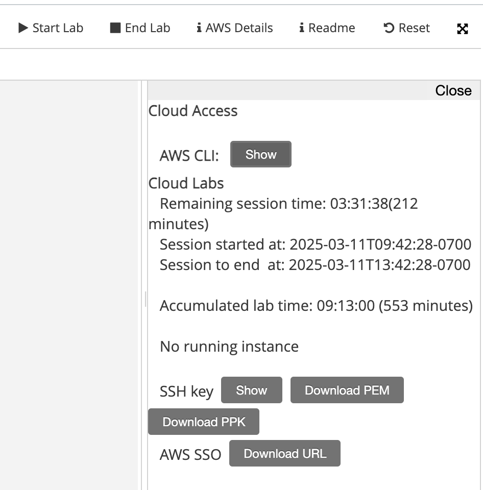
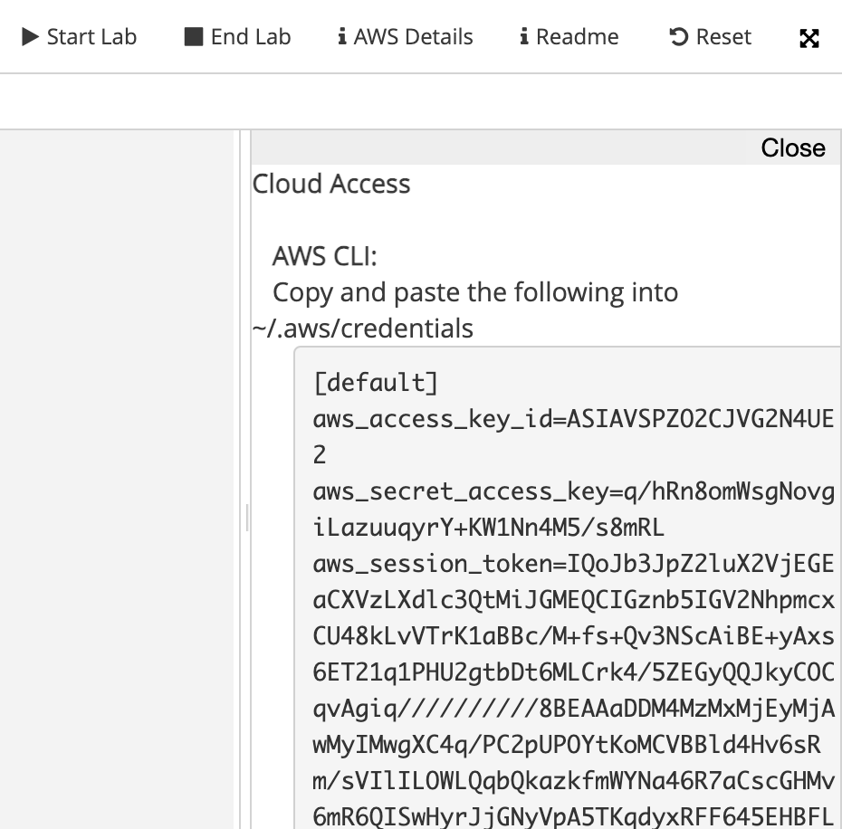

# Lab session #4: Use of services programmatically through their API

[Scrapy](https://scrapy.org/) is a Python framework for large-scale web scraping. It provides all the tools needed to extract data from websites efficiently, process them as required, and [store them in the most suitable structure and format](https://doc.scrapy.org/en/latest/topics/feed-exports.html).

[AWS Rekognition](https://aws.amazon.com/rekognition/)  is an image recognition service that detects objects, scenes, activities, landmarks, faces, dominant colors, and image quality. AWS Rekognition also extracts text, recognizes celebrities, and identifies inappropriate image content.

In this lab session, you will learn how to extract data from web pages and then analyze the images and videos using AWS Rekognition to obtain some interesting insights.

#  Pre-lab homework

<a name="aws"/>

Go to the AWS Academy and log into the course [AWS Academy Learner Lab](https://awsacademy.instructure.com/courses/109367). 

Watch the videos
- Demo - How to Access Learner Lab
- Demo - General Troubleshooting Tips
- Demo - How to Launch Services through AWS Console

If you cannot see the Learner Lab as shown below you may need to check that your browser is allowing 3rd party cookies (at least to execute the Learner Lab).

  


 You can go back into stopping 3rd party cookies after working with the environment.

  

#  Tasks for Lab session #4

* [Task 4.1: Extract images from a website](#Tasks41)
* [Task 4.2: Obtain insights about an image using AWS Rekognition](#Tasks42) 
* [Task 4.3: Get insights into a website images using AWS Rekognition](#Tasks43) 

<a name="Tasks41"/>

## Task 4.1: Extract images from a website

Learn more about Scrapy by reading a detailed [Scrapy Tutorial](https://doc.scrapy.org/en/latest/intro/tutorial.html) and [Scrapy documentation](https://doc.scrapy.org/en/latest/).

### Scrapy installation

Scrapy can be installed using pip.

```bash
_$ pip install scrapy
```

### Scrapy shell

Once the Scrapy package is installed, you can use the Scrapy shell to do some testing before programming your web data extraction. In the following example, we download the home page of ["Universitat Politècnica de Catalunya"](https://www.upc.edu/). Please, inspect the structure of the HTML, and extract the images included in each page. As you can see we can use a CSS syntax to select the HTML elements of the page.

```python
fetch("https://www.upc.edu/")
print(response.text)
response.css("img").extract_first()
response.css("a").extract_first()
```

To find the "search path" you may want to use Google Chrome, find the URL, inspect the code, and use the search bar at the bottom of the code to match the path.

### Scrapy custom spyders

Once you have explored the page you can write a custom spyder to programmatically extract data from HTML pages.

```bash
_$ scrapy startproject imageScraper
```

The above command will create the following file structure in the current directory:


  


The most important components are the file `imageScraper/settings.py` containing the settings for the project and the directory `imageScraper/spiders/` that keeps all the custom spiders.

We can use the DEPTH_LIMIT configuration variable to restrict image retrieval to first-level pages (e.g., www.upc.edu/xxx/) and exclude second-level (e.g., www.upc.edu/xxx/yyy/) and third-level URLs (e.g., www.upc.edu/xxx/yyy/zzz/) and beyond. By setting DEPTH_LIMIT to 0, which is the default value, the crawler will access pages at all levels within the website.

```python
DEPTH_LIMIT = 1
```

Now you can create a new spider by typing:

```bash
_$ cd imageScraper
_$ scrapy genspider image www.upc.edu
```

The execution creates a file named `imageScraper/spiders/image.py` inside the project directory. The file contains the following basic code:
```python
import scrapy


class ImageSpider(scrapy.Spider):
    name = 'image'
    allowed_domains = ['www.upc.edu']
    start_urls = ['http://www.upc.edu/']

    def parse(self, response):
        pass
```

Few things to note here:

- **name**: Name of the spider, in this case, it is “image”. Naming spiders properly is essential when you have to maintain hundreds of spiders.
- **allowed_domains**: An optional list of strings containing domains that this spider is allowed to crawl. Requests for URLs not belonging to the domain names specified in this list won’t be followed.
- **parse(self, response)**: This function is called whenever the crawler successfully crawls a URL. Remember the response object from earlier?.

After every successful crawl the *parse(..)* method is called, and so that’s where you write your extraction logic. 

For our example, we decide that we want to extract the list of images from the homepage.

```python
import scrapy
from urllib.parse import urljoin

class ImagesSpider(scrapy.Spider):
    name = "images"
    allowed_domains = ["www.upc.edu"]
    start_urls = ["https://www.upc.edu"]

    def parse(self, response):
        # Extract image URLs
        for img in response.css("img"):
            image_src = img.attrib.get('src') or img.attrib.get('data-src')  # Fallback to 'data-src'
            if image_src is not None:
                full_image_url = urljoin(response.url, image_src)
                yield {
                    'img_url': full_image_url,
                    'appears_url': response.url,
                }
```

Once the homepage has been crawled we can continue crawling the rest of the URLs that appear in the page by selecting the tag **a** (anchor) with the attribute **href**.
```python
        # Extract and follow hyperlinks
        for link in response.css("a[href]"):
            link_href = link.attrib.get('href')
            if link_href and link_href.startswith('https://'):  # Validating full link
                yield response.follow(link_href, callback=self.parse)
```
We can feed the crawler with all the URLs found. The only URLs that will be crawled will be the ones matching the allowed_domains and the DEPTH_LIMIT defined.

```python
    allowed_domains = ["www.upc.edu"]
```
We need to get the list of unique images found. It is possible to define `unique_images` inside the `ImagesSpider` class.
```python
    unique_images = []
```

We'll add the images to the list only if it is not already present.

```python
                if full_image_url not in self.unique_images:
                    self.unique_images.append(full_image_url)
```

`closed` is a method that can be defined in class `ImagesSpider` and it is invoked once all the URLs have been crawled.

```python

    def closed(self, cause):
        self.unique_images.sort()
        print(self.unique_images)
```

The above code yields a JSON record containing something like the following example:

```json
   {
    "img_url": "https://www.upc.edu/++theme++homeupc/assets/images/Logo.svg",
    "appears_url": "https://www.upc.edu/ca"
  }
```

### Extract your results to a JSON file

To obtain the results of parsing the home page of the UPC we can type at the command line below. We use the *name* of the parser and tell it to output the result to a file that will contain a list of JSON records.

```bash
_$ scrapy crawl image -o image.json

```

To debug the code using PyCharm we can add a new file named `main.py`, in the same directory containing `scrapy.cnf`, that will contain the command line that we typed before. I strongly advise you to use this option to speed up the creation of your parsers.


  


```python
from scrapy import cmdline

cmdline.execute("scrapy crawl image -o image.json".split())
```


**Q41** Add all the files that you have created to your private .*https://github.com/CCBDA-UPC/2024-4-xx* repository. Add your thoughts about the above task.


<a name="Tasks42"/>

## Task 4.2: Obtain insights about an image using AWS Rekognition

Open the modules and open the "Learner Lab". Click the button "Start Lab", wait until the environment is up, and then click "AWS" at the top of the window and open the AWS Console.


Once the AWS Console is open find the service "Amazon Rekognition" and launch the demo.


Play with the demo using the provided image some of the images obtained in the previous section.


**Q421 Add your thoughts about the above task.** 

### Create a Python script that sends an image to AWS Rekognition and retrieves the analysis

Using the "AWS Academy Learner Lab" AWS console it is only possible to execute Python code in the browser terminal of the environment.

Currently, the terminal shown in the screenshot above includes Python 3.7 which is incompatible with the boto3 version. You can also obtain a terminal by clicking on the icon shown in blue in the screenshot below.


#### Obtain the AWS credentials

All service access to the *AWS Learner Lab account* is limited to the **us-east-1** and **us-west-2** regions unless
mentioned otherwise in the service details that appear in the Learner Lab service description. If you load a service
console page in another AWS Region you will see access error messages.

##### List the contents of the configuration file

At your CLI type the following command that will provide the necessary values

````bash
ddd_v1_w_3cWf_628331@runweb75472:~$ cat $HOME/.aws/credentials
[default]
aws_access_key_id = <YOUR-ACCESS-KEY-ID>
aws_secret_access_key = <YOUR-SECRET-ACCESS-KEY>
aws_session_token = <YOUR-AWS-SESSION-TOKEN>
````
If the file does not contain the credentials use the second method.

##### Use AWS Details






#### Add a script to interact with AWS Comprehend

Use the code in [`Recognize_1.py`](Recognize_1.py) which uses the [boto3 library](https://boto3.amazonaws.com/v1/documentation/api/latest/guide/quickstart.html) to invoke the [image recognition service](https://boto3.amazonaws.com/v1/documentation/api/latest/reference/services/rekognition.html) and outputs the result.

```python
import boto3
import json
import os
from dotenv import load_dotenv

load_dotenv()

with open('./images/Lab04-sampleImage.jpeg', 'rb') as fd:
    image = fd.read()

recognize = boto3.client('rekognition',
                         region_name=os.getenv('AWS_REGION'),
                         aws_access_key_id=os.getenv('AWS_ACCESS_KEY_ID'),
                         aws_secret_access_key=os.getenv('AWS_SECRET_ACCESS_KEY'),
                         aws_session_token=os.getenv('AWS_SESSION_TOKEN'))
labels_list = recognize.detect_labels(Image={'Bytes': image}, MaxLabels=10, MinConfidence=70)
print(json.dumps(labels_list, indent=4))
```

```json
{
  "Labels": [
    {
      "Name": "Crowd",
      "Confidence": 99.99995422363281,
      "Instances": [],
      "Parents": [
        {
          "Name": "Person"
        }
      ],
      "Aliases": [],
      "Categories": [
        {
          "Name": "Person Description"
        }
      ]
    },
    {
      "Name": "Person",
      "Confidence": 99.99995422363281,
      "Instances": [
        {
          "BoundingBox": {
            "Width": 0.12894393503665924,
            "Height": 0.35750454664230347,
            "Left": 0.4808120131492615,
            "Top": 0.3740279972553253
          },
          "Confidence": 99.70088958740234
        },
        {
          "BoundingBox": {
            "Width": 0.11610560119152069,
            "Height": 0.4229159355163574,
            "Left": 0.0818672701716423,
            "Top": 0.2698194086551666
          },
          "Confidence": 99.66973876953125
        },
        {
          "BoundingBox": {
            "Width": 0.21254201233386993,
            "Height": 0.37966635823249817,
            "Left": 0.7135862112045288,
            "Top": 0.40775251388549805
          },
          "Confidence": 99.6224136352539
        },
        {
          "BoundingBox": {
            "Width": 0.1125546246767044,
            "Height": 0.32264119386672974,
            "Left": 0.27944132685661316,
            "Top": 0.3795841634273529
          },
          "Confidence": 99.5901870727539
        },
        {
          "BoundingBox": {
            "Width": 0.1910828799009323,
            "Height": 0.30100688338279724,
            "Left": 0.20694220066070557,
            "Top": 0.6622647047042847
          },
          "Confidence": 99.55730438232422
        },
        {
          "BoundingBox": {
            "Width": 0.18923720717430115,
            "Height": 0.3014851212501526,
            "Left": 0.39241740107536316,
            "Top": 0.6974440217018127
          },
          "Confidence": 98.555419921875
        },
        {
          "BoundingBox": {
            "Width": 0.22100703418254852,
            "Height": 0.281598836183548,
            "Left": 0.5547536611557007,
            "Top": 0.7183756232261658
          },
          "Confidence": 98.39226531982422
        },
        {
          "BoundingBox": {
            "Width": 0.2582959532737732,
            "Height": 0.2904464602470398,
            "Left": 0.6936929821968079,
            "Top": 0.7093237042427063
          },
          "Confidence": 98.30375671386719
        },
        {
          "BoundingBox": {
            "Width": 0.15318384766578674,
            "Height": 0.30458614230155945,
            "Left": 0.7919331192970276,
            "Top": 0.6382029056549072
          },
          "Confidence": 97.72750091552734
        },
        {
          "BoundingBox": {
            "Width": 0.13399796187877655,
            "Height": 0.2561280429363251,
            "Left": 0.6102837324142456,
            "Top": 0.611282229423523
          },
          "Confidence": 97.62276458740234
        },
        {
          "BoundingBox": {
            "Width": 0.14009936153888702,
            "Height": 0.15651848912239075,
            "Left": 0.17773200571537018,
            "Top": 0.618211567401886
          },
          "Confidence": 95.98444366455078
        },
        {
          "BoundingBox": {
            "Width": 0.14211870729923248,
            "Height": 0.179799884557724,
            "Left": 0.03909475356340408,
            "Top": 0.5740248560905457
          },
          "Confidence": 95.24139404296875
        },
        {
          "BoundingBox": {
            "Width": 0.1584833562374115,
            "Height": 0.29877763986587524,
            "Left": 0.0796993225812912,
            "Top": 0.700888454914093
          },
          "Confidence": 95.08063507080078
        },
        {
          "BoundingBox": {
            "Width": 0.16035592555999756,
            "Height": 0.2708810567855835,
            "Left": 0.0003941879840567708,
            "Top": 0.7290992140769958
          },
          "Confidence": 92.44922637939453
        },
        {
          "BoundingBox": {
            "Width": 0.035537686198949814,
            "Height": 0.07679184526205063,
            "Left": 0.01201602816581726,
            "Top": 0.6788983941078186
          },
          "Confidence": 84.72416687011719
        }
      ],
      "Parents": [],
      "Aliases": [
        {
          "Name": "Human"
        }
      ],
      "Categories": [
        {
          "Name": "Person Description"
        }
      ]
    },
    {
      "Name": "Audience",
      "Confidence": 99.96797943115234,
      "Instances": [],
      "Parents": [
        {
          "Name": "Crowd"
        },
        {
          "Name": "Person"
        }
      ],
      "Aliases": [],
      "Categories": [
        {
          "Name": "Performing Arts"
        }
      ]
    },
    {
      "Name": "Chair",
      "Confidence": 99.93281555175781,
      "Instances": [
        {
          "BoundingBox": {
            "Width": 0.14681798219680786,
            "Height": 0.2093701958656311,
            "Left": 0.4752836525440216,
            "Top": 0.5199379920959473
          },
          "Confidence": 99.93281555175781
        },
        {
          "BoundingBox": {
            "Width": 0.153163880109787,
            "Height": 0.17988941073417664,
            "Left": 0.24217256903648376,
            "Top": 0.55253666639328
          },
          "Confidence": 99.77008819580078
        },
        {
          "BoundingBox": {
            "Width": 0.14017456769943237,
            "Height": 0.08491340279579163,
            "Left": 0.7451263666152954,
            "Top": 0.9150865077972412
          },
          "Confidence": 97.67218780517578
        },
        {
          "BoundingBox": {
            "Width": 0.15577459335327148,
            "Height": 0.2323492467403412,
            "Left": 0.7789000868797302,
            "Top": 0.5389119982719421
          },
          "Confidence": 97.0833740234375
        },
        {
          "BoundingBox": {
            "Width": 0.06615076959133148,
            "Height": 0.08635266125202179,
            "Left": 0.6475703716278076,
            "Top": 0.8072365522384644
          },
          "Confidence": 75.36813354492188
        }
      ],
      "Parents": [
        {
          "Name": "Furniture"
        }
      ],
      "Aliases": [],
      "Categories": [
        {
          "Name": "Furniture and Furnishings"
        }
      ]
    },
    {
      "Name": "Microphone",
      "Confidence": 99.73712921142578,
      "Instances": [
        {
          "BoundingBox": {
            "Width": 0.04608222842216492,
            "Height": 0.05529649555683136,
            "Left": 0.07135389000177383,
            "Top": 0.3253592550754547
          },
          "Confidence": 99.73712921142578
        }
      ],
      "Parents": [
        {
          "Name": "Electrical Device"
        }
      ],
      "Aliases": [],
      "Categories": [
        {
          "Name": "Technology and Computing"
        }
      ]
    },
    {
      "Name": "Adult",
      "Confidence": 99.70088958740234,
      "Instances": [
        {
          "BoundingBox": {
            "Width": 0.12894393503665924,
            "Height": 0.35750454664230347,
            "Left": 0.4808120131492615,
            "Top": 0.3740279972553253
          },
          "Confidence": 99.70088958740234
        },
        {
          "BoundingBox": {
            "Width": 0.11610560119152069,
            "Height": 0.4229159355163574,
            "Left": 0.0818672701716423,
            "Top": 0.2698194086551666
          },
          "Confidence": 99.66973876953125
        },
        {
          "BoundingBox": {
            "Width": 0.21254201233386993,
            "Height": 0.37966635823249817,
            "Left": 0.7135862112045288,
            "Top": 0.40775251388549805
          },
          "Confidence": 99.6224136352539
        },
        {
          "BoundingBox": {
            "Width": 0.1910828799009323,
            "Height": 0.30100688338279724,
            "Left": 0.20694220066070557,
            "Top": 0.6622647047042847
          },
          "Confidence": 99.55730438232422
        },
        {
          "BoundingBox": {
            "Width": 0.2582959532737732,
            "Height": 0.2904464602470398,
            "Left": 0.6936929821968079,
            "Top": 0.7093237042427063
          },
          "Confidence": 98.30375671386719
        },
        {
          "BoundingBox": {
            "Width": 0.15318384766578674,
            "Height": 0.30458614230155945,
            "Left": 0.7919331192970276,
            "Top": 0.6382029056549072
          },
          "Confidence": 97.72750091552734
        }
      ],
      "Parents": [
        {
          "Name": "Person"
        }
      ],
      "Aliases": [],
      "Categories": [
        {
          "Name": "Person Description"
        }
      ]
    },
    {
      "Name": "Female",
      "Confidence": 99.70088958740234,
      "Instances": [
        {
          "BoundingBox": {
            "Width": 0.12894393503665924,
            "Height": 0.35750454664230347,
            "Left": 0.4808120131492615,
            "Top": 0.3740279972553253
          },
          "Confidence": 99.70088958740234
        },
        {
          "BoundingBox": {
            "Width": 0.11610560119152069,
            "Height": 0.4229159355163574,
            "Left": 0.0818672701716423,
            "Top": 0.2698194086551666
          },
          "Confidence": 99.66973876953125
        },
        {
          "BoundingBox": {
            "Width": 0.21254201233386993,
            "Height": 0.37966635823249817,
            "Left": 0.7135862112045288,
            "Top": 0.40775251388549805
          },
          "Confidence": 99.6224136352539
        },
        {
          "BoundingBox": {
            "Width": 0.1910828799009323,
            "Height": 0.30100688338279724,
            "Left": 0.20694220066070557,
            "Top": 0.6622647047042847
          },
          "Confidence": 99.55730438232422
        },
        {
          "BoundingBox": {
            "Width": 0.2582959532737732,
            "Height": 0.2904464602470398,
            "Left": 0.6936929821968079,
            "Top": 0.7093237042427063
          },
          "Confidence": 98.30375671386719
        },
        {
          "BoundingBox": {
            "Width": 0.15318384766578674,
            "Height": 0.30458614230155945,
            "Left": 0.7919331192970276,
            "Top": 0.6382029056549072
          },
          "Confidence": 97.72750091552734
        }
      ],
      "Parents": [
        {
          "Name": "Person"
        }
      ],
      "Aliases": [],
      "Categories": [
        {
          "Name": "Person Description"
        }
      ]
    },
    {
      "Name": "Woman",
      "Confidence": 99.70088958740234,
      "Instances": [
        {
          "BoundingBox": {
            "Width": 0.12894393503665924,
            "Height": 0.35750454664230347,
            "Left": 0.4808120131492615,
            "Top": 0.3740279972553253
          },
          "Confidence": 99.70088958740234
        },
        {
          "BoundingBox": {
            "Width": 0.11610560119152069,
            "Height": 0.4229159355163574,
            "Left": 0.0818672701716423,
            "Top": 0.2698194086551666
          },
          "Confidence": 99.66973876953125
        },
        {
          "BoundingBox": {
            "Width": 0.21254201233386993,
            "Height": 0.37966635823249817,
            "Left": 0.7135862112045288,
            "Top": 0.40775251388549805
          },
          "Confidence": 99.6224136352539
        },
        {
          "BoundingBox": {
            "Width": 0.1910828799009323,
            "Height": 0.30100688338279724,
            "Left": 0.20694220066070557,
            "Top": 0.6622647047042847
          },
          "Confidence": 99.55730438232422
        },
        {
          "BoundingBox": {
            "Width": 0.2582959532737732,
            "Height": 0.2904464602470398,
            "Left": 0.6936929821968079,
            "Top": 0.7093237042427063
          },
          "Confidence": 98.30375671386719
        },
        {
          "BoundingBox": {
            "Width": 0.15318384766578674,
            "Height": 0.30458614230155945,
            "Left": 0.7919331192970276,
            "Top": 0.6382029056549072
          },
          "Confidence": 97.72750091552734
        }
      ],
      "Parents": [
        {
          "Name": "Adult"
        },
        {
          "Name": "Female"
        },
        {
          "Name": "Person"
        }
      ],
      "Aliases": [],
      "Categories": [
        {
          "Name": "Person Description"
        }
      ]
    },
    {
      "Name": "Speech",
      "Confidence": 99.23688507080078,
      "Instances": [],
      "Parents": [
        {
          "Name": "Audience"
        },
        {
          "Name": "Crowd"
        },
        {
          "Name": "Person"
        }
      ],
      "Aliases": [
        {
          "Name": "Public Speaking"
        }
      ],
      "Categories": [
        {
          "Name": "Actions"
        }
      ]
    },
    {
      "Name": "People",
      "Confidence": 98.7227783203125,
      "Instances": [],
      "Parents": [
        {
          "Name": "Person"
        }
      ],
      "Aliases": [],
      "Categories": [
        {
          "Name": "Person Description"
        }
      ]
    }
  ],
  "LabelModelVersion": "3.0",
  "ResponseMetadata": {
    "RequestId": "0ea0a699-dc16-45e9-8a13-028aac977a45",
    "HTTPStatusCode": 200,
    "HTTPHeaders": {
      "x-amzn-requestid": "0ea0a699-dc16-45e9-8a13-028aac977a45",
      "content-type": "application/x-amz-json-1.1",
      "content-length": "7779",
      "date": "Tue, 11 Mar 2025 17:32:47 GMT"
    },
    "RetryAttempts": 0
  }
}
```

**Q422 Add your thoughts about the above task.** 

<a name="Tasks43"/>

## Task 4.3: Get insights of website images using AWS Rekognition

Using the code in the prevous sections build a Python application that obtains some insights out of website images. You are free to use any AWS Rekognition functionality.

You may want to use the [requests](https://pypi.org/project/requests/) Python library to interact with the images.

You may also want to create an AWS S3 Bucket to [store the images](./S3.py), depending on the AWS Rekognition functionality. The example below considers that the bucket `lab04-main.ccbda.upc.edu` already exists. Remember that AWS S3 buckets **must** have a globally unique name.

```python
import boto3
import os
from dotenv import load_dotenv

load_dotenv()

# Define the name of the S3 bucket
BUCKET = 'lab04-main.ccbda.upc.edu'

# Create an S3 client using boto3 and credentials loaded from environment variables
s3 = boto3.client(
    's3',  # Specify that it is an S3 client
    region_name=os.getenv('AWS_REGION'),
    aws_access_key_id=os.getenv('AWS_ACCESS_KEY_ID'),
    aws_secret_access_key=os.getenv('AWS_SECRET_ACCESS_KEY'),
    aws_session_token=os.getenv('AWS_SESSION_TOKEN')
)

# Specify the name of the object to be uploaded to S3
objectName = 'sample_image.jpg'

# Open the file located at './images/Lab04-sampleImage.jpeg' in binary read mode
with open('./images/Lab04-sampleImage.jpeg', 'rb') as fd:
    # Read the content of the file as binary data
    image = fd.read()
    # Upload the binary data (image) to the specified S3 bucket with the given object name
    s3.put_object(Bucket=BUCKET, Body=image, Key=objectName)

# Open (or create) a file named 'downloaded.jpeg' in binary write mode to save the downloaded object
with open('./downloaded.jpeg', 'wb') as fd:
    # Retrieve the object from the S3 bucket using its key
    response = s3.get_object(Bucket=BUCKET, Key=objectName)
    # Write the content of the downloaded object to the local file
    fd.write(response['Body'].read())
```

**Q431 What is the goal of your application?**

Include the code modifications and eventual new files in the repo.

**Q432  Add your thoughts about the application developed and the results that you have obtained.**


Make sure that you have updated your local GitHub repository (using the `git` commands `add`, `commit`, and `push`) with all the files generated during this session. 

**Before the deadline**, all team members shall push their responses to their private *https://github.com/CCBDA-UPC/2024-4-xx* repository.