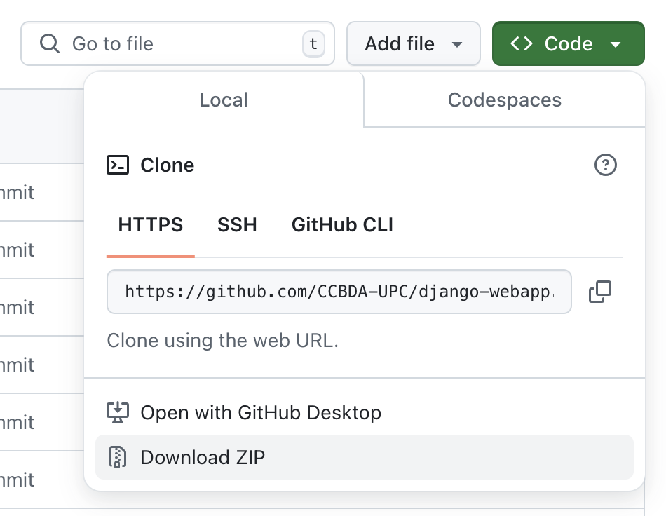
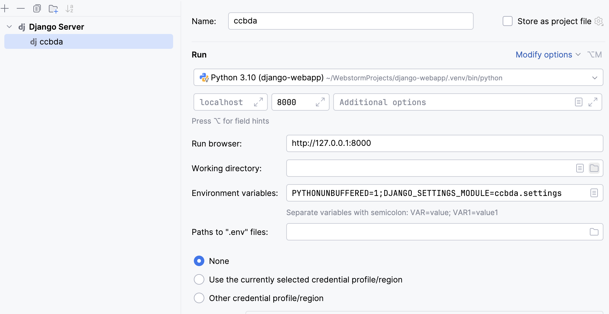
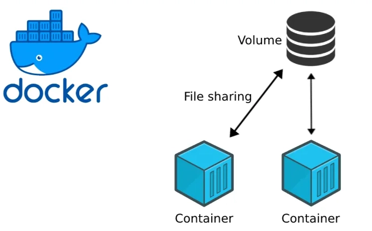

# Lab session 5: Deploy a custom web app using additional cloud services

We are going to assume that you are working on a new subject on Cloud Computing that isn't ready for students to enroll
yet, but in the meantime, you plan to deploy a small placeholder app that collects contact information from the website
visitors who sign up to hear more. The signup app will help you reach potential students who might take part in a
private beta test of the laboratory sessions.

### The Signup App

The app will allow your future students to submit contact information and express interest in a preview of the new
subject on Cloud Computing that you're developing.

To make the app look good, we use [Bootstrap](https://getbootstrap.com/), a mobile-first front-end framework that
started as a Twitter project.

#### Django: web framework

[Django](https://www.djangoproject.com/start/) is a high-level Python web framework designed for rapid development and
clean, pragmatic design. Built by experienced developers, it handles many complexities of web development, allowing you
to focus on building your application without reinventing the wheel. Plus, it’s free and open source.

### AWS DynamoDB

**Amazon DynamoDB**, a NoSQL database service, is going to be used to store the contact information that users submit.

DynamoDB is a schema-less database, so you need to specify only a primary key attribute. Let us use the email field as a
key for each register.

### AWS Simple Notification Service (SNS)

We want to know when customers submit a form, therefore we are going to use **AWS Simple Notification Service** (AWS
SNS), a message pushing service that can deliver notifications over various protocols. For our web app, we are going to
push notifications to an email address.

### Docker

[Docker](https://www.docker.com/) is a **Platform as a Service (PaaS)** solution that leverages OS-level virtualization
to package software into
units known as **containers**. These containers ensure that applications can run consistently and efficiently across
various environments. Docker provides both free and premium options and operates through its core software, Docker
Engine, which has been maintained by Docker, Inc. since its initial release in 2013.

The primary purpose of Docker is to streamline the deployment process by isolating applications in lightweight
containers, enabling smooth operation in diverse environments.

# Pre-lab homework

Make sure that you install [Docker Desktop](https://www.docker.com/products/docker-desktop/)
and [Docker Compose](https://docs.docker.com/compose/) on your machine.

If you need help with the installation, you can find detailed instructions on the Docker and Django websites.

# Tasks for Lab session #5

* [Task 5.1: Create a DynamoDB Table](#Task51)
* [Task 5.2: Download the code for the Web App](#Task52)
* [Task 5.3: Test the web app locally](#Task53)
* [Task 5.4: Use AWS Simple Notification Service in your web app](#Tasks54)
* [Task 5.5: Configure Docker](#Tasks55)
* [Task 5.6: Deploy the target web app](#Tasks56)

<a name="Task51"/>

## Task 5.1: Create a DynamoDB Table

The signup app uses a DynamoDB table to store the contact information that users submit.

#### To create a DynamoDB table

Go to the course "AWS Academy Learner Lab", open the modules and open the "Learner Lab". Click the button "Start Lab",
wait until the environment is up and then click "AWS" at the top of the window and open the AWS Console.

1. At the console search for "DynamoDB".

3. Go to Tables and **Create table**.

4. For Table name, type **ccbda-signup-table**.

5. For the `Partition key`, type `email`. Choose **Create**.

<a name="Task52"/>

## Task 5.2: Download the code for the Web App

You are going to make a few changes to the base Python code. Therefore, download
the [repository](https://github.com/CCBDA-UPC/django-webapp) on your local disk drive
as a **zip file**.



Unzip the file inside your responses repository for the current Lab session, and change the name of the folder to
**django-webapp**.

<a name="Task53"/>

## Task 5.3: Test the web app locally

### Configuration of the web application

Inside of the django-webapp folder, create a `.env` file with the configuration for the project:

```text
DJANGO_DEBUG=True
DJANGO_ALLOWED_HOSTS=localhost,127.0.0.1,0.0.0.0
DJANGO_SECRET_KEY="-lm+)b44uap8!0-^1w9&2zokys(47)8u698=dy0mb&6@4ee-hh"
DJANGO_LOGLEVEL=info
CCBDA_SIGNUP_TABLE=ccbda-signup-table
AWS_REGION=us-east-1
AWS_ACCESS_KEY_ID=<YOUR-ACCESS-KEY-ID>
AWS_SECRET_ACCESS_KEY=<YOUR-SECRET-ACCESS-KEY>
AWS_SESSION_TOKEN=<YOUR-AWS-SESSION-TOKEN>
```

Open the .gitignore file and check that it contains rules to avoid pushing to the repository files such as `.env`
containing sensitive information. **Make sure to have such functionality present in your future projects**.

### Web application Virtual environment 

Next, create a **new Python 3.13 virtual environment** specially for this web app and install the packages required to
run it. The new Python virtual environment is created locally only to keep the packages that the web app uses. Having a
small Python environment implies a faster web app startup avoiding, as much as possible, any hidden dependencies and
ambiguities.

Check the contents of the file **requirements.txt** that the web application declares as the set of Python packages, and
its version, that it requires to be executed successfully.

The package `boto3` is a library that hides de AWS REST API to the programmer and manages the communication between the
web app and all the AWS services.
Check [**Boto 3 Documentation**](https://boto3.readthedocs.io/en/latest/reference/services/index.html) for more details.

Please, note the different prompt  `(.env)_$`  vs. `_$` when you are inside or outside the Python virtual
environment.

```
_$ virtualenv -p python3 ../.venv
_$ source ../.venv/bin/activate
(.venv)_$ pip install -r requirements.txt
```

You will now need to run a local testing server.

```
(.venv)_$ python manage.py runserver
Watching for file changes with StatReloader
Performing system checks...

System check identified no issues (0 silenced).
January 08, 2025 - 19:36:44
Django version 5.1.7, using settings 'ccbda.settings'
Starting development server at http://127.0.0.1:8000/
Quit the server with CONTROL-C.
(.venv)_$ deactivate
```

You can also create a PyCharm configuration tu run or debug the code.



### Web application running locally

Once the web app is running, check that you have configured the access to DynamoDB correctly by interacting with the web
app through your browser [http://127.0.0.1:8000/](http://127.0.0.1:8000/).

Go to the DynamoDB table browser tab and verify that the **ccbda-signup-table** table contains the new records that the
web app should have created. If all the above works correctly, you are almost ready to transfer the web app to Docker.

**Q53: Create a screen capture of your DyanmoDB table with the data of the new leads. Add your thoughts on the above
tasks.**

<a name="Tasks54" />

## Task 5.4: Use AWS Simple Notification Service in your web app

### Create a AWS SNS Topic

Our signup web app wants to notify you each time a user signs up. When the data from the signup form is written to the
DynamoDB table, the app will send you an AWS SNS notification.

First, you need to create an AWS SNS topic, which is a stream for notifications, and then you need to create a
subscription that tells AWS SNS where and how to send the notifications.

**To set up AWS SNS notifications**

At the "AWS" console search for "Simple Notification Service"

- Choose **Create topic**.
- For Topic name, type *ccbda-signup-notifications*. Choose **Standard** type and **Create topic**.
- Choose  **Create subscription**.
- For **Protocol**, choose *Email*. For **Endpoint**, enter *your email address*. Choose **Create Subscription**.

To confirm the subscription, AWS SNS sends an email named *AWS Notification — Subscription Confirmation*. Open the
link in the email to confirm your subscription.

Do not forget that before testing the new functionality you need to have the AWS SNS subscription approved.

### Modify the web app to send messages

Add the *unique identifier* for the AWS SNS topic to the configuration environment of your local deployment. It needs to
be instantiated in the  `settings.py` and `.env` files.

```bash
NEW_SIGNUP_TOPIC=arn:aws:sns:us-east-1:<YOUR-ACCOUNT-ID>:ccbda-signup-notifications
```

Open the files *form/models.py* and *form/views.py* read and understand what the code does.

Add the code below to *form/models.py* as a new operation of the model *Leads()*.

```python
def send_notification(self, email):
    sns = boto3.client('sns', region_name=settings.AWS_REGION,
                       aws_access_key_id=settings.AWS_ACCESS_KEY_ID,
                       aws_secret_access_key=settings.AWS_SECRET_ACCESS_KEY,
                       aws_session_token=settings.AWS_SESSION_TOKEN)
    try:
        sns.publish(
            TopicArn=settings.NEW_SIGNUP_TOPIC,
            Message='New signup: %s' % email,
            Subject='New signup',
        )
        logger.error('SNS message sent.')

    except Exception as e:
        logger.error(
            'Error sending AWS SNS message: ' + (e.fmt if hasattr(e, 'fmt') else '') + ','.join(e.args))
```

Go to *form/views.py* and modify the signup view: if the lead has been correctly inserted in our DynamoDB table we can
send the notification.

```python
def signup(request):
    leads = Leads()
    status = leads.insert_lead(request.POST['name'], request.POST['email'], request.POST['previewAccess'])
    if status == 200:
        leads.send_notification(request.POST['email'])
    return HttpResponse('', status=status)
```

Close the file and execute the Django web app locally. You can post a new record. This time you see no error, and you
receive a notification in your e-mail.

```bash
New item added to database.
SNS message sent.
"POST /signup HTTP/1.1" 200 0
```

**Q54: Has everything gone alright? Share your thoughts on the task developed above.**

<a name="Tasks55" />

## Task 5.5: Configure Docker

In this task, you will migrate the web application to run in a Docker container. The Docker container is portable and
could run on any OS that has the Docker engine installed.

The [Docker daemon](https://docs.docker.com/get-started/docker-overview/#docker-architecture) (dockerd) listens for
Docker API requests and manages Docker objects such as images, containers, networks, and volumes. A daemon can also
communicate with other daemons to manage Docker services.

For Windows and OSx operating systems, the Docker daemon is started by opening the
Docker [Desktop application](https://docs.docker.com/desktop/). Therefore, start the Docker Desktop application before
continuing.

### Create a Dockerfile

A Dockerfile is a script that tells Docker how to build your Docker image. Put it in the root directory of your Django
project. Here’s a basic Dockerfile setup for Django:

```dockerfile
# Use the official Python runtime image
FROM python:3.13.2  
 
# Create the app directory
RUN mkdir /app
 
# Set the working directory inside the container
WORKDIR /app
 
# Set environment variables 
# Prevents Python from writing pyc files to disk
ENV PYTHONDONTWRITEBYTECODE=1
#Prevents Python from buffering stdout and stderr
ENV PYTHONUNBUFFERED=1 
 
# Upgrade pip
RUN pip install --upgrade pip 
 
# Copy the Django project  and install dependencies
COPY requirements.txt  /app/
 
# run this command to install all dependencies 
RUN pip install --no-cache-dir -r requirements.txt
 
# Copy the Django project to the container
COPY . /app/
 
# Expose the Django port
EXPOSE 8000
 
# Run Django’s development server
CMD ["python", "manage.py", "runserver", "0.0.0.0:8000"]
```

Each line in the Dockerfile serves a specific purpose:

- **FROM**: Selects the image with the Python version you need.

- **WORKDIR**: Sets the working directory of the application within the container.

- **ENV**: Sets the environment variables needed to build the application

- **RUN** and **COPY** commands: Install dependencies and copy project files.

- **EXPOSE** and **CMD**: Expose the Django server port and define the startup command.

Go to your Docker Desktop and open the terminal, move to the directory where the web application is stored and build the
docker image.

```bash
_$ cd django-webapp               
_$ docker build -t django-docker .
[+] Building 32.8s (12/12) FINISHED                                                                   docker:desktop-linux
 => [internal] load build definition from Dockerfile                                                                  0.0s
 => => transferring dockerfile: 836B                                                                                  0.0s
 => [internal] load metadata for docker.io/library/python:3.13.2                                                      1.0s
 => [internal] load .dockerignore                                                                                     0.0s
 => => transferring context: 108B                                                                                     0.0s
 => [1/7] FROM docker.io/library/python:3.13.2@sha256:bc336add24c507d3a11b68a08fe694877faae3eab2d0e18b0653097f1a0db9  1.9s
 => => resolve docker.io/library/python:3.13.2@sha256:bc336add24c507d3a11b68a08fe694877faae3eab2d0e18b0653097f1a0db9  0.0s
 => => sha256:5e9ad5aa09b47978b1d78d8e37974138d57e5ffddce0ae411463fac97bddca83 249B / 249B                            0.2s
 => => sha256:854e2aed8debacc19d5e07410cdb618bf78860003d6bc9eeccc889a097eadcb8 27.36MB / 27.36MB                      0.9s
 => => sha256:21754c21aa78844ad4c04fa8837c92d47f71c59dd5e450e93eddb2c2d368c197 6.16MB / 6.16MB                        0.8s
 => => extracting sha256:21754c21aa78844ad4c04fa8837c92d47f71c59dd5e450e93eddb2c2d368c197                             0.3s
 => => extracting sha256:854e2aed8debacc19d5e07410cdb618bf78860003d6bc9eeccc889a097eadcb8                             0.7s
 => => extracting sha256:5e9ad5aa09b47978b1d78d8e37974138d57e5ffddce0ae411463fac97bddca83                             0.0s
 => [internal] load build context                                                                                     0.0s
 => => transferring context: 17.40kB                                                                                  0.0s
 => [2/7] RUN mkdir /app                                                                                              0.5s
 => [3/7] WORKDIR /app                                                                                                0.0s
 => [4/7] RUN pip install --upgrade pip                                                                               8.0s
 => [5/7] COPY requirements.txt  /app/                                                                                0.0s
 => [6/7] RUN pip install --no-cache-dir -r requirements.txt                                                         16.0s
 => [7/7] COPY . /app/                                                                                                0.1s
 => exporting to image                                                                                                5.1s
 => => exporting layers                                                                                               2.9s
 => => exporting manifest sha256:5734e099389204152daa1dc7f776eac832a9a906e67b1a2cc3c59d56ca106758                     0.0s
 => => exporting config sha256:76e68189a7448ac9a3e587611ebc0024fa61182885a019ba7e1d0819241bc4b4                       0.0s
 => => exporting attestation manifest sha256:71a2d3653951af13b510378334de77508b6a21dc3a6209ec7811060e4cf70698         0.0s
 => => exporting manifest list sha256:a1545142ab1d416ac5770a752d595e05cc8bd688ab0c4a5b78fb49acd4b4c20e                0.0s
 => => naming to docker.io/library/django-docker:latest                                                               0.0s
 => => unpacking to docker.io/library/django-docker:latest                                                            2.2s

View build details: docker-desktop://dashboard/build/desktop-linux/desktop-linux/5yaxtomey9oe1bp7wuz8fud9b
```

To see the new image created, you can run:

```bash 
_$ docker image list
REPOSITORY          TAG       IMAGE ID       CREATED          SIZE
django-docker       latest    a1545142ab1d   51 seconds ago   1.62GB
```

You can now create a **container** based on the image by typing the command below. The command also associates the
container internal port 8000 to the local computer port 8000 and sends the latest value of the configuration variables
using the [unix environment](https://en.wikipedia.org/wiki/Environment_variable).

The command will not return and will be updating the output with the requests that it is receiving. You need to type
CONTROL-C to stop the container. Open a new terminal if you need to issue additional commands such as "docker stop" to
alternativelly stop the container.

```bash
_$ docker run -p 8000:8000 --env-file .env django-docker
Watching for file changes with StatReloader
Performing system checks...

System check identified no issues (0 silenced).
March 09, 2025 - 20:22:05
Django version 5.1.7, using settings 'ccbda.settings'
Starting development server at http://0.0.0.0:8000/
Quit the server with CONTROL-C.

"GET / HTTP/1.1" 200 7299
New item added to database.
"POST /signup HTTP/1.1" 200 0
"GET / HTTP/1.1" 200 7299
New item added to database.
"POST /signup HTTP/1.1" 200 0
```

Open the URL http://0.0.0.0:8000/ in your browser and test the web application. If you did all the steps correctly you
shall be able to add a new entry to the database.

**Q55: Has everything gone alright? Share your thoughts on the task developed above.**


<a name="Tasks56" />

## Task 5.6: Deploy the target web app

Although this is a great start in containerizing the application, you’ll need to make a number of improvements to get it
ready for production.

- The CMD `manage.py` is only meant for development purposes and should be changed for
  a [WSGI](https://wsgi.readthedocs.io/en/latest/what.html) server.
- Reduce the size of the image by using a smaller linux image.
- Optimize the image by using a multistage build process.

Let’s get started with these improvements.

### Update requirements.txt

Make sure to add [`gunicorn`](https://gunicorn.org/) and `psycopg2-binary` to your `requirements.txt`. The updated file
should look something like this:

```text
asgiref==3.8.1
boto3==1.37.9
botocore==1.37.9
Django==5.1.7
dotenv==0.9.9
gunicorn==23.0.0
jmespath==1.0.1
packaging==24.2
psycopg2-binary==2.9.10
python-dateutil==2.9.0.post0
python-dotenv==1.0.1
s3transfer==0.11.4
six==1.17.0
sqlparse==0.5.3
typing_extensions==4.12.2
urllib3==2.3.0
```

### Make improvements to the Dockerfile

The Dockerfile below has changes that solve the three items on the list. The changes to the file are as follows:

- Updated the FROM python:3.13.2 image to FROM python:3.13.2-slim. This change reduces the size of the image
  considerably, as the image now only contains what is needed to run the application.
- Added a multi-stage build process to the Dockerfile. When you build applications, there are usually many files left on
  the file system that are only needed during build time and are not needed once the application is built and running.
  By adding a build stage, you use one image to build the application and then move the built files to the second image,
  leaving only the built code. Read more about [multi-stage builds](https://docs.docker.com/build/building/multi-stage/)
  in the documentation.
- Add the Gunicorn WSGI server to enable a production-ready deployment of the application.

```dockerfile
# Stage 1: Base build stage
FROM python:3.13.2-slim AS builder
 
# Create the app directory
RUN mkdir /app
 
# Set the working directory
WORKDIR /app
 
# Set environment variables to optimize Python
ENV PYTHONDONTWRITEBYTECODE=1
ENV PYTHONUNBUFFERED=1 
 
# Upgrade pip and install dependencies
RUN pip install --upgrade pip 
 
# Copy the requirements file first (better caching)
COPY requirements.txt /app/
 
# Install Python dependencies
RUN pip install --no-cache-dir -r requirements.txt
 
# Stage 2: Production stage
FROM python:3.13.2-slim
 
RUN useradd -m -r appuser && \
   mkdir /app && \
   chown -R appuser /app
 
# Copy the Python dependencies from the builder stage
COPY --from=builder /usr/local/lib/python3.13/site-packages/ /usr/local/lib/python3.13/site-packages/
COPY --from=builder /usr/local/bin/ /usr/local/bin/
 
# Set the working directory
WORKDIR /app
 
# Copy application code
COPY --chown=appuser:appuser . .
 
# Set environment variables to optimize Python
ENV PYTHONDONTWRITEBYTECODE=1
ENV PYTHONUNBUFFERED=1 
 
# Switch to non-root user
USER appuser
 
# Expose the application port
EXPOSE 8000 
 
# Start the application using Gunicorn
CMD ["gunicorn", "--bind", "0.0.0.0:8000", "--workers", "3", "my_docker_django_app.wsgi:application"]
```

Build the Docker container image again.

```bash
_$ docker build -t django-docker .
[+] Building 0.9s (16/16) FINISHED                                                                    docker:desktop-linux
 => [internal] load build definition from Dockerfile                                                                  0.0s
 => => transferring dockerfile: 1.31kB                                                                                0.0s
 => [internal] load metadata for docker.io/library/python:3.13.2-slim                                                 0.4s
 => [internal] load .dockerignore                                                                                     0.0s
 => => transferring context: 108B                                                                                     0.0s
 => [builder 1/6] FROM docker.io/library/python:3.13.2-slim@sha256:f3614d98f38b0525d670f287b0474385952e28eb43016655d  0.0s
 => => resolve docker.io/library/python:3.13.2-slim@sha256:f3614d98f38b0525d670f287b0474385952e28eb43016655dd003d0e2  0.0s
 => [internal] load build context                                                                                     0.0s
 => => transferring context: 17.80kB                                                                                  0.0s
 => CACHED [stage-1 2/6] RUN useradd -m -r appuser &&    mkdir /app &&    chown -R appuser /app                       0.0s
 => CACHED [builder 2/6] RUN mkdir /app                                                                               0.0s
 => CACHED [builder 3/6] WORKDIR /app                                                                                 0.0s
 => CACHED [builder 4/6] RUN pip install --upgrade pip                                                                0.0s
 => CACHED [builder 5/6] COPY requirements.txt /app/                                                                  0.0s
 => CACHED [builder 6/6] RUN pip install --no-cache-dir -r requirements.txt                                           0.0s
 => CACHED [stage-1 3/6] COPY --from=builder /usr/local/lib/python3.13/site-packages/ /usr/local/lib/python3.13/site  0.0s
 => CACHED [stage-1 4/6] COPY --from=builder /usr/local/bin/ /usr/local/bin/                                          0.0s
 => CACHED [stage-1 5/6] WORKDIR /app                                                                                 0.0s
 => [stage-1 6/6] COPY --chown=appuser:appuser . .                                                                    0.0s
 => exporting to image                                                                                                0.2s
 => => exporting layers                                                                                               0.1s
 => => exporting manifest sha256:56db48fb15a56394b268acbe3c80d51b25d08f736d293ee89f62158b3ab619b8                     0.0s
 => => exporting config sha256:573556a701dae35a76b79413265d839d49ab2f7e402cb57aca462e1e9cca0432                       0.0s
 => => exporting attestation manifest sha256:f6b7d79f2dfdfdfef29bc20bae2f6b82dfbd21ab9d685482d92aaf704d8757ce         0.0s
 => => exporting manifest list sha256:bef8941dad38cae70d4b6cca04f98c5312074ce6b955c1af3d02ecbb1b86783f                0.0s
 => => naming to docker.io/library/django-docker:latest                                                               0.0s
 => => unpacking to docker.io/library/django-docker:latest                                                            0.0s

View build details: docker-desktop://dashboard/build/desktop-linux/desktop-linux/eozjf8cg6oqlycu26ukdja5sb
```

After making these changes, we can run a docker image list again:

```text
_$  docker image list  
REPOSITORY          TAG       IMAGE ID       CREATED              SIZE
django-docker       latest    bef8941dad38   About a minute ago   323MB
```

You can see a significant improvement in the size of the container.

The size was reduced from 1.62GB to 323MB, which leads to faster a deployment process when images are downloaded and
cheaper storage costs when storing images.

Django is configured to, by default use a [SQLite](https://www.sqlite.org/) database which is not suitable for
production environments. Let's add a [PostGreSQL](https://www.postgresql.org/) database that will be running in another
container. See below the definition of the databases usage in the file `settings.py`.

```python

DATABASES = {
    'default': {
        'ENGINE': 'django.db.backends.sqlite3',
        'NAME': BASE_DIR / 'db.sqlite3',
    },
    "postgresql": {
        "ENGINE": "django.db.backends.postgresql",
        'DISABLE_SERVER_SIDE_CURSORS': True,
        "NAME": os.getenv('DB_NAME', '---no-db-name---'),
        "USER": os.getenv('DB_USER', '---no-db-user---'),
        "PASSWORD": os.getenv('DB_PASSWORD', '---no-db-password---'),
        "HOST": os.getenv('DB_HOST', '127.0.0.1'),
        "PORT": os.getenv('DB_PORT', 5432),
    }
}

DATABASES['default'] = DATABASES[os.getenv('DATABASE', 'default')]
```

### Configure the Docker Compose file

A `compose.yml` file allows you to manage multi-container applications.



The following file creates two containers: `db` and `code` and one volume `postgres_data` that is used to store the
database contents. Volumes are mounted to filesystem paths in your containers. Additionally, each container exposes some
ports and connects them to external ports of the deployment.

```yaml
services:
  db:
    image: postgres:17
    environment:
      - POSTGRES_DB=${DB_NAME}
      - POSTGRES_USER=${DB_USER}
      - POSTGRES_PASSWORD=${DB_PASSWORD}
    ports:
      - "5432:5432"
    volumes:
      - postgres_data:/var/lib/postgresql/data
    restart: always
    container_name: postgress-db
    healthcheck:
      test: [ "CMD", "pg_isready", "-q", "-d", "${DB_NAME}", "-U", "${DB_USER}" ]
      interval: 1s
      timeout: 5s
      retries: 10
  code:
    build: .
    container_name: code
    ports:
      - "8000:8000"
    depends_on:
      - db
    environment:
      - DJANGO_DEBUG=${DJANGO_DEBUG}
      - DJANGO_ALLOWED_HOSTS=${DJANGO_ALLOWED_HOSTS}
      - DJANGO_SECRET_KEY=${DJANGO_SECRET_KEY}
      - DJANGO_LOGLEVEL=${DJANGO_LOGLEVEL}
      - DATABASE=${DATABASE}
      - DB_NAME=${DB_NAME}
      - DB_USER=${DB_USER}
      - DB_PASSWORD=${DB_PASSWORD}
      - DB_HOST=db
      - DB_PORT=${DB_PORT}
      - CCBDA_SIGNUP_TABLE=${CCBDA_SIGNUP_TABLE}
      - AWS_REGION=${AWS_REGION}
      - AWS_ACCESS_KEY_ID=${AWS_ACCESS_KEY_ID}
      - AWS_SECRET_ACCESS_KEY=${AWS_SECRET_ACCESS_KEY}
      - AWS_SESSION_TOKEN=${AWS_SESSION_TOKEN}
volumes:
  postgres_data:
```

Let's now create a new file named `production.env` to define the same `.env` variables adding the ones related to using
the
PostGreSQL database.

```bash
_$ cat production.env
DJANGO_DEBUG=False
DJANGO_ALLOWED_HOSTS=localhost,127.0.0.1,0.0.0.0
DJANGO_SECRET_KEY="-lm+)b44uap8!0-^1w9&2zokys(47)8u698=dy0mb&6@4ee-hh"
DJANGO_LOGLEVEL=info
CCBDA_SIGNUP_TABLE=ccbda-signup-table
AWS_REGION=us-east-1
AWS_ACCESS_KEY_ID=<YOUR-ACCESS-KEY-ID>
AWS_SECRET_ACCESS_KEY=<YOUR-SECRET-ACCESS-KEY>
AWS_SESSION_TOKEN=<YOUR-AWS-SESSION-TOKEN>
DB_NAME=ccbdadb
DB_USER=ccbdauser
DB_PASSWORD=ccbdapassword
DB_PORT=5432
DATABASE=postgresql
```

We need to add a new file named `.dockerignore`, similar to `.gitignore`, where we configure what files and folders
shall not be copied to the container when creating the Docker image.

```bash
_$ cat .dockerignore
.venv
*.env
.gitignore
README.md
compose.yml
*.sqlite
*.sqlite3
.DS_Store
.git
.idea
.private
```

### Build and run your new Django project

By running the following command, Docker pulls the PostGreSQL container image from a Docker repository. It then creates
a database with the name, user and password that we have defined. Check the log after the command.

```bash
_$ docker compose --env-file production.env up
[+] Running 14/14
 ✔ db Pulled                                                                                                                                      6.8s 
Compose now can delegate build to bake for better performances
Just set COMPOSE_BAKE=true
[+] Building 4.5s (18/18) FINISHED                                                                                                docker:desktop-linux
 => [code internal] load build definition from Dockerfile                                                                                          0.0s
 => => transferring dockerfile: 1.31kB                                                                                                            0.0s
 => [code internal] load metadata for docker.io/library/python:3.13.2-slim                                                                         0.8s
 => [code auth] library/python:pull token for registry-1.docker.io                                                                                 0.0s
 => [code internal] load .dockerignore                                                                                                             0.0s
 => => transferring context: 130B                                                                                                                 0.0s
 => [code builder 1/6] FROM docker.io/library/python:3.13.2-slim@sha256:f3614d98f38b0525d670f287b0474385952e28eb43016655dd003d0e28cf8652           0.0s
 => => resolve docker.io/library/python:3.13.2-slim@sha256:f3614d98f38b0525d670f287b0474385952e28eb43016655dd003d0e28cf8652                       0.0s
 => [code internal] load build context                                                                                                             0.1s
 => => transferring context: 22.11kB                                                                                                              0.1s
 => CACHED [code stage-1 2/6] RUN useradd -m -r appuser &&    mkdir /app &&    chown -R appuser /app                                               0.0s
 => CACHED [code builder 2/6] RUN mkdir /app                                                                                                       0.0s
 => CACHED [code builder 3/6] WORKDIR /app                                                                                                         0.0s
 => CACHED [code builder 4/6] RUN pip install --upgrade pip                                                                                        0.0s
 => CACHED [code builder 5/6] COPY requirements.txt /app/                                                                                          0.0s
 => CACHED [code builder 6/6] RUN pip install --no-cache-dir -r requirements.txt                                                                   0.0s
 => CACHED [code stage-1 3/6] COPY --from=builder /usr/local/lib/python3.13/site-packages/ /usr/local/lib/python3.13/site-packages/                0.0s
 => CACHED [code stage-1 4/6] COPY --from=builder /usr/local/bin/ /usr/local/bin/                                                                  0.0s
 => CACHED [code stage-1 5/6] WORKDIR /app                                                                                                         0.0s
 => [code stage-1 6/6] COPY --chown=appuser:appuser . .                                                                                            0.7s
 => [code] exporting to image                                                                                                                      2.6s
 => => exporting layers                                                                                                                           0.1s
 => => exporting manifest sha256:2222b5f73ed85273f12efae0558757fa351bab444311dc2386452c4c2baa975c                                                 0.0s
 => => exporting config sha256:926f8eaca3f3e66e3477352e6ab02c545db461429749568cc737a41ee4e0faae                                                   0.0s
 => => exporting attestation manifest sha256:4098f7bccec9fe7fde841baacf7ded8be6b98e84b22e7c9851e4492cdfa23529                                     0.0s
 => => exporting manifest list sha256:5308235bfe9356bf00b3c907e44248d5daac8f7ffe18fb2fd05360e4ee685db2                                            0.0s
 => => naming to docker.io/library/django-webapp-code:latest                                                                                       0.0s
 => => unpacking to docker.io/library/django-webapp-code:latest                                                                                    2.4s
 => [code] resolving provenance for metadata file                                                                                                  0.0s
[+] Running 5/5
 ✔ code                                   Built                                                                                                    0.0s 
 ✔ Network django-webapp_default         Created                                                                                                  0.1s 
 ✔ Volume "django-webapp_postgres_data"  Created                                                                                                  0.0s 
 ✔ Container postgress-db                Created                                                                                                  0.5s 
 ✔ Container django-docker               Created                                                                                                  0.2s 
Attaching to django-docker, postgress-db
postgress-db   | The files belonging to this database system will be owned by user "postgres".
postgress-db   | This user must also own the server process.
postgress-db   | 
postgress-db   | The database cluster will be initialized with locale "en_US.utf8".
postgress-db   | The default database encoding has accordingly been set to "UTF8".
postgress-db   | The default text search configuration will be set to "english".
postgress-db   | 
postgress-db   | Data page checksums are disabled.
postgress-db   | 
postgress-db   | fixing permissions on existing directory /var/lib/postgresql/data ... ok
postgress-db   | creating subdirectories ... ok
postgress-db   | selecting dynamic shared memory implementation ... posix
postgress-db   | selecting default "max_connections" ... 100
postgress-db   | selecting default "shared_buffers" ... 128MB
postgress-db   | selecting default time zone ... Etc/UTC
postgress-db   | creating configuration files ... ok
postgress-db   | running bootstrap script ... ok
django-docker  | [2025-03-14 14:27:55 +0000] [1] [INFO] Starting gunicorn 23.0.0
django-docker  | [2025-03-14 14:27:55 +0000] [1] [INFO] Listening at: http://0.0.0.0:8000 (1)
django-docker  | [2025-03-14 14:27:55 +0000] [1] [INFO] Using worker: sync
django-docker  | [2025-03-14 14:27:55 +0000] [7] [INFO] Booting worker with pid: 7
django-docker  | [2025-03-14 14:27:55 +0000] [8] [INFO] Booting worker with pid: 8
postgress-db   | performing post-bootstrap initialization ... ok
django-docker  | [2025-03-14 14:27:55 +0000] [9] [INFO] Booting worker with pid: 9
postgress-db   | initdb: warning: enabling "trust" authentication for local connections
postgress-db   | initdb: hint: You can change this by editing pg_hba.conf or using the option -A, or --auth-local and --auth-host, the next time you run initdb.
postgress-db   | syncing data to disk ... ok
postgress-db   | 
postgress-db   | 
postgress-db   | Success. You can now start the database server using:
postgress-db   | 
postgress-db   |     pg_ctl -D /var/lib/postgresql/data -l logfile start
postgress-db   | 
postgress-db   | waiting for server to start....2025-03-14 14:27:55.434 UTC [54] LOG:  starting PostgreSQL 17.4 (Debian 17.4-1.pgdg120+2) on x86_64-pc-linux-gnu, compiled by gcc (Debian 12.2.0-14) 12.2.0, 64-bit
postgress-db   | 2025-03-14 14:27:55.439 UTC [54] LOG:  listening on Unix socket "/var/run/postgresql/.s.PGSQL.5432"
postgress-db   | 2025-03-14 14:27:55.446 UTC [57] LOG:  database system was shut down at 2025-03-14 14:27:55 UTC
postgress-db   | 2025-03-14 14:27:55.452 UTC [54] LOG:  database system is ready to accept connections
postgress-db   |  done
postgress-db   | server started
postgress-db   | CREATE DATABASE
postgress-db   | 
postgress-db   | 
postgress-db   | /usr/local/bin/docker-entrypoint.sh: ignoring /docker-entrypoint-initdb.d/*
postgress-db   | 
postgress-db   | waiting for server to shut down....2025-03-14 14:27:55.663 UTC [54] LOG:  received fast shutdown request
postgress-db   | 2025-03-14 14:27:55.667 UTC [54] LOG:  aborting any active transactions
postgress-db   | 2025-03-14 14:27:55.672 UTC [54] LOG:  background worker "logical replication launcher" (PID 60) exited with exit code 1
postgress-db   | 2025-03-14 14:27:55.672 UTC [55] LOG:  shutting down
postgress-db   | 2025-03-14 14:27:55.675 UTC [55] LOG:  checkpoint starting: shutdown immediate
postgress-db   | 2025-03-14 14:27:55.746 UTC [55] LOG:  checkpoint complete: wrote 921 buffers (5.6%); 0 WAL file(s) added, 0 removed, 0 recycled; write=0.023 s, sync=0.043 s, total=0.074 s; sync files=301, longest=0.011 s, average=0.001 s; distance=4238 kB, estimate=4238 kB; lsn=0/1908978, redo lsn=0/1908978
postgress-db   | 2025-03-14 14:27:55.751 UTC [54] LOG:  database system is shut down
postgress-db   |  done
postgress-db   | server stopped
postgress-db   | 
postgress-db   | PostgreSQL init process complete; ready for start up.
postgress-db   | 
postgress-db   | 2025-03-14 14:27:55.798 UTC [1] LOG:  starting PostgreSQL 17.4 (Debian 17.4-1.pgdg120+2) on x86_64-pc-linux-gnu, compiled by gcc (Debian 12.2.0-14) 12.2.0, 64-bit
postgress-db   | 2025-03-14 14:27:55.798 UTC [1] LOG:  listening on IPv4 address "0.0.0.0", port 5432
postgress-db   | 2025-03-14 14:27:55.798 UTC [1] LOG:  listening on IPv6 address "::", port 5432
postgress-db   | 2025-03-14 14:27:55.802 UTC [1] LOG:  listening on Unix socket "/var/run/postgresql/.s.PGSQL.5432"
postgress-db   | 2025-03-14 14:27:55.808 UTC [70] LOG:  database system was shut down at 2025-03-14 14:27:55 UTC
postgress-db   | 2025-03-14 14:27:55.815 UTC [1] LOG:  database system is ready to accept connections                     
```

Finally, Django needs that the database contains some tables. That task needs to be done only at the beginning or every
time that the Django code changes its data models. See that the command below **exec**utes in the container named "code"
the command line `python manage.py migrate`.

```bash
_$ docker compose --env-file production.env exec code python manage.py migrate
Operations to perform:
  Apply all migrations: admin, auth, contenttypes, sessions
Running migrations:
  Applying contenttypes.0001_initial... OK
  Applying auth.0001_initial... OK
  Applying admin.0001_initial... OK
  Applying admin.0002_logentry_remove_auto_add... OK
  Applying admin.0003_logentry_add_action_flag_choices... OK
  Applying contenttypes.0002_remove_content_type_name... OK
  Applying auth.0002_alter_permission_name_max_length... OK
  Applying auth.0003_alter_user_email_max_length... OK
  Applying auth.0004_alter_user_username_opts... OK
  Applying auth.0005_alter_user_last_login_null... OK
  Applying auth.0006_require_contenttypes_0002... OK
  Applying auth.0007_alter_validators_add_error_messages... OK
  Applying auth.0008_alter_user_username_max_length... OK
  Applying auth.0009_alter_user_last_name_max_length... OK
  Applying auth.0010_alter_group_name_max_length... OK
  Applying auth.0011_update_proxy_permissions... OK
  Applying auth.0012_alter_user_first_name_max_length... OK
  Applying sessions.0001_initial... OK
```

### Test and access your application and its containers

Once the webapp is running, you can test it by navigating to http://localhost:8000. You should see Django’s welcome
page, indicating that your app is up and running.

Additionally, you can also create a command line connection with each container by issuing the commands below. See that
the command `docker exec -it 07 bash` executes a `bash` interactive command line interpreter (CLI) that shows the prompt
`appuser@07bd0798d09f:/app$` meaning that you are inside of the docker container. `07bd0798d09f` is the container ID
that shall be used in the `-it` parameter, but only a few initial distinctive characters are needed. Use CONTROL-D to
exit the CLI.

Please check that `.gitignore` has prevented some files to be copied.

```bash
_$ docker ps
CONTAINER ID   IMAGE               COMMAND                  CREATED          STATUS                    PORTS                    NAMES
07bd0798d09f   django-webapp-code   "gunicorn --bind 0.0…"   26 minutes ago   Up 26 minutes             0.0.0.0:8000->8000/tcp   django-docker
de27f59e7644   postgres:17         "docker-entrypoint.s…"   26 minutes ago   Up 26 minutes (healthy)   0.0.0.0:5432->5432/tcp   postgress-db
_$ docker exec -it 07 bash
appuser@07bd0798d09f:/app$  ls -l
total 168
-rw-r--r-- 1 appuser appuser   1230 Mar 12 21:48 Dockerfile
drwxr-xr-x 3 appuser appuser   4096 Mar 14 14:09 ccbda
lrwxrwxrwx 1 appuser appuser     39 Mar  9 19:36 config.json -> /Users/angeltoribio/.docker/config.json
drwxr-xr-x 3 appuser appuser   4096 Mar 14 14:09 form
-rwxr-xr-x 1 appuser appuser    661 Mar  8 18:52 manage.py
-rw-r--r-- 1 appuser appuser    285 Mar  9 15:11 requirements.txt
drwxr-xr-x 2 appuser appuser   4096 Mar  9 12:30 static
drwxr-xr-x 3 appuser appuser   4096 Mar  9 12:29 templates
^D

_$ docker exec -it de bash
root@de27f59e7644:/# ls -l
total 56
lrwxrwxrwx   1 root root    7 Feb 24 00:00 bin -> usr/bin
drwxr-xr-x   2 root root 4096 Dec 31 10:25 boot
drwxr-xr-x   5 root root  340 Mar 14 14:27 dev
drwxr-xr-x   2 root root 4096 Feb 28 23:24 docker-entrypoint-initdb.d
drwxr-xr-x   1 root root 4096 Mar 14 14:27 etc
drwxr-xr-x   2 root root 4096 Dec 31 10:25 home
lrwxrwxrwx   1 root root    7 Feb 24 00:00 lib -> usr/lib
lrwxrwxrwx   1 root root    9 Feb 24 00:00 lib64 -> usr/lib64
drwxr-xr-x   2 root root 4096 Feb 24 00:00 media
drwxr-xr-x   2 root root 4096 Feb 24 00:00 mnt
drwxr-xr-x   2 root root 4096 Feb 24 00:00 opt
dr-xr-xr-x 220 root root    0 Mar 14 14:27 proc
drwx------   1 root root 4096 Feb 28 23:24 root
drwxr-xr-x   1 root root 4096 Feb 28 23:24 run
lrwxrwxrwx   1 root root    8 Feb 24 00:00 sbin -> usr/sbin
drwxr-xr-x   2 root root 4096 Feb 24 00:00 srv
^D
```

**Q55: Share your thoughts on the task developed above.**

# How to submit this assignment:

Make sure that you have updated your local GitHub repository (using the `git` commands `add`, `commit`, and `push`) with
all the files generated during this session.

**Before the deadline**, all team members shall push their responses to their private
*https://github.com/CCBDA-UPC/2024-5-xx* repository.