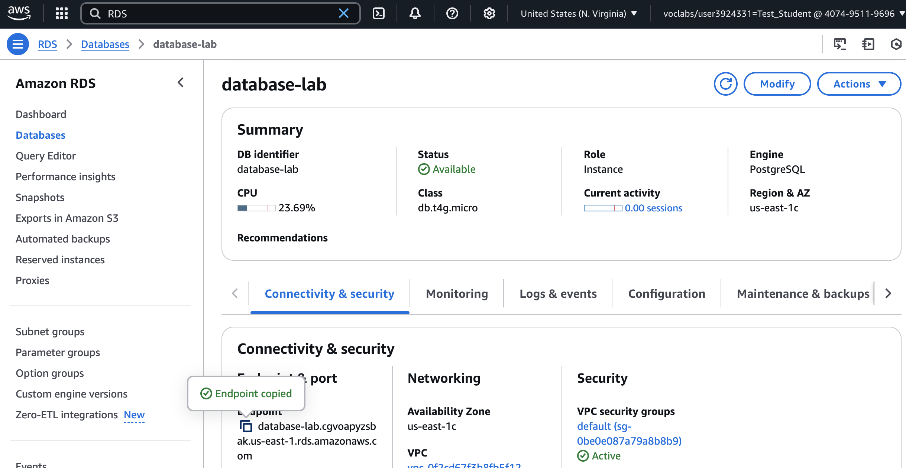
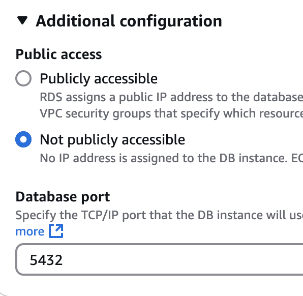
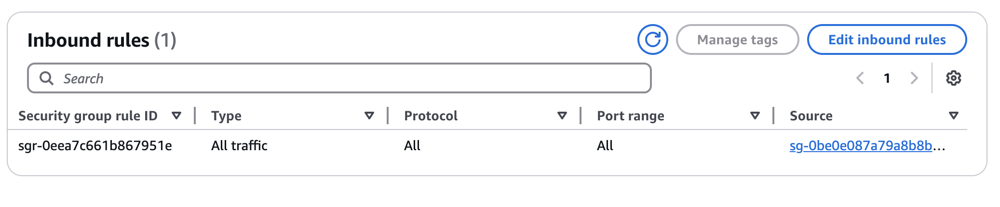
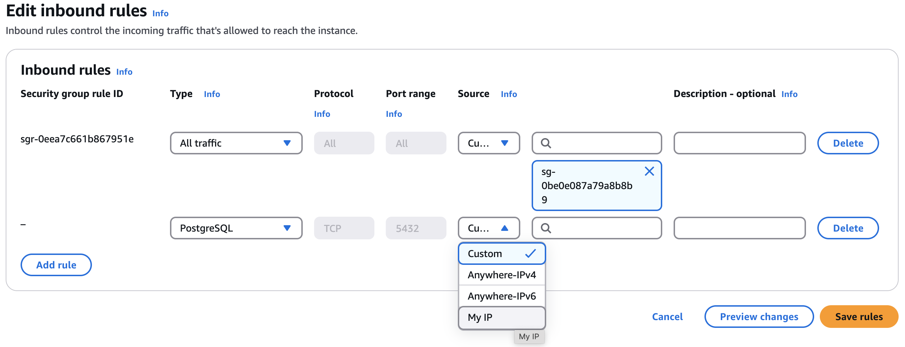
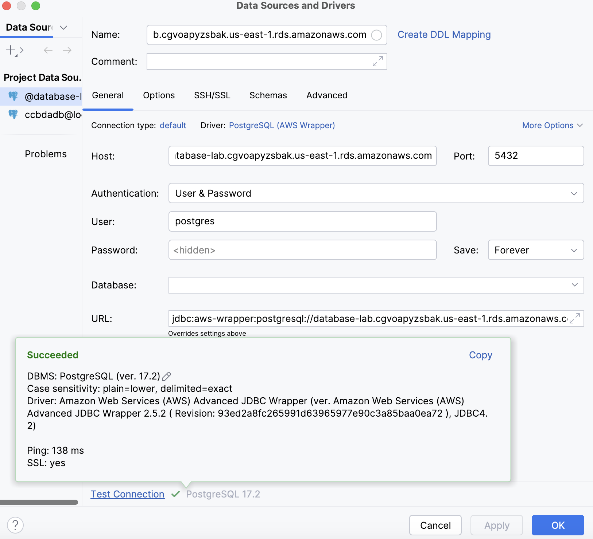
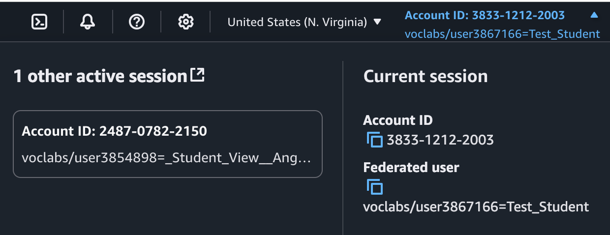
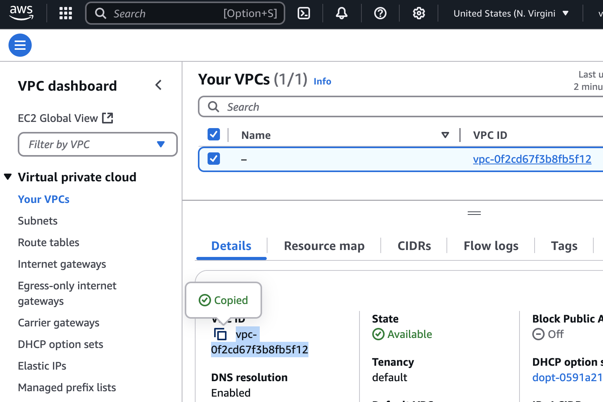
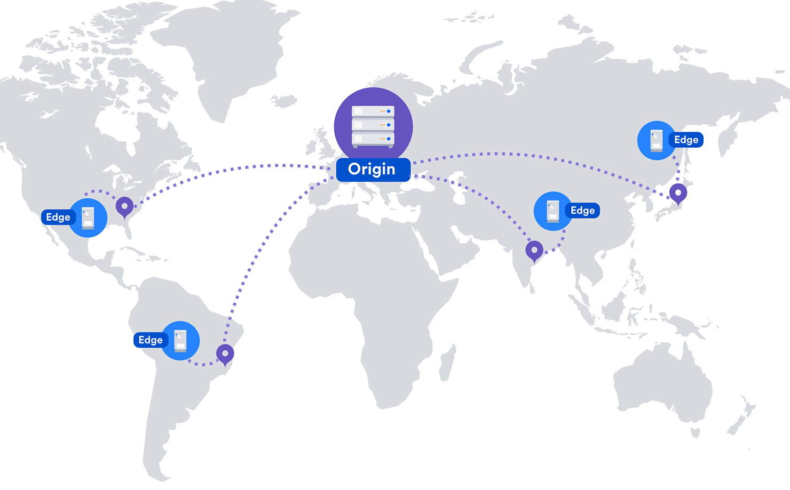
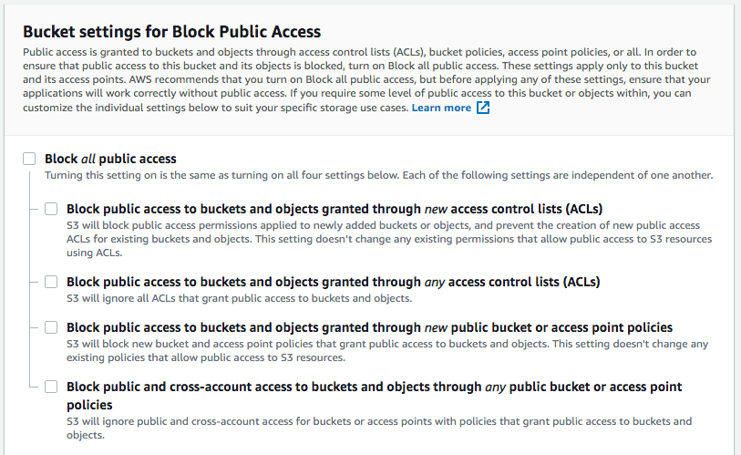

## Pre-requisites

Have **AWS Command Line Interface ([AWS CLI](https://aws.amazon.com/cli/))** installed and configured with the current
value of your AWS credentials.

Check the instructions
for [installing or updating to the latest version of the AWS CLI](https://docs.aws.amazon.com/cli/latest/userguide/getting-started-install.html) depending on the operating system of your laptop.

You can save your frequently used configuration settings and credentials in files that are maintained by the AWS CLI.

The files are divided into profiles. By default, the AWS CLI uses the settings found in the profile named **default**.
To use alternate settings, you can create and reference additional profiles.

Let's create a configuration file: `aws configure` asks you for the value of the different parameters that you've
obtained from your current Learner Lab session. We are not going to enter any value for the credentials and only select
the default AWS region and output format.


```bash
_$ aws configure
AWS Access Key ID [None]: 
AWS Secret Access Key [None]: 
Default region name [None]: us-east-1
Default output format [None]: json
_$ cat $HOME/.aws/config
[default]
region = us-east-1
output = json
```

We will edit the `$HOME/.aws/config` file and paste the values directly. Then we can check that the AWS CLI is correctly configured by showing its version, listing the AWS S3 buckets or the current account summary.

```bash
_$ cat $HOME/.aws/config
[default]
output = json
region = us-east-1
aws_access_key_id = <YOUR-ACCESS-KEY-ID>
aws_secret_access_key = <YOUR-SECRET-ACCESS-KEY>
aws_session_token = <YOUR-AWS-SESSION-TOKEN>
_$  aws --version
aws-cli/2.0.16 Python/3.7.4 Darwin/24.3.0 botocore/2.0.0dev20
_$  aws s3 ls
2025-01-11 18:47:30 lab04-main.ccbda.upc.edu
_$ aws iam get-account-summary
{
    "SummaryMap": {
        "GroupPolicySizeQuota": 5120,
        "InstanceProfilesQuota": 1000,
        "Policies": 6,
      ....
        "GroupsQuota": 300
    }
} 
```

<a name="Task61"/>

## Task 6.1: AWS Relational Database Service

In lab session 5 we used a PostGreSQL database that we installed in a container. In this session we are going to be using a more robust database provided by the AWS RDS service.

**AWS Relational Database Service (AWS RDS)** is a managed database service that simplifies the setup, operation, and scaling of relational databases in the cloud. It allows you to run databases such as MySQL, PostgreSQL, MariaDB, Oracle Database, and Microsoft SQL Server without the need to manage the underlying infrastructure manually.

#### Key Features:
1. **Managed Service**: Automates time-consuming tasks like provisioning, upgrading, patching, backups, and recovery.
2. **Performance**: Offers high performance with support for read replicas, caching, and optimized configurations.
3. **Scalability**: Easily scale database instances up or down to adjust to workload demands.
4. **Security**: Provides built-in security features like encryption at rest, encryption in transit, and integration with AWS Identity and Access Management (IAM).
5. **Backup and Recovery**: Comes with automated backups and point-in-time restoration capabilities.
6. **Multi-AZ Deployment**: Supports high availability through Multi-AZ deployments, which provide automatic failover to a secondary instance in case of a failure.

#### Benefits:
- Reduces administrative overhead by automating routine database tasks.
- Ensures better reliability and uptime with features like replication and Multi-AZ deployments.
- Pay-as-you-go pricing makes it cost-effective for a broad range of use cases.

AWS RDS is widely used for hosting production databases, applications, and even analytics workloads while reducing operational complexity.

### Create your AWS RDS PostGreSQL instance

Navigate to the Amazon `Aurora and RDS` console to create a new PostGreSQL database engine that will replace the database engine used in the previous lab session.

For the `database creation method` use `Easy create` and `PostGreSQL` for the `Configuration` box. A `DB instance size` of `Free tier` will be enough for the Lab session.

In `DB instance identifier` type `database-lab`, for `Master username` keep `postgres`, for `Credentials management` select `self managed`, for `Master password` type `MyP4ssW0rd!`, and finally click on the `Create database` button. Skip the add-on screen and wait a few minutes until the database is created. 

Click on the database links, find and copy the database `Endpoint` in the text file. That is the DNS name for the new database engine to be accessed by any application.



### Temporarily open the database access to your laptop

By default, following the `Easy create` wizard the database engine is only accessible inside the Virtual Private Cloud, therefore the DNS name is initialized with a class B [private IP address](https://en.wikipedia.org/wiki/Private_network).

```bash
_$  ping database-lab.cgvoapyzsbak.us-east-1.rds.amazonaws.com
PING database-lab.cgvoapyzsbak.us-east-1.rds.amazonaws.com (172.31.79.242): 56 data bytes
```

To have a public IP assigned you need to `Modify` the database engine configuration, scroll down to the `Connectivity` box, unfold the `Additional configuration` and change from `Not publicly accessible` to `Publicly accessible` as shown below. Click on `Continue` and then `Modify database` buttons. The Status will change to `Modifying` and in a few minutes it will turn green and return to `Available`. A new public IP appear then associated to the DNS name.

```bash
_$ ping database-lab.cgvoapyzsbak.us-east-1.rds.amazonaws.com
PING ec2-54-198-59-77.compute-1.amazonaws.com (54.198.59.77): 56 data bytes
```





Stay on the same view as the previous screenshot and click on the **"default" security group** link. You will see that there is a single rule for the inbound traffic allowing any traffic inside of the same security group (see screenshot below).



Therefore you need to temporarily add a new rule that allows PostGreSQL traffic (on port 5432) to come from your laptop (add more than one rule to allow more IPs).




Using the PyCharm database wizard you could access the database from your laptop as shown below.



To achieve that you'll need to make the RDS instance to be assigned a public IP and modify the network security group to allow connections to port 5432 from your IP.

**QS621: (optional) If you have time and want to work on connecting to the DB explain the steps that you have followed. Would you open that access on a production system? Justify your response.**

<a name="Task61"/>

## Task 6.1: Adding the Docker images to AWS ECR

In this task you will add the Docker images that you created to an AWS Elastic Container Registry (AWS ECR)
repository.

Authorize your Docker client to connect to the AWS ECR service.

### Discover your AWS account ID.

In the AWS Management Console, in the upper-right corner, click on top of your username. Your username begins with
voclab/user.



Copy the Account ID value from the menu. Next, return to the Bash terminal.

To authorize your Docker client, run the following command. Replacing `<account-id>` with the actual account
ID that you just found:

```bash
_$ aws ecr get-login-password | docker login --username AWS --password-stdin <account-id>.dkr.ecr.us-east-1.amazonaws.com
Login Succeeded
```

Verify that the command responds with a message indicating that the login succeeded.

### Create an AWS ECR Docker repository named `django-webapp-code`

To create the repository, run the following command:

```bash
_$ aws ecr create-repository --repository-name django-webapp-code
{
    "repository": {
        "repositoryArn": "arn:aws:ecr:us-east-1:<registry-id>:repository/django-webapp-code",
        "registryId": "<registry-id>",
        "repositoryName": "django-webapp-code",
        "repositoryUri": "<registry-id>.dkr.ecr.us-east-1.amazonaws.com/django-webapp-code",
        "createdAt": "2025-03-15T16:44:17.171000+01:00",
        "imageTagMutability": "MUTABLE",
        "imageScanningConfiguration": {
            "scanOnPush": false
        }
    }
}
```

The response data is in JSON format and includes a repositoryArn value. This is the URI that you would use to reference
your image for future deployments. The response also includes a registryId, which you will use in a moment.

### Tag the Docker image.

In this step, you will tag the image with your unique registryId value to make it easier to manage and keep track of
this image. Run the following command. Replace <registry-id> with your actual registry ID number.

```
_$ docker tag django-webapp-code:latest <registry-id>.dkr.ecr.us-east-1.amazonaws.com/django-webapp:latest
```

The command does not provide a response. To verify that the tag was applied, run the following command:

```bash
_$ docker images
REPOSITORY                                                        TAG       IMAGE ID       CREATED        SIZE
<registry-id>.dkr.ecr.us-east-1.amazonaws.com/django-webapp-code   latest    79e93509f63d   21 hours ago   321MB
django-webapp-code                                                latest    79e93509f63d   21 hours ago   321MB
postgres                                                          17        81f32a88ec56   2 weeks ago    621MB
```

This time, notice that the latest tag was applied and the image name includes the remote repository name where you
intend to store it.

### Push the Docker image to the AWS ECR repository.

To push your image to AWS ECR, run the following command. Replace <registry-id> with your actual registry ID number:

```bash
_$ docker push <registry-id>.dkr.ecr.us-east-1.amazonaws.com/django-webapp-code:latest
The push refers to repository [<registry-id>.dkr.ecr.us-east-1.amazonaws.com/django-webapp-code]
4b785e93aa71: Pushed 
be1449717b1e: Pushed 
ff1399ac0930: Pushed 
7cf63256a31a: Pushed 
dac1d3453b30: Pushed 
e1599d0f5c4d: Pushed 
8b6fcbaf930d: Pushed 
000e068808cd: Pushed

latest: digest: sha256:79e93509f63df0e0808ba8780fdd08bb5dc597b400807637c77044c04f361125 size: 856
```

To confirm that the django-webapp-code image is now stored in AWS ECR, run the following aws ecr list-images command:

```bash
_$ aws ecr list-images --repository-name django-webapp-code
{
    "imageIds": [
        {
            "imageDigest": "sha256:e33b3087f42f9b5b23ee5ce33a8a279fc1c2a2d1070a9eaae3c298cd8d3c803f"
        },
        {
            "imageDigest": "sha256:8f1ee7414d796b6ed70dcfa9facff56438bba6b2665066362eea9b5dca2c667d"
        },
        {
            "imageDigest": "sha256:79e93509f63df0e0808ba8780fdd08bb5dc597b400807637c77044c04f361125",
            "imageTag": "latest"
        }
    ]
}
```

You can also find more details about the repositories that you have created.

```bash
_$ aws ecr describe-repositories
{
    "repositories": [
        {
            "repositoryArn": "arn:aws:ecr:us-east-1:<registry-id>:repository/django-webapp-code",
            "registryId": "<registry-id>",
            "repositoryName": "django-webapp-code",
            "repositoryUri": "<registry-id>.dkr.ecr.us-east-1.amazonaws.com/django-webapp-code",
            "createdAt": "2025-03-15T16:44:17.171000+01:00",
            "imageTagMutability": "MUTABLE",
            "imageScanningConfiguration": {
                "scanOnPush": false
            }
        }
    ]
}
```

And information about the images of the repository.

```bash
_$ aws ecr describe-images --repository-name django-webapp-code
{
    "imageDetails": [
        {
            "registryId": "<registry-id>",
            "repositoryName": "django-webapp-code",
            "imageDigest": "sha256:e33b3087f42f9b5b23ee5ce33a8a279fc1c2a2d1070a9eaae3c298cd8d3c803f",
            "imageSizeInBytes": 1348,
            "imagePushedAt": "2025-03-15T16:47:53.153000+01:00"
        },
        {
            "registryId": "<registry-id>",
            "repositoryName": "django-webapp-code",
            "imageDigest": "sha256:8f1ee7414d796b6ed70dcfa9facff56438bba6b2665066362eea9b5dca2c667d",
            "imageSizeInBytes": 75387102,
            "imagePushedAt": "2025-03-15T16:47:53.161000+01:00"
        },
        {
            "registryId": "<registry-id>",
            "repositoryName": "django-webapp-code",
            "imageDigest": "sha256:79e93509f63df0e0808ba8780fdd08bb5dc597b400807637c77044c04f361125",
            "imageTags": [
                "latest"
            ],
            "imageSizeInBytes": 75387102,
            "imagePushedAt": "2025-03-15T16:47:53.707000+01:00"
        }
    ]
}
```


<a name="Tasks62" />

## Task 6.2: Running Containers on AWS Elastic Beanstalk

Open your preferred text editor, and copy and paste the following text into a new file.


```text
Database endpoint:
Database master User: postgres
Database master Password: MyP4ssW0rd!
IDE VPC ID:
IDE Availability Zone:
IDE subnet ID:
extraSubnetForRds subnet ID:
IDE security group ID:
Repository URI:
Elastic Beanstalk URL:

```


Let's now test the web application running in Docker and connect it to the AWS RDS database. We are now going to copy the production environment to a new file named `aws.env` and replace the PostGreSQL variable `DB_HOST` and adding `PGPASSWORD` with the master password.


```bash
_$ cat aws.env
DJANGO_DEBUG=False
DJANGO_ALLOWED_HOSTS=localhost,127.0.0.1,0.0.0.0
DJANGO_SECRET_KEY="-lm+)b44uap8!0-^1w9&2zokys(47)8u698=dy0mb&6@4ee-hh"
DJANGO_LOGLEVEL=info
CCBDA_SIGNUP_TABLE=ccbda-signup-table
AWS_REGION=us-east-1
AWS_ACCESS_KEY_ID=<YOUR-ACCESS-KEY-ID>
AWS_SECRET_ACCESS_KEY=<YOUR-SECRET-ACCESS-KEY>
AWS_SESSION_TOKEN=<YOUR-AWS-SESSION-TOKEN>
DB_NAME=ccbdadb
DB_USER=ccbdauser
DB_PASSWORD=ccbdapassword
DB_PORT=5432
DB_HOST=database-lab.cgvoapyzsbak.us-east-1.rds.amazonaws.com
DATABASE=postgresql
PGPASSWORD=MyP4ssW0rd!
```

```bash
_$ psql \
   --host=$DB_HOST \
   --port=$DB_PORT \
   --username=postgres \
   --password
```

```sql
CREATE DATABASE ccbdadb;
CREATE USER ccbdauser WITH ENCRYPTED PASSWORD 'ccbdapassword';
ALTER USER ccbdauser WITH PASSWORD 'ccbdapassword';
GRANT ALL PRIVILEGES ON DATABASE ccbdadb TO ccbdauser;
```


### Elastic beanstalk

- Navigate to the Amazon VPC console.
    - Return to the AWS Management Console browser tab.
    - From the Services menu, choose VPC. 
    - In the left navigation pane, choose Your VPCs. 
    - Select the checkbox for IDE VPC, and then copy the VPC ID into your text editor.



- Review the Availability Zone for the IDE Subnet.
    - In the left navigation pane, choose Subnets.
    - Select the checkbox for IDE Public Subnet One. 
    - In the bottom pane, locate the Availability Zone and copy the value into your text editor. 
    - The Availability Zone looks similar to the following: us-east-1a 
    - Copy the Subnet ID value into your text editor as the IDE Subnet ID. 


<a name="Tasks56" />

## Task 5.6: Create a new option to retrieve the list of leads

Edit the file *form/urls.py* to add the new URL and associate it to the new view *search*.

```python
urlpatterns = [
    # ex: /
    path('', views.home, name='home'),
    # ex: /signup
    path('signup', views.signup, name='signup'),
    # ex: /search
    path('search', views.search, name='search'),
]
```

To create the controller for the new view edit *form/views.py* and include the following code:

```python
from collections import Counter


def search(request):
    domain = request.GET.get('domain')
    preview = request.GET.get('preview')
    leads = Leads()
    items = leads.get_leads(domain, preview)
    if domain or preview:
        return render(request, 'search.html', {'items': items})
    else:
        domain_count = Counter()
        domain_count.update([item['email'].split('@')[1] for item in items])
        return render(request, 'search.html', {'domains': sorted(domain_count.items())})
```

The search view gets two parameters:

- preview: (*values are Yes/No*) lists the leads that are interested, or not, in a preview.
- domain: (*value is the part right after the @ of an e-mail address*) will list only the leads from that domain.

Reading the code, we understand that the search view retrieves the value of the parameters, gets the complete list of
leads and then:

- if any parameter is set, the program just lists all the records matching the search.
- if both parameters are empty the program extracts the domain from each e-mail address and counts how many addresses
  belong to each domain.

To access the records stored at the NoSQL table *ccbda-signup-table* you need to add a method *get_leads* to the model
*Leads()* file *form/models.py*.
The [Scan](https://docs.aws.amazon.com/amazondynamodb/latest/APIReference/API_Scan.html) operation allows us to filter
values from the table.

```python
def get_leads(self, domain, preview):
    try:
        dynamodb = boto3.resource('dynamodb',
                                  region_name=AWS_REGION,
                                  aws_access_key_id=AWS_ACCESS_KEY_ID,
                                  aws_secret_access_key=AWS_SECRET_ACCESS_KEY,
                                  aws_session_token=AWS_SESSION_TOKEN)
        table = dynamodb.Table('ccbda-signup-table')
    except Exception as e:
        logger.error(
            'Error connecting to database table: ' + (e.fmt if hasattr(e, 'fmt') else '') + ','.join(e.args))
        return None
    expression_attribute_values = {}
    FilterExpression = []
    if preview:
        expression_attribute_values[':p'] = preview
        FilterExpression.append('preview = :p')
    if domain:
        expression_attribute_values[':d'] = '@' + domain
        FilterExpression.append('contains(email, :d)')
    if expression_attribute_values and FilterExpression:
        response = table.scan(
            FilterExpression=' and '.join(FilterExpression),
            ExpressionAttributeValues=expression_attribute_values,
        )
    else:
        response = table.scan(
            ReturnConsumedCapacity='TOTAL',
        )
    if response['ResponseMetadata']['HTTPStatusCode'] == 200:
        return response['Items']
    logger.error('Unknown error retrieving items from database.')
    return None
```

A final step is to move the file *extra-file/search.html* to *form/templates/search.html*. That file receives the data
from the view controller and creates the HTML to show the results.

Save the changes and, before committing them, check that everything works fine by typing *http://127.0.0.1:8000/search*
in your browser.


To add the new option to the menu bar, simply edit the file *form/templates/generic.html*, go to line 28 and add the
second navbar as shown below. Save the file and, with no further delay, check that you have it added in the version that
runs in your computer.

```html

<div class="collapse navbar-collapse" id="navbarResponsive">
	<ul class="navbar-nav">
		<li class="nav-item active">
			<a class="nav-link active" href="">Home</a>
		</li>
		<li class="nav-item">
			<a class="nav-link" href="#">About</a>
		</li>
		<li class="nav-item">
			<a class="nav-link" href="#">Blog</a>
		</li>
		<li class="nav-item">
			<a class="nav-link" href="#">Press</a>
		</li>
	</ul>
	<ul class="nav navbar-nav ml-auto">
		<li class="nav-item">
			<a class="nav-link" href="">Admin search</a>
		</li>
	</ul>
</div>
```


If the web app works correctly in your computer commit the changes and deploy the new version in the cloud. Change
whatever is necessary to make it work.

**Q53: Has everything gone alright? What have you changed?** Add your answers to the `README.md` file in the responses
repository.

<a name="Tasks57" />

## Task 5.7: Improve the web app transfer of information (optional)

You can work on this section locally in order to save expenses; you can terminate your environment from the EB console.

If you analyze the new function added, probably a wise thing to do will be to optimize the data transfer from the
DynamoDB table: imagine that instead of a few records in your NoSQL table you have millions of records. Transferring
millions of records to your web app just to count how many e-mail addresses match a domain doesn't seem to be a great
idea.

DynamoDB is a NoSQL database and does not allow aggregation SQL queries. You are encouraged to improve the above code to
obtain a more efficient way of counting the e-mail addresses for each domain. Try to optimize the transfer of
information as well as the web app processing. Maybe you need to change the way that the records are stored.

Test the changes locally, commit them to your GitHub repository.

**Q54: Describe the strategy used to fulfill the requirements of this section. What have you changed in the code and the
configuration of the different resources used by the web app? What are the tradeoffs of your solution?** Add your
responses to `README.md`.

GitHub Actions is a powerful CI/CD platform that enables developers to build, test, and deploy pipelines efficiently.
These pipelines are essential for maintaining consistency in deployments, identifying errors quickly, improving
efficiency, and streamlining the development process.

**Continuous Integration (CI)** and **Continuous Delivery (CD)** are critical practices for delivering high-quality
software. They ensure a great user experience by preventing bugs from being pushed to production. GitHub Actions allows
you to create custom workflows that are triggered based on specific events, such as pull requests, code commits, or
pushes to a repository.

In this laboratory session, you will learn how to create CI/CD pipelines using GitHub Actions. This process continues
with the previous session using the created Docker image, pushing it to AWS Elastic Container Registry (AWS ECR) ,
and deploying the application to AWS Elastic Container Service (AWS ECS).

### CI/CD build using GitHub Actions

A workflow is an automated process that runs one or more defined jobs. A workflow file contains various sections within
which each action in the pipeline is defined. These are:

- **name**: This is the workflow's name as will appear on your repository's ‘Actions’ section.
- **on**: This section specifies the workflow trigger. Here, you can have successful merges to the repository and pushes
  to the main or other branches among other actions.
- **jobs**: Here, all the jobs that are run in the workflow will be defined.

```yaml
name: Deploy to AWS ECS

on:
  push:
    branches: [ "main" ]

jobs:
  deploy:
    runs-on: ubuntu-latest

    steps:
```

To create the workflow, add to your responses repo the file `.github/workflows/aws.yml`

The proposed workflow will build and push a new container image to AWS ECR,
and then will deploy a new task definition to AWS ECS, when there is a push to the "main" branch.

To use this workflow, you will need to complete the following set-up steps:

1. Create an ECR repository to store your images.
   For example: `aws ecr create-repository --repository-name my-ecr-repo`.
   Replace the value of the `ECR_REPOSITORY` environment variable in the workflow below with your repository's name.
   Replace the value of the `AWS_REGION` environment variable in the workflow below with your repository's region.

2. Create an ECS task definition, an ECS cluster, and an ECS service.
   For example, follow the Getting Started guide on the ECS console:
   https://us-east-1.console.aws.amazon.com/ecs/home?region=us-east-1#/firstRun
   Replace the value of the `ECS_SERVICE` environment variable in the workflow below with the name you set for the
   AWS ECS service.
   Replace the value of the `ECS_CLUSTER` environment variable in the workflow below with the name you set for the
   cluster.

3. Store your ECS task definition as a JSON file in your repository.
   The format should follow the output of `aws ecs register-task-definition --generate-cli-skeleton`.
   Replace the value of the `ECS_TASK_DEFINITION` environment variable in the workflow below with the path to the JSON
   file.
   Replace the value of the `CONTAINER_NAME` environment variable in the workflow below with the name of the container
   in the `containerDefinitions` section of the task definition.

4. Store an IAM user access key in GitHub Actions secrets named `AWS_ACCESS_KEY_ID` and `AWS_SECRET_ACCESS_KEY`.
   See the documentation for each action used below for the recommended IAM policies for this IAM user,
   and best practices on handling the access key credentials.

Starter workflow outline

trigger and branches

permissions

jobs and runner

steps

name and uses

### AWS CloudFront CDN

A content delivery network or content distribution network (CDN) is a geographically distributed network of proxy
servers that disseminate a service spatially, as close to end-users as possible, to provide high availability, low
latency, and high performance.



The information that flows every day on the Internet can be classified as "static" and "dynamic" content. The "dynamic"
part is the one that changes depending on the user's input. It is distributed by, for instance, PaaS servers with load
balancers. The "static" part does not change based on the user's input, and it can be moved as close to the end user as
possible to improve the "user experience".

Nowadays, CDNs serve a substantial portion of the "static" content of the Internet: text, graphics, scripts,
downloadable media files (documents, software products, videos, etc.), live streaming media, on-demand streaming media,
social networks and so much more.

Content owners pay CDN operators to deliver the content that they produce to their end users. In turn, a CDN pays ISPs (
Internet Service Providers), carriers, and network operators for hosting its servers in their data centers.

**AWS CloudFront CDN** is a global CDN service that securely delivers static content with low latency and high transfer
speeds. CloudFront CDN works seamlessly with other AWS services including **AWS Shield** for DDoS mitigation,
**AWS S3**, **Elastic Load Balancing** or **AWS EC2** as origins for your applications, and **AWS Lambda** to run
custom code close to final viewers.

### AWS ECS: Elastic Container Service

AWS Elastic Container Service (ECS) is a fully managed container orchestration service that simplifies deploying,
managing, and scaling containerized applications. It seamlessly integrates with AWS, offering a secure and flexible
solution for running workloads in the cloud or on-premises with AWS ECS Anywhere.

Containerizing a Django app with Docker enhances productivity and consistency. Here’s why:

- **Stable and Consistent Environment**: Docker eliminates the “*it works on my machine*” problem by ensuring a
  consistent environment with all dependencies pre-installed. This allows you to reproduce the app seamlessly across
  different systems and servers, making local development, testing, and deployment more reliable.

- **Reproducibility and Portability**: A Dockerized app packages all its dependencies, environment variables, and
  configurations, guaranteeing it runs the same way across various environments. This simplifies deployment and reduces
  compatibility issues.

- **Improved Team Collaboration**: With Docker, every developer works in an identical environment, preventing conflicts
  caused by different system setups. Shared Docker images streamline onboarding and reduce setup time.

- **Faster Deployment**: Docker accelerates project setup by automating environment configuration, so developers can
  start coding right away. It ensures uniformity across development, staging, and production, making it easier to
  integrate and deploy changes.

* [Task 5.5: Create a new option to retrieve the list of leads](#Tasks55)
* [Task 5.6: Improve the web app transfer of information](#Tasks56)
* [Task 5.7: Deliver static content using a Content Delivery Network](#Tasks57)

The Python virtual environment will be re-created remotely by Docker through the use of the file *requirements.txt* and
other configuration that you are going to set up later.


<a name="Tasks58" />

## Task 5.8: Deliver static content using a Content Delivery Network

### The static content in our web app

If you check line 11 of the file *templates/generic.html* you will see that, instead of loading in our server
Bootstrap 4 CSS, we are already using a CDN to retrieve the CSS and send it to the final users. Bootstrap uses
*maxcdn.bootstrapcdn.com* as their CDN distribution point.

```html

<link href="https://cdn.jsdelivr.net/npm/bootstrap@5.2.3/dist/css/bootstrap.min.css" rel="stylesheet" crossorigin="anonymous">
```

We can now add our CSS code to customize the look and feel of our web app even more. In that same file, add the
following line just before closing the **head** HTML tag:

```html

<link href="" rel="stylesheet"></head>
```

If you check the contents of the file *static/custom.css* you will see that it includes some images, also available in
the same folder. If you save the modifications to *form/templates/generic.html* and review your web
app, http://127.0.0.1:8000, you will see that it appears slightly different.

### Upload your static content to AWS S3 and grant object permissions

All the distributed static content overloads our server with requests. Moving it to a CDN will reduce our server's load
and, at the same time, the users will experience a much lower latency while using our web app. We only have static files
in this app, but a typical web app distributes hundreds of pieces of static content.

To configure our CDN, we are going to follow the steps
at ["Getting Started with CloudFront CDN"](https://docs.aws.amazon.com/AmazonCloudFront/latest/DeveloperGuide/GettingStarted.html).
Check that document if you need extra details.

Review the QuickStart
hands-on [Getting Started in the Cloud with AWS](../../../Cloud-Computing-QuickStart/blob/master/Quick-Start-AWS.md) and
create a new bucket in 'us-east-1' region to deposit the web app static content. Let us name this bucket *
*eb-django-express-signup-YOUR-ID** (YOUR-ID can be your AWS account number or any other distinctive string because you
will not be allowed to create two buckets with the same name, regardless the owner).

AWS has recently set some restrictions when creating an S3 bucket with public access. Make sure that you uncheck all the
following options before uploading files. You can later check them back.

 

 

This time add the files manually and grant them public read permission.

  

You can also use AWS CLI to sync the contents of your static folder with that
bucket. [Synchronize with your S3 bucket](https://docs.aws.amazon.com/cli/latest/reference/s3/sync.html) using the
following command:

```bash
_$ aws s3 sync --acl public-read ./static s3://eb-django-express-signup-YOUR-ID
upload: ./static/custom.css to s3://eb-django-express-signup-YOUR-ID/custom.css
upload: ./static/CCBDA-Square.png to s3://eb-django-express-signup-YOUR-ID/CCBDA-Square.png
upload: ./static/startup-bg.png to s3://eb-django-express-signup-YOUR-ID/startup-bg.png
```

If you explore in your S3 console you will see that there is a URL available to retrieve the files. Verify that you can
access the contents of that URL, making the file public if it was not already.

```
https://s3-us-east-1.amazonaws.com/eb-django-express-signup-YOUR-ID/CCBDA-Square.png
```


### Create a CloudFront CDN Web Distribution

Following the steps
at ["Getting Started with CloudFront CDN"](https://docs.aws.amazon.com/AmazonCloudFront/latest/DeveloperGuide/GettingStarted.html)
we end up having to wait until the files are distributed. It takes five minutes or more, be patient. Once the first
distribution is set up, whenever you resync your static contents it will take much less.

 

### Change the code and test your links

The HTML code of our web app has only one direct access to a static file; the images referenced (using a relative route)
through the CSS stylesheet. We just need to change *form/templates/generic.html* and our web app is now retrieving all
static content from our CDN distribution.

Consider that we are now borrowing a CloudFront URL (RANDOM-ID-FROM-CLOUDFRONT.cloudfront.net) but usually, in the
setup, we will use a URL from our domain, something like *static.mydomain.com* to map the CDN distribution.

```html

<link href="//RANDOM-ID-FROM-CLOUDFRONT.cloudfront.net/custom.css" rel="stylesheet">
```

**Q55: Take a couple of screenshots of you S3 and CloudFront consoles to demonstrate that everything worked all right.**
Commit the changes on your web app, deploy them on Docker and check that it also works fine from there: **use
Google Chrome and check the origin of the files that you are loading (attach a screen shot similar to the one below)**:

 

**Q56: How long have you been working on this session (including the optional part)? What have been the main
difficulties that you have faced and how have you solved them?** Add your answers to `README.md`.

Add all these files to your repository and comment what you think is relevant in your session's *README.md*.

### Django support for CDN

Having to go through the code of a web app to locate all the static files is a not only tedious task but also prone to
errors. Since Django Framework distinguishes the static content from the dynamic content, it supports the smooth
integration of a CDN to distribute it. Try configuring this feature if you are curious and have time.

First of all, you need to add the following package to your environment:

```bash
(eb-virt)_$ pip install django-storages
```

Then modify `eb-django-express-signup\eb-django-express-signup\settings.py` by adding 'storages' as an installed
application and tell Django to use the new storage schema as well as the name of your bucket and the name of the
CloudFront domain.

```python
INSTALLED_APPS = [
    ...
    'storages',
    ...
]

...

CLOUD_FRONT = bool(os.environ.get("CLOUD_FRONT", default=False))

if CLOUD_FRONT:
    DEFAULT_FILE_STORAGE = 'storages.backends.s3boto3.S3Boto3Storage'
    STATICFILES_STORAGE = 'storages.backends.s3boto3.S3Boto3Storage'
    AWS_STORAGE_BUCKET_NAME = 'eb-django-express-signup-YOUR-ID'
    AWS_S3_CUSTOM_DOMAIN = 'RANDOM-ID-FROM-CLOUDFRONT.cloudfront.net'

```

Having done that you should be able to keep all static files declared the way Django expects to and, at the same time,
access them using a CDN.

```html

<link href="" rel="stylesheet"></head>
```

This should be the last step on the deployment of the web app and you can activate it only if the variable DEBUG is set
to False.

Django can also assume the synchronization of the static files to the CDN by means of the maintenace
command `python manage.py collectstatic`.