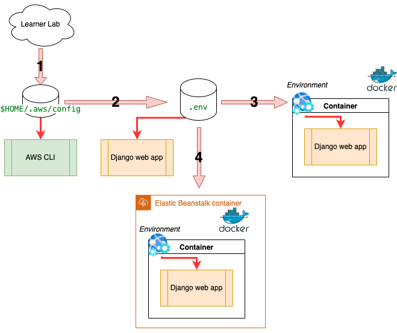
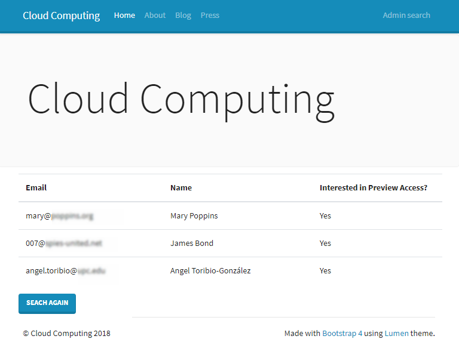

# Lab session 6: Running a custom web app in the cloud

In this session, we will use a more robust SQL database engine and scale the application by running multiple instances. A load balancer will be used to distribute incoming requests across these instances, ensuring optimal performance.

As the number of instances fluctuates with creation and termination, it’s essential to track the web application’s activity by securely storing log files for monitoring and future analysis.

Finally, we’ll reduce the load on the web application server by distributing static assets (such as images, CSS, and JavaScript) to edge locations closer to the visitors, improving response times and overall performance.

> [!Note]
> This lab session **builds upon the work from the previous session**, where we isolated the web application within a Docker container running locally. Make sure that you have available and working everything done in the previous session.

### AWS RDS: AWS Relational Database Service

**AWS RDS** is a managed database service that simplifies the setup, operation, and scaling of relational databases in the cloud. It allows you to run databases such as MySQL, PostgreSQL, MariaDB, Oracle Database, and Microsoft SQL Server without the need to manage the underlying infrastructure manually.

#### Key Features:
1. **Managed Service**: Automates time-consuming tasks like provisioning, upgrading, patching, backups, and recovery.
2. **Performance**: Offers high performance with support for read replicas, caching, and optimized configurations.
3. **Scalability**: Easily scale database instances up or down to adjust to workload demands.
4. **Security**: Provides built-in security features like encryption at rest, encryption in transit, and integration with AWS Identity and Access Management (IAM).
5. **Backup and Recovery**: Comes with automated backups and point-in-time restoration capabilities.
6. **Multi-AZ Deployment**: Supports high availability through Multi-AZ deployments, which provide automatic failover to a secondary instance in case of a failure.

#### Benefits:
- Reduces administrative overhead by automating routine database tasks.
- Ensures better reliability and uptime with features like replication and Multi-AZ deployments.
- Pay-as-you-go pricing makes it cost-effective for a broad range of use cases.

AWS RDS is widely used for hosting production databases, applications, and even analytics workloads while reducing operational complexity.

### AWS ECR: Elastic Container Registry

AWS Elastic Container Registry (AWS ECR) is an AWS managed container image registry service that is secure, scalable, and reliable. AWS ECR supports private repositories with resource-based permissions using AWS IAM. This is so that specified users or AWS EC2 instances can access your container repositories and images. You can use your preferred CLI to push, pull, and manage Docker images.

### AWS Elastic Beanstalk 
With AWS Elastic Beanstalk, you can quickly deploy and manage applications in the AWS Cloud without worrying about the infrastructure that runs those applications. AWS Elastic Beanstalk reduces management complexity without restricting choice or control. You simply upload your application, and AWS Elastic Beanstalk automatically handles the details of capacity provisioning, load balancing, scaling, and application health monitoring.

### AWS S3

AWS Simple Storage Service (AWS S3) is an object storage service renowned for its industry-leading scalability, data availability, security, and performance. Millions of customers across various industries rely on S3 to store, manage, analyze, and protect vast amounts of data for a wide range of use cases, including data lakes, cloud-native applications, and mobile apps. With its cost-effective storage classes and intuitive management features, S3 enables customers to optimize costs, efficiently organize and analyze data, and configure precise access controls to meet specific business and compliance needs.

### AWS CloudFront CDN

A content delivery network or content distribution network (CDN) is a geographically distributed network of proxy servers that disseminate a service spatially, as close to end-users as possible, to provide high availability, low latency, and high performance.


The information that flows every day on the Internet can be classified as "static" and "dynamic" content. The "dynamic"
part is the one that changes depending on the user's input. It is distributed by, for instance, PaaS servers with load
balancers. The "static" part does not change based on the user's input, and it can be moved as close to the end user as
possible to improve the "user experience".

Nowadays, CDNs serve a substantial portion of the "static" content of the Internet: text, graphics, scripts,
downloadable media files (documents, software products, videos, etc.), live streaming media, on-demand streaming media,
social networks and so much more.

Content owners pay CDN operators to deliver the content that they produce to their end users. In turn, a CDN pays ISPs (
Internet Service Providers), carriers, and network operators for hosting its servers in their data centers.

**AWS CloudFront CDN** is a global CDN service that securely delivers static content with low latency and high transfer
speeds. CloudFront CDN works seamlessly with other AWS services including **AWS Shield** for DDoS mitigation,
**AWS S3**, **Elastic Load Balancing** or **AWS EC2** as origins for your applications, and **AWS Lambda** to run
custom code close to final viewers.


## Pre-lab homework

You need to install the Elastic Beanstalk CLI. You can find more information on  **[eb
command line interface](https://docs.aws.amazon.com/elasticbeanstalk/latest/dg/eb-cli3-getting-started.html)**.

On macOS you can use:

``` 
_$ brew install awsebcli
```

# Tasks for Lab session #6

* [Task 6.1: AWS Relational Database Service](#Task61)
* [Task 6.2: Adding the Docker images to AWS ECR](#Task62)
* [Task 6.3: Running Docker Container images on AWS Elastic Beanstalk](#Task63)
* [Task 6.4: Centralize the logs of your application instances](#Task64)
* [Task 6.5: Deliver static content using a Content Delivery Network](#Task65)
* [Task 6.6: Create a new option to retrieve the list of leads](#Task66)


<a name="Task61"/>

## Task 6.1: AWS Relational Database Service

In lab session 5 we used a PostGreSQL database installed in a container. In this session we are going to be using a more robust database provided by the AWS RDS service.

### Create your AWS RDS PostGreSQL instance

Navigate to the AWS `Aurora and RDS` console to create a new PostGreSQL database engine that will replace the database engine used in the previous lab session.

For the `database creation method` use `Easy create` and `PostGreSQL` for the `Configuration` box. A `DB instance size` of `Free tier` will be enough for the Lab session.

In `DB instance identifier` type `database-lab`, for `Master username` keep `postgres`, for `Credentials management` select `self managed`, for `Master password` type `MyP4ssW0rd!`, and finally click on the `Create database` button. Skip the add-on screen and wait a few minutes until the database is created. 

Click on the database links, find and copy the database `Endpoint` in the text file. That is the DNS name for the new database engine to be accessed by any application.


### Temporarily open the database access to your laptop

By default, following the `Easy create` wizard, the database engine is only accessible inside the Virtual Private Cloud, therefore the DNS name is initialized with a class B [private IP address](https://en.wikipedia.org/wiki/Private_network).

```bash
_$  ping database-lab.cgvoapyzsbak.us-east-1.rds.amazonaws.com
PING database-lab.cgvoapyzsbak.us-east-1.rds.amazonaws.com (172.31.79.242): 56 data bytes
```

To have a public IP assigned you need to `Modify` the database engine configuration, scroll down to the `Connectivity` box, unfold the `Additional configuration` and change from `Not publicly accessible` to `Publicly accessible` as shown below. Click on `Continue` and then `Modify database` buttons.


The Status will change to `Modifying` and in a few minutes it will turn green and return to `Available`. A new public IP appear then associated to the DNS name.

```bash
_$ ping database-lab.cgvoapyzsbak.us-east-1.rds.amazonaws.com
PING ec2-54-198-59-77.compute-1.amazonaws.com (54.198.59.77): 56 data bytes
```

Now go back to the `database-lab` properties display, where you obtained the `Endpoint` and now click on the **"default" security group** link. You will see that there is a single rule for the inbound traffic allowing any traffic inside the same security group (see screenshot below).


Now, you need to temporarily add a new rule to allow PostgreSQL traffic (port 5432) from your laptop. If necessary, you can add multiple rules to allow access from additional IP addresses.


If you have followed the above steps correctly, using the PyCharm database wizard you could access the database engine from your laptop as shown below. Once all the parameters are in place click on `Apply` and then `Test Connection`. You shall be getting the response shown below.


> :question: **Question 1**: Would you keep that access open on a production system? Justify your response.

Let's now build a new Docker image, tagging it with a version number. Next test the web application running in Docker in your laptop and connect it to the AWS RDS database. Now, copy the production environment to a new file named `aws.env` and replace the PostGreSQL variable `DB_HOST` and adding `PGPASSWORD` with the master password as shown below.

> [!Warning]
> Since AWS EC2, by default, provides instances based on Intel x86 architecture, if your laptop is **using a different architecture** (i.e. Apple M4) you need to create Docker images that use Intel x86 in order to deploy then on AWS EC2 instances by adding to `docker create` the parameter `--platform`. Please check "[Set the target platforms for the build](https://docs.docker.com/reference/cli/docker/buildx/build/#platform)".

```bash
_$ docker build -t django-docker:v1.0.0 .
_$ docker images
REPOSITORY                                                               TAG       IMAGE ID       CREATED          SIZE
django-docker                                                            latest    d8bc6a1aed71   20 minutes ago   476MB
django-docker                                                            v1.0.0    0a325b16e03d   20 minutes ago   476MB
_$ cat aws.env
DJANGO_DEBUG="False"
DJANGO_ALLOWED_HOSTS="0.0.0.0:127.0.0.1:localhost"
DJANGO_SECRET_KEY="-lm+)b44uap8!0-^1w9&2zokys(47)8u698=dy0mb&6@4ee-hh"
DJANGO_LOGLEVEL="INFO"
CCBDA_SIGNUP_TABLE="ccbda-signup-table"
AWS_REGION="us-east-1"
AWS_ACCESS_KEY_ID="<YOUR-AWS-ACCESS-KEY-ID>"
AWS_SECRET_ACCESS_KEY="<YOUR-AWS-SECRET-ACCESS-KEY>"
AWS_SESSION_TOKEN="<YOUR-AWS-SESSION-TOKEN>"
DB_NAME="ccbdadb"
DB_USER="ccbdauser"
DB_PASSWORD="ccbdapassword"
DB_PORT="5432"
DB_HOST="database-lab.cgvoapyzsbak.us-east-1.rds.amazonaws.com"
DATABASE="postgresql"
PGPASSWORD="MyP4ssW0rd!"
```

> :question: **Question 2**: Using the above configuration file, what steps will you follow to have the web application running in your local Docker use the AWS RDS database engine?

The unix command `psql` is installed in the `django-docker` image, and you can use it by typing the command below. The values of `$DB_HOST` and `$DB_PORT` are declared inside the unix environment of the container. If an evironment variable named `PGPASSWORD` exits, psql uses its value to authenticate against the PostGreSQL database engine.

```bash
_$ env
....
HOSTNAME=307613c5c952
DB_PORT=5432
PWD=/app
DB_HOST=database-lab.cgvoapyzsbak.us-east-1.rds.amazonaws.com
PGPASSWORD=MyP4ssW0rd!
.....
_$ cat > init_db.sql
CREATE DATABASE ccbdadb;
CREATE USER ccbdauser
    WITH ENCRYPTED PASSWORD 'ccbdapassword'
    createdb
    createrole
    bypassrls;
ALTER USER ccbdauser SET TimeZone = utc;
ALTER DATABASE ccbdadb OWNER TO ccbdauser;
^D
_$ psql --host=$DB_HOST --port=$DB_PORT --username=postgres < init_db.sql
CREATE DATABASE
CREATE ROLE
ALTER ROLE
GRANT
_$ python manage.py migrate
Operations to perform:
  Apply all migrations: admin, auth, contenttypes, sessions
Running migrations:
  Applying contenttypes.0001_initial... OK
  Applying auth.0001_initial... OK
  Applying admin.0001_initial... OK
  Applying admin.0002_logentry_remove_auto_add... OK
  Applying admin.0003_logentry_add_action_flag_choices... OK
  Applying contenttypes.0002_remove_content_type_name... OK
  Applying auth.0002_alter_permission_name_max_length... OK
  Applying auth.0003_alter_user_email_max_length... OK
  Applying auth.0004_alter_user_username_opts... OK
  Applying auth.0005_alter_user_last_login_null... OK
  Applying auth.0006_require_contenttypes_0002... OK
  Applying auth.0007_alter_validators_add_error_messages... OK
  Applying auth.0008_alter_user_username_max_length... OK
  Applying auth.0009_alter_user_last_name_max_length... OK
  Applying auth.0010_alter_group_name_max_length... OK
  Applying auth.0011_update_proxy_permissions... OK
  Applying auth.0012_alter_user_first_name_max_length... OK
  Applying sessions.0001_initial... OK
```

> :question: **Question 3**: Explain what does the code in the box above. How can you execute it inside the Docker container?

**Q6-14:  What is the result of "select * FROM django_migrations;"**

<a name="Task62"/>

## Task 6.2: Adding the Docker image to AWS ECR

Before being able to deploy in the cloud the Docker image for the web application, that you've created in the previous lab session, we need to push it to a Docker images repository hosted in AWS: the **AWS Elastic Container Registry (AWS ECR)**.

### Discover your AWS account ID

You can find it issuing the following AWS CLI command.

```bash
_$ aws sts get-caller-identity | grep Account
    "Account": "383312122003",
```

You can also go to the upper-right corner of the AWS Management Console, click on top of your username and unfold the black box shown below. Copy the Account ID value from the menu. Next, return to the Bash terminal.


To authorize your Docker command line client, run the following command replacing `<aws-account-id>` with the 
actual account ID that you just found:

```bash
_$ aws ecr get-login-password | docker login --username AWS --password-stdin <aws-account-id>.dkr.ecr.us-east-1.amazonaws.com
Login Succeeded
```

Verify that the command responds with a message indicating that the login succeeded.

### Create an AWS ECR Docker repository named `django-webapp-docker-repo`

To create the repository, run the following command:

```bash
_$ aws ecr create-repository --repository-name django-webapp-docker-repo
{
    "repository": {
        "repositoryArn": "arn:aws:ecr:us-east-1:<aws-registry-id>:repository/django-webapp-docker-repo",
        "registryId": "<aws-registry-id>",
        "repositoryName": "django-webapp-docker-repo",
        "repositoryUri": "<aws-registry-id>.dkr.ecr.us-east-1.amazonaws.com/django-webapp-docker-repo",
        "createdAt": "2025-03-15T16:44:17.171000+01:00",
        "imageTagMutability": "MUTABLE",
        "imageScanningConfiguration": {
            "scanOnPush": false
        }
    }
}
```

The response data is in JSON format and includes a repository Arn value. This is the URI that you would use to reference your image for future deployments. The response also includes a registryId, which you will use in a moment.

### Tag the Docker image.

In this step, you will tag the image with your unique registryId value to make it easier to manage and keep track of
this image. Run the following command. Replace <aws-registry-id> with your actual registry ID number.

```
_$ docker tag django-docker:v1.0.0 <aws-registry-id>.dkr.ecr.us-east-1.amazonaws.com/django-webapp-docker-repo:v1.0.0
_$ docker image list
<aws-registry-id>.dkr.ecr.us-east-1.amazonaws.com/django-webapp-docker-repo   v1.0.0    1cb356277c4a   42 hours ago   433MB
django-docker                                                             v1.0.0    1cb356277c4a   42 hours ago   433MB
postgres                                                                  17        81f32a88ec56   2 weeks ago    621MB
```

The command `docker tag` does not provide a response. To verify that the tag was applied we query the images available. This time, notice that the latest tag was applied and the image name includes the remote repository name where you intend to store it.

### Push the Docker image to the AWS ECR repository.

To push your image to AWS ECR, run the following command. Replace <aws-registry-id> with your actual registry ID number:

```bash
_$ docker push <aws-registry-id>.dkr.ecr.us-east-1.amazonaws.com/django-webapp-docker-repo:v1.0.0
The push refers to repository [<aws-registry-id>.dkr.ecr.us-east-1.amazonaws.com/django-webapp-docker-repo]
4b785e93aa71: Pushed 
be1449717b1e: Pushed 
ff1399ac0930: Pushed 
7cf63256a31a: Pushed 
dac1d3453b30: Pushed 
e1599d0f5c4d: Pushed 
8b6fcbaf930d: Pushed 
000e068808cd: Pushed

v1.0.0: digest: sha256:79e93509f63df0e0808ba8780fdd08bb5dc597b400807637c77044c04f361125 size: 856
```

To confirm that the django-webapp-docker-repo image is now stored in AWS ECR, run the following aws `aws ecr list-images` command:

```bash
_$ aws ecr list-images --repository-name django-webapp-docker-repo
{
    "imageIds": [
        {
            "imageDigest": "sha256:e33b3087f42f9b5b23ee5ce33a8a279fc1c2a2d1070a9eaae3c298cd8d3c803f"
        },
        {
            "imageDigest": "sha256:8f1ee7414d796b6ed70dcfa9facff56438bba6b2665066362eea9b5dca2c667d"
        },
        {
            "imageDigest": "sha256:79e93509f63df0e0808ba8780fdd08bb5dc597b400807637c77044c04f361125",
            "imageTag": "v1.0.0"
        }
    ]
}
```

You can also find more details about the repositories that you have created.

```bash
_$ aws ecr describe-repositories
{
    "repositories": [
        {
            "repositoryArn": "arn:aws:ecr:us-east-1:<aws-registry-id>:repository/django-webapp-docker-repo",
            "registryId": "<aws-registry-id>",
            "repositoryName": "django-webapp-docker-repo",
            "repositoryUri": "<aws-registry-id>.dkr.ecr.us-east-1.amazonaws.com/django-webapp-docker-repo",
            "createdAt": "2025-03-15T16:44:17.171000+01:00",
            "imageTagMutability": "MUTABLE",
            "imageScanningConfiguration": {
                "scanOnPush": false
            }
        }
    ]
}
```

And information about the images of the repository.

```bash
_$ aws ecr describe-images --repository-name django-webapp-docker-repo
{
    "imageDetails": [
        {
            "registryId": "<aws-registry-id>",
            "repositoryName": "django-webapp-docker-repo",
            "imageDigest": "sha256:e33b3087f42f9b5b23ee5ce33a8a279fc1c2a2d1070a9eaae3c298cd8d3c803f",
            "imageSizeInBytes": 1348,
            "imagePushedAt": "2025-03-15T16:47:53.153000+01:00"
        },
        {
            "registryId": "<aws-registry-id>",
            "repositoryName": "django-webapp-docker-repo",
            "imageDigest": "sha256:8f1ee7414d796b6ed70dcfa9facff56438bba6b2665066362eea9b5dca2c667d",
            "imageSizeInBytes": 75387102,
            "imagePushedAt": "2025-03-15T16:47:53.161000+01:00"
        },
        {
            "registryId": "<aws-registry-id>",
            "repositoryName": "django-webapp-docker-repo",
            "imageDigest": "sha256:79e93509f63df0e0808ba8780fdd08bb5dc597b400807637c77044c04f361125",
            "imageTags": [
                "v1.0.0"
            ],
            "imageSizeInBytes": 75387102,
            "imagePushedAt": "2025-03-15T16:47:53.707000+01:00"
        }
    ]
}
```

<a name="Task63" />

## Task 6.3: Running Docker Container images on AWS Elastic Beanstalk

### Managing the configuration and the environment variables correctly

Each session of the Learner Lab generates a new set of AWS credentials. It is **essential** that you retrieve these credentials at the start of every session and **immediately** update the contents of your `$HOME/.aws/config` file. These credentials are required for all AWS CLI commands executed on your **laptop**.

The Django web application, in turn, relies on a `.env` file to configure various environment variables—**including** those defined in `$HOME/.aws/config`. This means you must also **update** each `.env` file with the new credentials. To streamline this process, an administrative script is included in the Django web app repository: `.housekeeping/scripts/updateAWS.py`. You **must execute** this script **after** updating `$HOME/.aws/config` to ensure that all relevant `.env` files are properly synchronized.

Keep in mind that Docker reads the values defined in the `.env` file and loads them as environment variables within its containers.

Additionally, AWS Elastic Beanstalk defines and manages its own environment variables, which are passed into the running Docker container during deployment.



<small>Red arrows mean variable value imported from the program. Pink numbered arrows are information transfer from one place holder to another.</small>

> [!tip]
> **Understand and internalize** the flow of configuration values as shown in the diagram above. Being aware of how each environment (local CLI, Django app, Docker container, and Elastic Beanstalk) relies on properly synchronized variables will help you diagnose and resolve issues more efficiently.

> [!tip]
> It is a good practice to maintain separate `.env` files—such as `local.env`, `production.env`, and `aws.env`—to align with the specific configurations required at different stages of the application lifecycle.

### Identification of the current EC2 instance

AWS Elastic Beanstalk automatically provisions a set of AWS EC2 instances to run containerized web applications concurrently, scaling the number of instances based on demand. It also monitors these instances by periodically sending requests to a URL on each EC2 instance and checking for an HTTP status code of 200 (success). If the code differs, it triggers a response to handle potential issues.

On the other hand, Django requires the hostnames and IP addresses of the servers to be included in the ALLOWED_HOSTS variable. This is a security measure designed to prevent HTTP Host header attacks, which can occur even with seemingly secure web server configurations. To maintain a high level of security, it is important to explicitly add the IP addresses of the AWS EC2 instances. Using a wildcard in ALLOWED_HOSTS would reduce security by allowing unintended hosts to access the application.

AWS provides a [mechanism to retrieve information for each EC2 inside the running instance](https://docs.aws.amazon.com/AWSEC2/latest/UserGuide/instancedata-data-retrieval.html#instancedata-inside-access). If you go to the AWS EC2 console and open a terminal, type the following code that creates a token for 1h that is used to query about the local instance.

```bash
_$ TOKEN=`curl -X PUT "http://169.254.169.254/latest/api/token" -H "X-aws-ec2-metadata-token-ttl-seconds: 3600"`
_$ curl -H "X-aws-ec2-metadata-token: $TOKEN" http://169.254.169.254/latest/meta-data/instance-id/
i-1234567898abcdef0
_$ curl -H "X-aws-ec2-metadata-token: $TOKEN" http://169.254.169.254/latest/meta-data/instance-type/
t2.small
_$ curl -H "X-aws-ec2-metadata-token: $TOKEN" http://169.254.169.254/latest/meta-data/placement/availability-zone/
us-east-1f
_$ curl -H "X-aws-ec2-metadata-token: $TOKEN" http://169.254.169.254/latest/meta-data/local-ipv4/
172.17.25.45
```

We can define the `get_metadata()` function at the top of the settings.py file. Since http://169.254.169.254 is only accessible from within an EC2 instance, we set a connection timeout of 5 seconds to ensure the function doesn’t hang indefinitely.

This function is executed when the web application starts, and it keeps the value of ALLOWED_HOSTS accessible throughout the code, ensuring it is available for any necessary security checks.

```python
....
import requests
import logging

def get_metadata(path='', default=''):
    if DEBUG:
        return default
    try:
        headers = {"X-aws-ec2-metadata-token-ttl-seconds": "60"}
        response = requests.put('http://169.254.169.254/latest/api/token', headers=headers, timeout=5)
        if response.status_code == 200:
            response = requests.get(f'http://169.254.169.254/latest/meta-data/{path}',
                                    headers={'X-aws-ec2-metadata-token': response.text})
            return response.text
        else:
            return default
    except requests.exceptions.RequestException as e:
        logger.warning(f"Error accessing metadata: {e}")
        return default  
...
ALLOWED_HOSTS = os.getenv('DJANGO_ALLOWED_HOSTS').split(':')
ALLOWED_HOSTS.append(get_metadata('local-ipv4','127.0.0.1'))
ALLOWED_HOSTS = list(set(ALLOWED_HOSTS))
...
```

### Launch your new Elastic Beanstalk environment

Open a terminal and create a folder named `.housekeeping/elasticbeanstalk` at the top of your web application. Have the `elasticbeanstalk` folder as your working directory initialize the creation of an Elastic Beanstalk application:

```
_$ cd .housekeeping/elasticbeanstalk
_$ eb init -i
Select a default region
...
1) us-east-1 : US East (N. Virginia)
...
(default is 3): 1

Select an application to use
...
2) [ Create new Application ]
(default is 2): 2

Enter Application Name
(default is "django-webapp-eb"):
Application django-webapp-eb has been created.

Select a platform.
...
3) Docker
...
(make a selection): 3

Select a platform branch.
1)  Docker running on 64bit Amazon Linux 2023
...
(default is 1): 1
Do you wish to continue with CodeCommit? (y/N): n
Do you want to set up SSH for your instances?
(Y/n): y

Select a keypair.
1) aws-eb
2) [ Create new KeyPair ]
(default is 1): 1
```

The command `eb init` creates a configuration file at `.housekeeping/elasticbeanstalk/.elasticbeanstalk/config.yml`. You can edit it if necessary.

```yaml
branch-defaults:
  default:
    environment: null
global:
  application_name: django-webapp-eb
  branch: null
  default_ec2_keyname: aws-eb
  default_platform: Docker running on 64bit Amazon Linux 2023
  default_region: us-east-1
  include_git_submodules: true
  instance_profile: null
  platform_name: null
  platform_version: null
  profile: null
  repository: null
  sc: null
  workspace_type: Application
```

Now, you need to create an Elastic Beanstalk environment and run the application. That needs a quite complex command line that we are going to create using a python script in the file `ebcreate.py` that you'll save inside the `.housekeeping/scripts` folder.

```python
from dotenv import dotenv_values
import sys

ebOptions = {
    'min-instances': '1',
    'max-instances': '3',
    'instance_profile': 'LabInstanceProfile',
    'service-role': 'LabRole',
    'elb-type': 'application',
    'instance-types':'t2.small',
}

try:
    CONFIGURATION_FILE = sys.argv[1]
    HOSTNAME = sys.argv[2]
except:
    print('ERROR: filename missing\npython ebcreate.py filename hostname')
    exit()
config = dotenv_values(CONFIGURATION_FILE)

hostname = f'{HOSTNAME}.{config["AWS_REGION"]}.elasticbeanstalk.com'

hosts = config['DJANGO_ALLOWED_HOSTS'].split(':')
if hostname not in hosts:
    hosts.append(hostname)
    config['DJANGO_ALLOWED_HOSTS'] = ':'.join(hosts)
opt = []
for k, v in config.items():
    opt.append(f'{k}={v}')
ebOptions['cname'] = HOSTNAME
ebOptions['envvars'] = '"%s"' % ','.join(opt)


opt = []
for k, v in ebOptions.items():
    opt.append(f'--{k} {v}')

print(f'eb create {HOSTNAME} %s ' % ' '.join(opt))
```

 Execute it as shown below. The script creates the command to type in order to create an Elastic Beanstalk that has:

- one EC2 instance minimum and three EC2 instances maximum (see `ebOptions` in the Python code above).
- the instance profile and service role are the ones that must be used in the Learning Lab environment (see `ebOptions` in the Python code above).
- the Elastic Load Balancer (ELB) is of type application, as necessary for this type of deployment (see `ebOptions` in the Python code above).
- a small EC2 instance type `t2.small` will be used (see `ebOptions` in the Python code above).
- the name of your team will be used as the name of the environment (see command below).

The final hostname that Elastic Beanstalk is creating will be `team<YOUR-TEAM-NUMBER>.us-east-1.elasticbeanstalk.com` that host name needs to be unique. I suggest you to use team and two digits of your team number for this lab session.

The output of the command is extremely long, scroll to the right inside the box below or see the output in your terminal.

```bash
_$ cd .houskeeping/elasticbeanstalk
_$ python ../scripts/ebcreate.py ../../aws.env team<YOUR-TEAM-NUMBER>
eb create team<YOUR-TEAM-NUMBER> --min-instances 1 --max-instances 3 --instance_profile LabInstanceProfile --service-role LabRole --elb-type application --instance-types t2.small --cname team<YOUR-TEAM-NUMBER> --envvars "DJANGO_DEBUG=True,DJANGO_ALLOWED_HOSTS=0.0.0.0:127.0.0.1:localhost:172.*.*.*:team<YOUR-TEAM-NUMBER>.us-east-1.elasticbeanstalk.com,DJANGO_SECRET_KEY=-lm+)b44uap8!0-^1w9&2zokys(47)8u698=dy0mb&6@4ee-hh,DJANGO_LOGLEVEL=info,CCBDA_SIGNUP_TABLE=ccbda-signup-table,DB_NAME=ccbdadb,DB_USER=ccbdauser,DB_PASSWORD=ccbdapassword,DB_PORT=5432,DATABASE=postgresql,AWS_REGION=us-east-1,AWS_ACCESS_KEY_ID=ASI......ORM,AWS_SECRET_ACCESS_KEY=SwJu.....9XpmR,AWS_SESSION_TOKEN=IQoJb3Jp.....740ebvY"
```

There is just one final thing to do before we issue the command above. Create a file named `Dockerrun.aws.json` inside of the `elasticbeanstalk` folder. Make sure you change `<aws-registry-id>` by the actual ID. This file informs AWS Elastic Beanstalk from which repository it needs to pull the Docker immage to install on each AWS EC2 instance.

```json
{
  "AWSEBDockerrunVersion": "1",
  "Image": {
    "Name": "<aws-registry-id>.dkr.ecr.us-east-1.amazonaws.com/django-webapp-docker-repo:v1.0.0"
  },
  "Ports": [
    {
      "ContainerPort": 8000
    }
  ]
}
```

In Unix, you can use the back quotes to execute the text produced by the script above. If you are using windows copy and paste in the command line the output of the Python script. In Windows, you'll need to copy and paste the output text of the script.

```bash
_$ `python .housekeeping/scripts/ebcreate.py aws.env team<YOUR-TEAM-NUMBER>`
Creating application version archive "app-250319_155025031208".
Uploading django-webapp-eb/app-250319_155025031208.zip to S3. This may take a while.
Upload Complete.
Environment details for: team<YOUR-TEAM-NUMBER>
  Application name: django-webapp-eb
  Region: us-east-1
  Deployed Version: app-250319_155025031208
  Environment ID: e-jip3st2sem
  Platform: arn:aws:elasticbeanstalk:us-east-1::platform/Docker running on 64bit Amazon Linux 2023/4.4.4
  Tier: WebServer-Standard-1.0
  CNAME: UNKNOWN
  Updated: 2025-03-19 14:50:28.780000+00:00
Printing Status:
2025-03-19 14:50:27    INFO    createEnvironment is starting.
2025-03-19 14:50:28    INFO    Using elasticbeanstalk-us-east-1-<aws-registry-id> as Amazon S3 storage bucket for environment data.
2025-03-19 14:50:49    INFO    Created security group named: sg-0b7beef319967146f
2025-03-19 14:51:05    INFO    Created target group named: arn:aws:elasticloadbalancing:us-east-1:<aws-registry-id>:targetgroup/awseb-AWSEB-BZUZMCTWTRWQ/9862edfd7688018f
......
2025-03-19 14:54:30    INFO    Application available at team<YOUR-TEAM-NUMBER>.us-east-1.elasticbeanstalk.com.
2025-03-19 14:54:31    INFO    Successfully launched environment: team<YOUR-TEAM-NUMBER>
```
If you have followed all the steps above you shall have now a web application deployed and accesible. It will take a few minutes until you are able to read `Successfully launched environment`.

You can use the `eb` command to query and interact with the Elastic Beanstalk environment.

```bash
_$ eb use team<YOUR-TEAM-NUMBER>
_$ eb printenv
 Environment Variables:
     AWS_ACCESS_KEY_ID = *****
     AWS_REGION = us-east-1
     AWS_SECRET_ACCESS_KEY = SwJugAoWSiQJRymo1g5HjuK3JEApzTgsm7s9XpmR
     AWS_SESSION_TOKEN = IQoJb3JpZ......SSAuddsriLNBSBb23740ebvY
     CCBDA_SIGNUP_TABLE = ccbda-signup-table
     DATABASE = postgresql
     DB_NAME = ccbdadb
     DB_PASSWORD = ccbdapassword
     DB_PORT = 5432
     DB_USER = ccbdauser
     DJANGO_ALLOWED_HOSTS = 0.0.0.0:127.0.0.1:localhost:team<YOUR-TEAM-NUMBER>.us-east-1.elasticbeanstalk.com
     DJANGO_DEBUG = True
     DJANGO_LOGLEVEL = info
     DJANGO_SECRET_KEY = -lm+)b44uap8!0-^1w9&2zokys(47)8u698=dy0mb&6@4ee-hh
```

To visit the web application using your browser type:

```bash
_$ eb open
```

Probably you'll see that the application is not yet working correctly. You can check the AWS Elasticbeanstalk console and see that the web application environment is not healthy.


Connect to the running EC2 instance by using `eb ssh`. You shall then be connected to the EC2 instance using the user **ec2-user** as shown in the prompt  `[ec2-user@ip-172-31-9-174 ~]$`. To issue docker commands you need to connect as **root** and that is what `sudo bash` does, and you'll see it reflected in the prompt `[root@ip-172-31-9-174 ec2-user]`. 

The command `docker ps` shows the Docker containers currently working in that AWS EC2 instance. We want to verify that the container can connect to the PostGreSQL database engine and we type `docker exec -t <CONTAINER-NAME> python manage.py dbshell` which shall respond with a database prompt `ccbdadb=>`. For the moment it takes a few minutes, when it shall be almost immediate, and returns an error: *Is the server running on that host and accepting TCP/IP connections?*

```bash
_$ cd .housekeeping/elasticbeanstalk
_$ eb ssh
INFO: Running ssh -i /Users/angeltoribio/.ssh/aws-eb -o IdentitiesOnly yes ec2-user@44.193.0.196
  _____ _           _   _      ____                       _        _ _
 | ____| | __   ___| |_(_) ___| __ )  ___  __ _ _ __  ___| |_ __ _| | | __
 |  _| | |/ _ \/ __| __| |/ __|  _ \ / _ \/ _\ | '_ \/ __| __/ _\ | | |/ /
 | |___| | (_| \__ \ |_| | (__| |_) |  __/ (_| | | | \__ \ || (_| | |   <
 |_____|_|\__,_|___/\__|_|\___|____/ \___|\__,_|_| |_|___/\__\__,_|_|_|\_\

 Amazon Linux 2023 AMI

 This EC2 instance is managed by AWS Elastic Beanstalk. Changes made via SSH
 WILL BE LOST if the instance is replaced by auto-scaling. For more information
 on customizing your Elastic Beanstalk environment, see our documentation here:
 http://docs.aws.amazon.com/elasticbeanstalk/latest/dg/customize-containers-ec2.html

   ,     #_
   ~\_  ####_        Amazon Linux 2023
  ~~  \_#####\
  ~~     \###|
  ~~       \#/ ___   https://aws.amazon.com/linux/amazon-linux-2023
   ~~       V~' '->
    ~~~         /
      ~~._.   _/
         _/ _/
       _/m/'
Last login: Sun Mar 30 10:10:33 2025 from 91.134.180.105
[ec2-user@ip-172-31-9-174 ~]$ sudo bash
[root@ip-172-31-9-174 ec2-user]# docker ps
CONTAINER ID   IMAGE          COMMAND                  CREATED          STATUS          PORTS      NAMES
3a8f275f4f77   2a4a23d3dfbb   "gunicorn --bind 0.0…"   25 minutes ago   Up 25 minutes   8000/tcp   blissful_wu
[root@ip-172-31-9-174 ec2-user]# docker exec -t blissful_wu python manage.py dbshell
psql: error: connection to server at "database-lab2.cgvoapyzsbak.us-east-1.rds.amazonaws.com" (172.31.69.44), port 5432 failed: Connection timed out
        Is the server running on that host and accepting TCP/IP connections?
CommandError: "psql -U ccbdauser -h database-lab2.cgvoapyzsbak.us-east-1.rds.amazonaws.com -p 5432 ccbdadb" returned non-zero exit status 2.
```

A connectivity problem seems to be happening. Both AWS RDS and AWS Elasticbeanstalk use class B private IP address inside the only VPC that we have. If you check again the AWS RDS security group, it only allows traffic inside its security group. We have then two options:

- include the Elasticbeanstalk environment into the same AWS RDS instance security group
- add a new rule, as we did before to grant access to the laptop. This time the rule shall allow traffic from the 172.16.0.0/12 CIDR.

The second option is easier to apply. Once it's applied, the connection between the AWS EC2 instance and the AWS RDS engine will be possible and the web application will work correctly.

```bash
[root@ip-172-31-9-174 ec2-user]# docker exec -t blissful_wu python manage.py dbshell
psql (15.12 (Debian 15.12-0+deb12u2), server 17.2)
WARNING: psql major version 15, server major version 17.
         Some psql features might not work.
SSL connection (protocol: TLSv1.3, cipher: TLS_AES_256_GCM_SHA384, compression: off)
Type "help" for help.

ccbdadb=> 
```

```bash
_$ cd .housekeeping/elasticbeanstalk
_$ eb terminate
The environment "team<YOUR-TEAM-NUMBER>" and all associated instances will be terminated.
To confirm, type the environment name: team<YOUR-TEAM-NUMBER>
2025-03-24 18:23:23    INFO    terminateEnvironment is starting.
2025-03-24 18:23:23    INFO    Validating environment's EC2 instances have termination protection disabled before performing termination.
2025-03-24 18:23:23    INFO    Finished validating environment's EC2 instances for termination protection.
....
2025-03-24 18:25:43    INFO    Deleted security group named: awseb-e-gcmgtmhupr-stack-AWSEBSecurityGroup-gjEZoswAShaF
2025-03-24 18:25:43    INFO    Deleted security group named: sg-0ea7bdd8c119da953
2025-03-24 18:25:45    INFO    Deleting SNS topic for environment team<YOUR-TEAM-NUMBER>.
2025-03-24 18:25:46    INFO    terminateEnvironment completed successfully.
```
### Debugging AWS Elastic Beanstalk issues

If you obtain a "Severe" execution status instead of a "Healthy" one, you’ve got several tools and techniques at your disposal depending on where the problem lies — whether it's deployment failures, runtime errors, configuration issues, or Docker/container problems.

#### Check Elastic Beanstalk Logs
Elastic Beanstalk offers a few ways to view logs from your environment:

##### Using the AWS Console
- Go to **Elastic Beanstalk > Your Environment**.
- Click **Logs > Request Logs**.
- Choose "Last 100 lines" or "Full logs".
- Look for:
  - `eb-engine.log` (deployment-related)
  - `web.stdout.log` / `web.error.log` (web server logs)
  - `docker logs` (for container output)
  - `nginx/access.log` or `nginx/error.log`

##### Using the Elastic Beanstalk CLI
```bash
_$ eb logs
_$ eb logs --all
_$ eb logs --zip  # Downloads all logs as a zip
```

#### SSH into the instance
To get real-time logs or debug deeply:

```bash
_$ eb ssh
```

Once inside view your app logs (example for Docker)
```bash
_$ docker ps  # get container ID
_$ docker logs <container_id>
```
Or look into specific log files

```bash
_$ cd /var/log
_$ ls -lh  # check logs like nginx, eb-engine, etc.
```

Files to check:

- `/var/log/nginx/access.log`
- `/var/log/nginx/error.log`
- `/var/log/eb-docker-process.log`
- `/var/log/eb-engine.log`
- `/var/log/docker.log`

#### Use `eb events` to check deployment errors

This shows recent event logs from the environment:

```bash
_$ eb events
```

It’s helpful for messages like “health degraded,” failed config/app deployments, etc.

####  Enable Enhanced Health Reporting
In the Elastic Beanstalk console:
- Environment > Configuration > Monitoring
- Enable **Enhanced Health Reporting** (provides detailed diagnostics)

You’ll get real-time health dashboards, metrics, and root causes.

####  Check Environment Variables

Ensure environment variables are set properly (via Console or `eb setenv`)

```bash
_$ eb setenv VAR1=value1 VAR2=value2
```


####  Use Platform Hooks or `.platform` Folder
If you're on a custom platform (e.g., Docker), you can add **custom scripts** for deeper debugging:
- Add to `.platform/hooks/postdeploy/`
- Log output or debugging info from those scripts


####  Rebuild Environment (last resort)
If the environment is too broken or stale:

```bash
eb rebuild
```
Or terminate and create a fresh environment.


#### Bonus: Docker-Specific Debug Tips
As you're deploying with a Dockerfile or `Dockerrun.aws.json`:
- Confirm your Dockerfile builds locally
- Check `web.stdout.log` or container logs via `docker logs`
- Beanstalk expects your container to expose on **port 5000**, unless otherwise configured

### Your feedback

Go to the AWS S3 console and see that it there is a new bucket named `elasticbeanstalk-us-east-1-<aws-account-id>`. Go to the `django-webapp-eb` folder and download the lastest zip file. Uncompress the zip file.

> :question: **Question 4**: What have you found on the zip file? Why do you think it is like that?.

> :question: **Question 5**: Open the AWS EC2 console and check how many instances are running and how many AWS ELB instances. Share your thoughts.

> :question: **Question 6**: Terminate one of the AWS EC2 instances using the AWS EC2 console. Is the web app responding now?  Why?

> :question: **Question 7**: Wait three minutes. What happens? Is the web app responding now?  Why? What do you expect to happen?

Finish the execution of the AWS Elastic Beanstalk environment.

<a name="Task64" />

## Task 6.4: Centralize the logs of your application instances

Centralized logging plays a critical role in ensuring the reliability, performance, security, and scalability of web applications. It makes monitoring, debugging, and analysis much easier, while also providing key insights into the behavior of your application and users.

To centralize the logs of your application instances, you can use a cloud-based service like AWS S3, which offers durable and scalable object storage. Here’s how you can implement this:

1. **Choose a Logging Solution**: Use a logging framework (like Logback, Log4j, or Winston) in your application to output logs in a structured format (e.g., JSON, plain text, or XML). Ensure your logs are stored in a centralized location, so all application instances can send logs to a common destination.

2. **Configure Cloud Storage (e.g., Amazon S3)**: Set up an S3 bucket to store the logs. You can create a dedicated S3 bucket for logs.

3. **Use Cloud Storage SDK or API**: Use the AWS SDK (boto3) or AWS CLI to upload logs from your application instances to the S3 bucket. Set up a script or logic in your application to upload logs periodically or after each log event.

4. **Implement Log Rotation and Retention Policies**: S3 supports lifecycle policies to automatically archive, delete, or transition older log files to cheaper storage classes (like S3 Glacier). Configure the retention policy to manage the logs effectively, especially when handling large volumes of logs.

5. **Monitor and Analyze Logs**: Once logs are stored in S3, you can integrate with services like AWS CloudWatch Logs or use third-party log analysis tools (e.g., ELK Stack, Splunk, or Datadog) for searching and analyzing logs in real-time.

### Log management in Django 

The [Django framework utilizes and extends Python's built-in logging module](https://docs.djangoproject.com/en/5.1/topics/logging/) to handle system logging. 

The code below needs to be included into the `settings.py` file. It defines two formats for the log lines named verbose and simple, as shown below. In the verbose log format we include the instance name and the module, file and line that outputs the message.

```text
2025-03-21 19:42:31,740 ERROR [localhost] [home:views:9] This is an error log message
2025-03-21 19:42:31,741 INFO [localhost] [home:views:10] This is an information log message
2025-03-21 19:42:31,741 WARNING [localhost] [home:views:10] This is a warning log message
```

```text
2025-03-21 19:42:31,740 ERROR This is an error log message
2025-03-21 19:42:31,741 INFO This is an information log message
2025-03-21 19:42:31,741 WARNING This is a warning log message
```

```python
AWS_EC2_INSTANCE_ID = get_metadata('instance-id')

LOGGING = {
    "version": 1,
    "disable_existing_loggers": False,
    "formatters": {
        "verbose": {
            "format": "{asctime} {levelname} ["+AWS_EC2_INSTANCE_ID+"] [{funcName}:{module}:{lineno}] {message}",
            "style": "{",
        },
        "simple": {
            "format": "{asctime} {levelname} {message}",
            "style": "{",
        },
    },
    "handlers": {
        "console": {
            "class": "logging.StreamHandler",
            "formatter": "verbose",
        },
        'file': {
            'level': 'INFO',
            "formatter": "verbose",
            'class': 'logging.handlers.RotatingFileHandler',
            'filename': os.path.join(BASE_DIR, "file.log"),
            "maxBytes": 5 * 1024 ,  # 5 K
            "backupCount": 1,
            "encoding": None,
            "delay": 0,
        },
        "s3": {
            "level": "INFO",
            "formatter": "verbose",
            "class": "ccbda.S3RotatingFileHandler",
            "filename": os.path.join(BASE_DIR, "s3.log"),
            "maxBytes": 5 * 1024 ,  # 5 K
            "backupCount": 1,
            "encoding": None,
            "delay": 0,
        },
    },
    "root": {
        "handlers": ["console"],
        "level": "INFO",
    },
    "loggers": {
        "django": {
            "handlers": ["console", "file", "s3"],
            "level": os.getenv("DJANGO_LOG_LEVEL", "INFO"),
            "propagate": False,
        },
    },
}
```

See the different variables that can be used in the log formatting.

```python
# Fetch specific metadata fields
#     %(name)s            Name of the logger (logging channel)
#     %(levelno)s         Numeric logging level for the message (DEBUG, INFO, WARNING, ERROR, CRITICAL)
#     %(levelname)s       Text logging level for the message ("DEBUG", "INFO", "WARNING", "ERROR", "CRITICAL")
#     %(pathname)s        Full pathname of the source file where the logging call was issued (if available)
#     %(filename)s        Filename portion of pathname
#     %(module)s          Module (name portion of filename)
#     %(lineno)d          Source line number where the logging call was issued (if available)
#     %(funcName)s        Function name
#     %(created)f         Time when the LogRecord was created (time.time() return value)
#     %(asctime)s         Textual time when the LogRecord was created
#     %(msecs)d           Millisecond portion of the creation time
#     %(relativeCreated)d Time in milliseconds when the LogRecord was created, relative to the time the logging module was loaded (typically at application startup time)
#     %(thread)d          Thread ID (if available)
#     %(threadName)s      Thread name (if available)
#     %(process)d         Process ID (if available)
#     %(message)s         The result of record.getMessage(), computed just as the record is emitted
```
You have probably noticed the variable named `AWS_EC2_INSTANCE_ID` that is used inside the log formatting. It will contain the AWS EC2 instance number that is used to run the code. To be able to analyze what is happening, it is very important to distinguish what instance is producing every log line, as well as when. We can use the function `get_metadata()` to obtain the EC2 instance ID.

In the handlers section we have three outputs for the messages: console, file and s3. We not only define the log file path but also the maximum number or bytes before the [file is rotated](https://en.wikipedia.org/wiki/Log_rotation).

### Log rotation in Django 

Finally, the configuration states that administrative logs will only be sent to the console while the django application will output its content simultaneously to the console, a local rotated log file and an AWS S3 bucket.

**Log rollover** is the process of starting a new log file when the current one reaches a certain size or age. This helps manage log file sizes, preventing them from growing too large and making them easier to organize and analyze.

We can include the `ccbda.S3RotatingFileHandler` class (see the logs configuration) in the `ccbda/__init__.py` file. When the class is first instantiated, as the web application starts, it creates a connection to the S3 bucket that will be used in the log rotate operation.

The function `emit` is invoked everytime a function like `logging.info(f'ROLLOVER {record.name}')` is called.

The function `doRollover` receives two full file path names. It renames the source file, which contains the full log, and sends the contents to AWS S3 with a **unique name** that is built using the original source file name and the current timestamp.

```python

import logging.handlers
import boto3
import os
from botocore.exceptions import ClientError
from django.conf import settings
import pathlib
from datetime import datetime, timezone


class S3RotatingFileHandler(logging.handlers.RotatingFileHandler):
    def __init__(self, filename, maxBytes=0, backupCount=0, encoding=None, delay=0):
        super().__init__(
            filename=filename, maxBytes=maxBytes, backupCount=backupCount, encoding=encoding, delay=delay
        )
        self.s3_client = boto3.client(
            "s3",
            aws_access_key_id=settings.AWS_ACCESS_KEY_ID,
            aws_secret_access_key=settings.AWS_SECRET_ACCESS_KEY,
            aws_session_token=settings.AWS_SESSION_TOKEN,
            region_name=settings.AWS_REGION,
        )
        self.bucket_name = settings.AWS_S3_BUCKET_NAME
        self.logs_prefix = settings.AWS_S3_LOGS_PREFIX
        if not self.logs_prefix.endswith("/"):
            self.logs_prefix += "/"

    def rotate(self, source, dest):
        if callable(self.rotator):
            self.rotator(source, dest)
        else:
            stem = pathlib.Path(source).stem
            suffix = pathlib.Path(source).suffix
            now = datetime.now(timezone.utc).strftime("%Y-%m-%d_%H-%M-%S")
            s3_key = f'{self.logs_prefix}{stem}.{now}{suffix}'

            if os.path.exists(source):
                os.rename(source, dest)
                if os.stat(dest).st_size > 0:
                    self.s3_client.upload_file(dest, self.bucket_name, s3_key)
                os.remove(dest)

    def emit(self, record):
        try:
            log_data = self.format(record)
            try:
                if self.shouldRollover(record):
                    logging.info(f'ROLLOVER {record.name}')
                    self.doRollover()
                self.stream.write(log_data + self.terminator)
            except Exception as err:
                self.handleError(record)
        except ClientError as e:
            logging.error(f"Error sending log to S3: {e}")

```

You need to add two additional variables to the web application environment which need to be also included inside of settings.py.

```text
AWS_S3_BUCKET_NAME=team<YOUR-TEAM-NUMBER>.ccbda.upc.edu
AWS_S3_LOGS_PREFIX=logs/
```

> :question: **Question 8**: What issues have you met when following the above instructions?

Use `logging.error()` or `logging.info()` inside of the web application to provide logging feedback of what is happening.

> :question: **Question 9**: Run the web application locally and play with the log size of the s3 handler and see how the bucket keeps receiving log files. Share your thoughts.

<a name="Task65" />

## Task 6.5: Deliver static content using a Content Delivery Network

### The static content in our web app

If you check line 11 of the file *templates/generic.html* you will see that, instead of loading in our server
Bootstrap CSS, we are already using a CDN to retrieve the CSS and send it to the final users. Bootstrap uses
*maxcdn.bootstrapcdn.com* as their CDN distribution point.

```html

<link href="https://cdn.jsdelivr.net/npm/bootstrap@5.2.3/dist/css/bootstrap.min.css" rel="stylesheet" crossorigin="anonymous">
```

We can now add our CSS code to customize the look and feel of our web app even more. In that same file, add the
following line just before closing the **head** HTML tag:

```html

<link href="" rel="stylesheet"></head>
```

If you check the contents of the file *static/custom.css* you will see that it includes some images, also available in
the same folder. If you save the modifications to *form/templates/generic.html* and review your web
app locally, http://127.0.0.1:8080, you will see that it appears slightly different.

### Upload your static content to AWS S3 and grant object permissions

All the distributed static content overloads our server with requests. Moving it to a CDN will reduce our server's load
and, at the same time, the visitors will experience a much lower latency while using our web app. We only have few static files
in this app, but a typical web app distributes hundreds of pieces of static content.

To configure our CDN, we are going to follow the steps
at ["Getting Started with CloudFront CDN"](https://docs.aws.amazon.com/AmazonCloudFront/latest/DeveloperGuide/GettingStarted.html).
Check that document if you need extra details.

Create a new bucket in 'us-east-1' region to deposit the web app static content. Let us name this bucket *
*ccbda-webapp-YOUR-ID** (YOUR-ID can be your AWS account number or any other distinctive string because you
will not be allowed to create two buckets with the same name, regardless the owner).

You can also use AWS CLI to sync the contents of your static folder with that
bucket. [Synchronize with your S3 bucket](https://docs.aws.amazon.com/cli/latest/reference/s3/sync.html) using the
following command:

```bash
_$ aws s3 sync --acl public-read ./static s3://ccbda-webapp-YOUR-ID
upload: ./static/custom.css to s3://ccbda-webapp-YOUR-ID/custom.css
upload: ./static/CCBDA-Square.png to s3://ccbda-webapp-YOUR-ID/CCBDA-Square.png
upload: ./static/startup-bg.png to s3://ccbda-webapp-YOUR-ID/startup-bg.png
```

### Create a CloudFront CDN Web Distribution

Following the steps
at ["Getting Started with CloudFront CDN"](https://docs.aws.amazon.com/AmazonCloudFront/latest/DeveloperGuide/GettingStarted.html)
we end up having to wait until the files are distributed. It takes five minutes or more, be patient. Once the first
distribution is set up, whenever you resync your static contents it will take much less.

 

### Change the code and test your links

The HTML code of our web app has only one direct access to a static file; the images referenced (using a relative route)
through the CSS stylesheet. We just need to change *form/templates/generic.html* and our web app is now retrieving all
static content from our CDN distribution.

Consider that we are now borrowing a CloudFront URL (RANDOM-ID-FROM-CLOUDFRONT.cloudfront.net) but usually, in the
setup, we will use a URL from our domain, something like *static.mydomain.com* to map the CDN distribution.

```html

<link href="//RANDOM-ID-FROM-CLOUDFRONT.cloudfront.net/custom.css" rel="stylesheet">
```

> :question: **Question 10**: Take a couple of screenshots of you S3 and CloudFront consoles to demonstrate that everything worked all right.

Commit the changes on your web app, deploy them on Docker and check that it also works fine from there: **use
Google Chrome and check the origin of the files that you are loading**:

 


### Django support for CDN

Having to go through the code of a web app to locate all the static files is a not only tedious task but also prone to
errors. Since Django Framework distinguishes the static content from the dynamic content, it supports the smooth
integration of a CDN to distribute it. Try configuring this feature if you are curious and have time.

First of all, you need to add the following package to your environment:

```bash
(venv)_$ pip install django-storages
```

Then modify `ccbda-webapp\ccbda-webapp\settings.py` by adding 'storages' as an installed
application and tell Django to use the new storage schema as well as the name of your bucket and the name of the
CloudFront domain.

```python
INSTALLED_APPS = [
    ...
    'storages',
    ...
]

...

CLOUD_FRONT = bool(os.environ.get("CLOUD_FRONT", default=False))

if CLOUD_FRONT:
    DEFAULT_FILE_STORAGE = 'storages.backends.s3boto3.S3Boto3Storage'
    STATICFILES_STORAGE = 'storages.backends.s3boto3.S3Boto3Storage'
    AWS_STORAGE_BUCKET_NAME = 'ccbda-webapp-YOUR-ID'
    AWS_S3_CUSTOM_DOMAIN = 'RANDOM-ID-FROM-CLOUDFRONT.cloudfront.net'
```

Having done that you should be able to keep all static files declared the way Django expects to and, at the same time, access them using a CDN.

```html

<link href="" rel="stylesheet"></head>
```

This should be the last step on the deployment of the web app and you can activate it only if the variable DEBUG is set to False.

Django can also assume the synchronization of the static files to the CDN by means of the maintenace command `python manage.py collectstatic`.

<a name="Task65" />

## Task 6.5: Create a new option to retrieve the list of leads

Edit the file *form/urls.py* to add the new URL and associate it to the new view *search*.

```python
urlpatterns = [
    # ex: /
    path('', views.home, name='home'),
    # ex: /signup
    path('signup', views.signup, name='signup'),
    # ex: /search
    path('search', views.search, name='search'),
]
```

To create the controller for the new view edit *form/views.py* and include the following code:

```python
from collections import Counter


def search(request):
    domain = request.GET.get('domain')
    preview = request.GET.get('preview')
    leads = Leads()
    items = leads.get_leads(domain, preview)
    if domain or preview:
        return render(request, 'search.html', {'items': items})
    else:
        domain_count = Counter()
        domain_count.update([item['email'].split('@')[1] for item in items])
        return render(request, 'search.html', {'domains': sorted(domain_count.items())})
```

The search view gets two parameters:

- preview: (*values are Yes/No*) lists the leads that are interested, or not, in a preview.
- domain: (*value is the part right after the @ of an e-mail address*) will list only the leads from that domain.

Reading the code, we understand that the search view retrieves the value of the parameters, gets the complete list of
leads and then:

- if any parameter is set, the program just lists all the records matching the search.
- if both parameters are empty the program extracts the domain from each e-mail address and counts how many addresses
  belong to each domain.

To access the records stored at the NoSQL table *ccbda-signup-table* you need to add a method *get_leads* to the model
*Leads()* file *form/models.py*.
The [Scan](https://docs.aws.amazon.com/amazondynamodb/latest/APIReference/API_Scan.html) operation allows us to filter
values from the table.

```python
def get_leads(self, domain, preview):
    try:
        dynamodb = boto3.resource('dynamodb',
                                  region_name=AWS_REGION,
                                  aws_access_key_id=AWS_ACCESS_KEY_ID,
                                  aws_secret_access_key=AWS_SECRET_ACCESS_KEY,
                                  aws_session_token=AWS_SESSION_TOKEN)
        table = dynamodb.Table('ccbda-signup-table')
    except Exception as e:
        logger.error(
            'Error connecting to database table: ' + (e.fmt if hasattr(e, 'fmt') else '') + ','.join(e.args))
        return None
    expression_attribute_values = {}
    FilterExpression = []
    if preview:
        expression_attribute_values[':p'] = preview
        FilterExpression.append('preview = :p')
    if domain:
        expression_attribute_values[':d'] = '@' + domain
        FilterExpression.append('contains(email, :d)')
    if expression_attribute_values and FilterExpression:
        response = table.scan(
            FilterExpression=' and '.join(FilterExpression),
            ExpressionAttributeValues=expression_attribute_values,
        )
    else:
        response = table.scan(
            ReturnConsumedCapacity='TOTAL',
        )
    if response['ResponseMetadata']['HTTPStatusCode'] == 200:
        return response['Items']
    logger.error('Unknown error retrieving items from database.')
    return None
```

*form/templates/search.html* receives the data from the view controller and creates the HTML to show the results.

Save the changes and, before committing them, check that everything works fine by typing *http://127.0.0.1:8080/search*
in your browser.



To add the new option to the menu bar, simply edit the file *form/templates/generic.html*, go to line 28 and add the
second navbar as shown below. Save the file and, with no further delay, check that you have it added in the version that
runs in your computer.

```html

<div class="collapse navbar-collapse" id="navbarResponsive">
	<ul class="navbar-nav">
		<li class="nav-item active">
			<a class="nav-link active" href="">Home</a>
		</li>
		<li class="nav-item">
			<a class="nav-link" href="#">About</a>
		</li>
		<li class="nav-item">
			<a class="nav-link" href="#">Blog</a>
		</li>
		<li class="nav-item">
			<a class="nav-link" href="#">Press</a>
		</li>
	</ul>
	<ul class="nav navbar-nav ml-auto">
		<li class="nav-item">
			<a class="nav-link" href="">Admin search</a>
		</li>
	</ul>
</div>
```

If the web app works correctly in your computer commit the changes and deploy the new version in the cloud. Change whatever is necessary to make it work.

> :question: **Question 11**: Has everything gone alright? What have you changed?

> :question: **Question 12**: Explain all the steps that you have followed after changing the web application code to have the web application updates running in the cloud.

## How to submit this assignment:

> :question: **Question 13**: Draw a diagram of the current deployment of the web app using a tool such as [Draw.io](https://www.drawio.com/blog/aws-diagrams)

> :question: **Question 14**: Assess the current version of the web application against each of the twelve factor application.

> :question: **Question 15**: How long have you been working on this session? What have been the main
difficulties that you have faced and how have you solved them? Add your answers to `README.md`.

Make sure that you have updated your local GitHub repository (using the git commands add, commit, and push) with all the files generated during this session.

Before the deadline, all team members shall push their responses to their private https://github.com/CCBDA-UPC/2024-6-xx repository.

Add all the web application files to your repository and comment what you think is relevant in your session's *README.md*.

> [!caution]
> Once you close your Learner Lab session, some services continue executing and affecting your budget.
> The aproximate cost for AWS RDS is 50 cents per day.
> Check [AWS Billing and Cost Management ](https://us-east-1.console.aws.amazon.com/costmanagement) to know more details on your expenditure.
