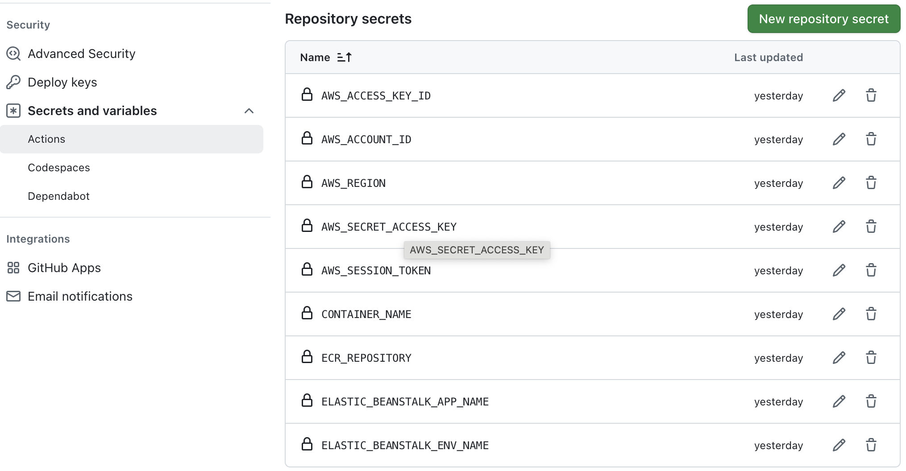
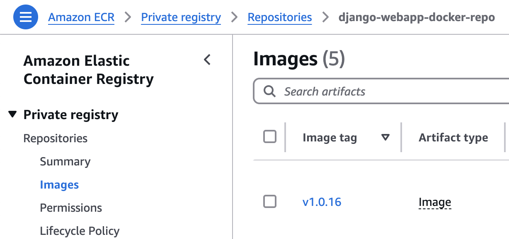
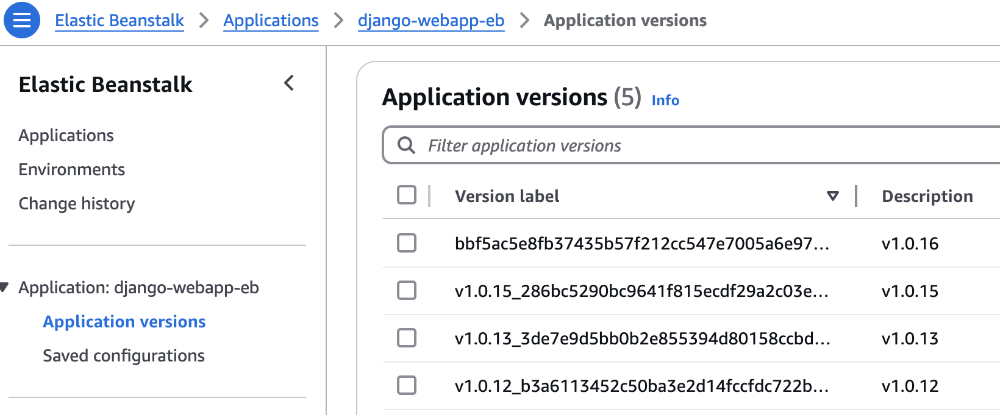
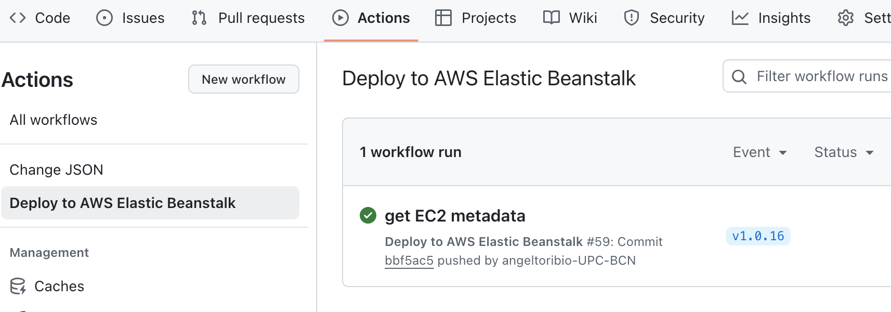
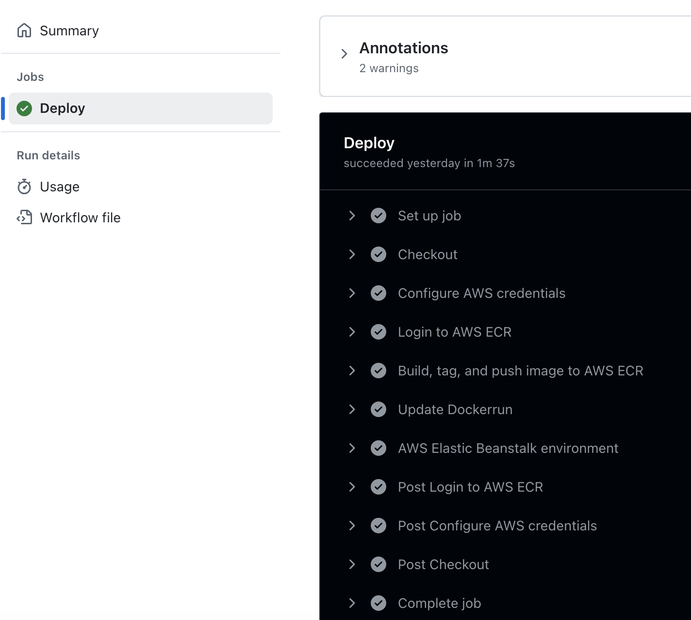

# Lab Session 7: Continuous Integration, Continuous Delivery, and Observability

This lab session focuses on three critical areas in modern software development: **Continuous Integration (CI)**, **Continuous Delivery (CD)**, **Observability**

### Continuous Integration (CI)

**Continuous Integration (CI)** is a software development practice where code changes are frequently merged into a
shared repository. Every change is validated by automated builds and tests to catch errors as early as possible.

#### Key Concepts of CI:

- **Version Control**: Developers push their code to a version control system (e.g., Git).
- **Automated Build**: Every time code is pushed, the system triggers an automated build process (e.g., using Jenkins,
  GitLab CI/CD, or GitHub Actions).
- **Automated Testing**: Unit tests, integration tests, and other checks run automatically to verify the quality of the
  code.

### Continuous Delivery (CD)

**Continuous Delivery (CD)** extends CI by automatically deploying the code to various environments after it passes all
tests. The goal is to make the release process predictable and automated.

#### Key Concepts of CD:

- **Automated Deployment**: Code is deployed automatically to different environments (e.g., development, staging, and
  production).
- **Automated Tests**: After deployment, automated tests ensure the application works as expected in the new
  environment.
- **Feature Toggles**: A technique used in CD where new features are hidden behind feature flags/toggles until they are
  ready for release.

### Observability

**Observability** is the ability to measure the internal state of a system based on the data it produces (logs, metrics,
and traces). It helps teams monitor and debug production systems effectively.

#### Key Concepts of Observability:

- **Logs**: Detailed records of events that happened during the execution of the application.
- **Metrics**: Numerical data that represent performance characteristics like CPU usage, request latency, etc.
- **Tracing**: Tracking the path of a request through various services (e.g., with OpenTelemetry).

#### Observability Tools:

- **Prometheus**: A monitoring tool that collects and stores metrics as time-series data.
- **Grafana**: A visualization tool used to display data from Prometheus and other data sources.
- **Elasticsearch, Logstash, and Kibana (ELK)**: A set of tools for searching, analyzing, and visualizing log data.
- **Datadog**: A SaaS-based monitoring service that provides full observability.

#### Visualizing Logs with ELK:

- **Elasticsearch** stores logs and allows you to query and analyze them.
- **Kibana** is a web interface to visualize and analyze log data stored in Elasticsearch.

# Tasks for Lab session #7

* [Task 7.1: CI/CD build using GitHub Actions](#Task71)
* [Task 7.2: CI/CD build using GitHub Actions](#Task72)

<a name="Task71"/>

## Task 7.1: CI/CD build using GitHub Actions

In this section, you will learn how to create CI/CD pipelines using GitHub Actions. This process continues
with the previous session using the created Docker image, pushing it to AWS Elastic Container Registry (AWS ECR) ,
and deploying the application to AWS Elastic Beanstalk.

A workflow is an automated process that runs one or more defined jobs. A workflow file contains various sections within
which each action in the pipeline is defined. These are:

- **name**: This is the workflow's name as will appear on your repository's ‘Actions’ section.
- **on**: This section specifies the workflow trigger. Here, you can have successful merges to the repository and pushes
  to the main or other branches among other actions.
- **jobs**: Here, all the jobs that are run in the workflow will be defined.

```yaml
name: Deploy to AWS ECS

on:
  push:
    branches: [ "main" ]

jobs:
  deploy:
    runs-on: ubuntu-latest

    steps:
```

### Example GitHub Actions workflow 

The proposed workflow builds and pushes a new container image to AWS ECR,
and then deploys a new environment definition to AWS Elastic Beanstalk, when there is a push to the "main" branch, and
it is tagged with a version number such as `v1.3.4`.

```yaml
name: Build new image and deploy to AWS Elastic Beanstalk

on:
  push:
    tags:
      - "v[0-9]+.[0-9]+.[0-9]+"

permissions:
  contents: read

jobs:
  deploy:
    name: Deploy
    runs-on: ubuntu-latest
    environment: production

    steps:
      - name: Checkout
        uses: actions/checkout@v4

      - name: Configure AWS credentials
        uses: aws-actions/configure-aws-credentials@v1
        with:
          aws-access-key-id: ${{ secrets.AWS_ACCESS_KEY_ID }}
          aws-secret-access-key: ${{ secrets.AWS_SECRET_ACCESS_KEY }}
          aws-region: ${{ secrets.AWS_REGION }}
          aws-session-token: ${{ secrets.AWS_SESSION_TOKEN }}


      - name: Login to AWS ECR
        id: login-ecr
        uses: aws-actions/amazon-ecr-login@v1

      - name: Build, tag, and push image to AWS ECR
        id: build-image
        env:
          IMAGE_ADDR: ${{ steps.login-ecr.outputs.registry }}/${{ secrets.ECR_REPOSITORY }}:${{  github.ref_name }}
        run: |
          # Build a docker container and push it to ECR so that it can be deployed to Elastic Beanstalk.
          echo "image=$IMAGE_ADDR" >> $GITHUB_OUTPUT          
          docker build -t django-docker:${{  github.ref_name }} .
          docker tag django-docker:${{  github.ref_name }} $IMAGE_ADDR
          docker push $IMAGE_ADDR

      - name: Update Dockerrun
        uses: actions/github-script@v7
        id: update-dockerrun
        env:
          IMAGE_ADDR: ${{ steps.login-ecr.outputs.registry }}/${{ secrets.ECR_REPOSITORY }}:${{  github.ref_name }}
        with:
          result-encoding: string
          script: |
            try {
              const fpath = '.housekeeping/elasticbeanstalk/Dockerrun.aws.json'
              const fs = require('fs')
              const jsonString = fs.readFileSync(fpath)
              var apps = JSON.parse(jsonString)
              console.log('Parsed JSON data:', apps)
              apps["Image"]["Name"] = process.env.IMAGE_ADDR
              console.log('Parsed JSON data:', apps);
              fs.writeFileSync(fpath,JSON.stringify(apps))
            } catch(err) {
              core.error("Error while reading or parsing the JSON")
              core.setFailed(err)
            }

      - name: AWS Elastic Beanstalk environment
        id: eb-env
        run: |
          # Update  Dockerrun.aws.json
          cd .housekeeping/elasticbeanstalk
          zip -r ../${{github.ref_name}}.zip Dockerrun.aws.json
          aws s3 cp "../${{github.ref_name}}.zip" s3://elasticbeanstalk-us-east-1-${{ secrets.AWS_ACCOUNT_ID }}/${{ secrets.ELASTIC_BEANSTALK_APP_NAME }}/
          aws elasticbeanstalk create-application-version --application-name ${{ secrets.ELASTIC_BEANSTALK_APP_NAME }} --version-label ${{github.sha}} --description ${{github.ref_name}} --source-bundle S3Bucket="elasticbeanstalk-us-east-1-${{ secrets.AWS_ACCOUNT_ID }}",S3Key="${{ secrets.ELASTIC_BEANSTALK_APP_NAME }}/${{github.ref_name}}.zip"
          aws elasticbeanstalk update-environment --application-name ${{ secrets.ELASTIC_BEANSTALK_APP_NAME }} --environment-name ${{ secrets.ELASTIC_BEANSTALK_ENV_NAME }} --version-label ${{github.sha}}
          aws elasticbeanstalk wait environment-updated --application-name ${{ secrets.ELASTIC_BEANSTALK_APP_NAME }} --environment-name ${{ secrets.ELASTIC_BEANSTALK_ENV_NAME }}
```

Let's go through it section by section

#### on: action trigger

The code below states that the action shall be executed when there is a push on the GitHub repo that has a tag matching
the regular expression.

```yaml
on:
  push:
    tags:
      - "v[0-9]+.[0-9]+.[0-9]+"
```

To achieve that, it is necessary to issue

```bash
_$ git commit -m "This fixes the bug!"
[cloud 7dfb8dd] This fixes the bug
 1 file changed, 1 insertion(+), 1 deletion(-)
_$ git tag "v1.0.19"
_$ git push
Enumerating objects: 9, done.
Counting objects: 100% (9/9), done.
Delta compression using up to 8 threads
Compressing objects: 100% (4/4), done.
Writing objects: 100% (5/5), 445 bytes | 445.00 KiB/s, done.
Total 5 (delta 2), reused 0 (delta 0), pack-reused 0 (from 0)
remote: Resolving deltas: 100% (2/2), completed with 2 local objects.
To https://github.com/CCBDA-UPC/2024-6-xx.git
```

#### Action execution

The action uses a `ubuntu` operating system environment that GitHub provides. Such environment has a clean file system with some utilities pre-installed.

```yaml
permissions:
  contents: read

jobs:
  deploy:
    name: Deploy
    runs-on: ubuntu-latest
    environment: production
```

#### Execution steps

The first step is to pull the git repo into the above-mentioned server. You can find
each [action description and code](https://github.com/actions/checkout) adding `https://github.com/` in front of
`actions/checkout`.

```yaml
      - name: Checkout
        uses: actions/checkout@v4
```

Next, it retrieves the credentials to interact with AWS. The 'secrets' are stored in the GitHub settings section of the
repo https://github.com/CCBDA-UPC/2025-7-xx/settings: section 'Secrets and variables' -> 'Actions'.

```yaml
      - name: Configure AWS credentials
        uses: aws-actions/configure-aws-credentials@v1
        with:
          aws-access-key-id: ${{ secrets.AWS_ACCESS_KEY_ID }}
          aws-secret-access-key: ${{ secrets.AWS_SECRET_ACCESS_KEY }}
          aws-region: ${{ secrets.AWS_REGION }}
          aws-session-token: ${{ secrets.AWS_SESSION_TOKEN }}
```



Fill the GitHub secrets value corresponding to the previous lab session.

```python
AWS_REGION=us-east-1
AWS_ACCESS_KEY_ID=<YOUR-AWS_ACCESS_KEY_ID>
AWS_ACCOUNT_ID=<YOUR-AWS_ACCOUNT_ID>
AWS_SECRET_ACCESS_KEY=<YOUR-AWS_SECRET_ACCESS_KEY>
AWS_SESSION_TOKEN=<YOUR-AWS_SESSION_TOKEN>
CONTAINER_NAME=django-webapp
ECR_REPOSITORY=django-webapp-docker-repo
ELASTIC_BEANSTALK_APP_NAME=django-webapp-eb
ELASTIC_BEANSTALK_ENV_NAME=team99
```

Once the credentials are set up in the environment it uses an AWS specific action to log into the AWS Elastic Container
Repository.

```yaml
      - name: Login to AWS ECR
        id: login-ecr
        uses: aws-actions/amazon-ecr-login@v1
```

Since the code has changed and Docker images are immutable it is necessary to build a new one. The variable
`github.ref_name` contains the value of the git tag: the version. The variable `steps.login-ecr.outputs.registry`
contains the `<registry-id>.dkr.ecr.us-east-1.amazonaws.com` value and `secrets.ECR_REPOSITORY`, following the previous lab session, is instatiated to `django-webapp-docker-repo`.

The Docker commands that you see are the ones that you manually issued in the previous lab session.

```yaml
      - name: Build, tag, and push image to AWS ECR
        id: build-image
        env:
          IMAGE_ADDR: ${{ steps.login-ecr.outputs.registry }}/${{ secrets.ECR_REPOSITORY }}:${{ github.ref_name }}
        run: |
          # Build a docker container and push it to ECR so that it can be deployed to Elastic Beanstalk.
          echo "image=$IMAGE_ADDR" >> $GITHUB_OUTPUT          
          docker build -t django-docker:${{ github.ref_name }} .
          docker tag django-docker:${{  github.ref_name }} $IMAGE_ADDR
          docker push $IMAGE_ADDR
```

The step below is programmed in [Node.js](https://nodejs.org/en), and reads the file `.housekeeping/elasticbeanstalk/Dockerrun.aws.json`, 
parsing the JSON contents, replacing it with a URL that refers to the previously pushed Docker image, and finally writing the new content in the ubuntu server's file system.

```yaml
      - name: Update Dockerrun
        uses: actions/github-script@v7
        id: update-dockerrun
        env:
          IMAGE_ADDR: ${{ steps.login-ecr.outputs.registry }}/${{ secrets.ECR_REPOSITORY }}:${{ github.ref_name }}
        with:
          result-encoding: string
          script: |
            try {
              const fpath = '.housekeeping/elasticbeanstalk/Dockerrun.aws.json'
              const fs = require('fs')
              const jsonString = fs.readFileSync(fpath)
              var apps = JSON.parse(jsonString)
              console.log('Parsed JSON data:', apps)
              apps["Image"]["Name"] = process.env.IMAGE_ADDR
              console.log('Parsed JSON data:', apps);
              fs.writeFileSync(fpath,JSON.stringify(apps))
            } catch(err) {
              core.error("Error while reading or parsing the JSON")
              core.setFailed(err)
            }
```

As you may remember the `eb create` command pushes a zip containing the file `Dockerrun.aws.json` to a specific AWS S3 bucket. The previous step updated the file contents and this one zips it and pushes it to the corresponding AWS S3 bucket.

Everything is ready to create a new AWS Elasticbeanstalk version in the AWS Elasticbeanstalk environment which will host the recently created Docker image that it pulls from AWS ECR.

```yaml
      - name: AWS Elastic Beanstalk environment
        id: eb-env
        run: |
          # Update  Dockerrun.aws.json
          cd .housekeeping/elasticbeanstalk
          zip -r ../${{github.ref_name}}.zip Dockerrun.aws.json
          aws s3 cp "../${{github.ref_name}}.zip" s3://elasticbeanstalk-us-east-1-${{ secrets.AWS_ACCOUNT_ID }}/${{ secrets.ELASTIC_BEANSTALK_APP_NAME }}/
          aws elasticbeanstalk create-application-version --application-name ${{ secrets.ELASTIC_BEANSTALK_APP_NAME }} --version-label ${{github.sha}} --description ${{github.ref_name}} --source-bundle S3Bucket="elasticbeanstalk-us-east-1-${{ secrets.AWS_ACCOUNT_ID }}",S3Key="${{ secrets.ELASTIC_BEANSTALK_APP_NAME }}/${{github.ref_name}}.zip"
          aws elasticbeanstalk update-environment --application-name ${{ secrets.ELASTIC_BEANSTALK_APP_NAME }} --environment-name ${{ secrets.ELASTIC_BEANSTALK_ENV_NAME }} --version-label ${{github.sha}}
          aws elasticbeanstalk wait environment-updated --application-name ${{ secrets.ELASTIC_BEANSTALK_APP_NAME }} --environment-name ${{ secrets.ELASTIC_BEANSTALK_ENV_NAME }}
```
See that AWS ECR is storing different Docker images labeled with it's version ID.



As well as the AWS Elasticbeanstalk application versions. In case of emergency we could always manually recover a previous version.




### Install and execute

**IMPORTANT**: You need to have the AWS Elasticbeanstalk environment running as it was at the end of the previous lab session. The above explained action assumes that the web application is sucessfully executing.

**Q7.11: Create an administrative Python script to have the AWS Elasticbeanstalk environment of the previous session up and running.**

To create the workflow, add to your responses repo the file `.github/workflows/aws.yml` containing the complete workflow listed above.

As soon as you have `.github/workflows/aws.yml` pushed to the repo as indicated above, go to the GitHub repo and click on the `Actions` tab.



Click on the different boxes until you reach the listing of all the steps and the log output of each and every operation.



In parallel, go to the AWS console and select the AWS Elasticbeanstalk environment to witness what happens.

**Q7.12 Have you been able to execute the action? Share your thoughts.**

### Yet a new administrative script

Store the script below under `.housekeeping/scripts/updateGitHubSecrets.py`

```python
import base64
from github import Github, Auth
import sys
from dotenv import dotenv_values
import boto3
from git import Repo


trans = {
    'access_key': 'AWS_ACCESS_KEY_ID',
    'secret_key': 'AWS_SECRET_ACCESS_KEY',
    'token': 'AWS_SESSION_TOKEN'
}

otherSecrets = [
    'AWS_REGION',
    'ECR_REPOSITORY',
    'CONTAINER_NAME',
    'ELASTIC_BEANSTALK_APP_NAME',
    'ELASTIC_BEANSTALK_ENV_NAME',
]

try:
    CONFIGURATION_FILE = sys.argv[1]
except:
    print('ERROR: filename missing\npython updateGitHubSecrets.py filename')
    exit()

repo = Repo('.')

github_repo = repo.config_reader().get('remote "origin"','url').replace('.git','').replace('https://github.com/','')

print(f'Updating secrets for repo "{github_repo}"')

config = dotenv_values(CONFIGURATION_FILE)

auth = Auth.Token(config['GITHUB_TOKEN'])
github_client = Github(auth=auth)

repo = github_client.get_repo(github_repo)

session = boto3.Session()
credentials = session.get_credentials().__dict__

for k, v in trans.items():
    print('\t', v)
    repo.create_secret(v, credentials[k], "actions")

sts = boto3.client("sts")
account_id = sts.get_caller_identity()["Account"]
repo.create_secret('AWS_ACCOUNT_ID', account_id, "actions")

for s in otherSecrets:
    print('\t', s)
    repo.create_secret(s, config[s], "actions")

# Update eb/Dockerrun.aws.json using Dockerrun.aws.json as template

print('\nUpdating Dockerrun.aws.json')

with open('.housekeeping/Dockerrun.aws.json', 'r') as f:
    s = f.read()

dockerrun = {
    'ECR_REPOSITORY': config['ECR_REPOSITORY'],
    'AWS_ACCOUNT_ID': account_id
}

dockerrun_content = s % dockerrun

try:
    contents = repo.get_contents("eb/Dockerrun.aws.json")
    f = base64.b64decode(contents.content).decode('utf8')
    if f != dockerrun_content:
        repo.update_file(contents.path, "updated Dockerrun.aws.json", dockerrun_content, contents.sha, branch='main')
except Exception as e:
    repo.create_file('eb/Dockerrun.aws.json', 'added Dockerrun.aws.json', dockerrun_content, branch='main')

with open('.housekeeping/elasticbeanstalk/Dockerrun.aws.json', 'w') as f:
    f.write(dockerrun_content)
```

**Q7.13 What does the above script do and how can you use it?**


Q74: Assess the current version of the web application against each of the twelve factor application.

Q75: How long have you been working on this session? What have been the main difficulties that you have faced and how have you solved them? Add your answers to README.md.


## How to submit this assignment:

Make sure that you have updated your local GitHub repository (using the git commands add, commit, and push) with all the
files generated during this session.

Before the deadline, all team members shall push their responses to their private https://github.com/CCBDA-UPC/2024-7-xx
repository.

Add all the web application files to your repository and comment what you think is relevant in your session's
*README.md*.


