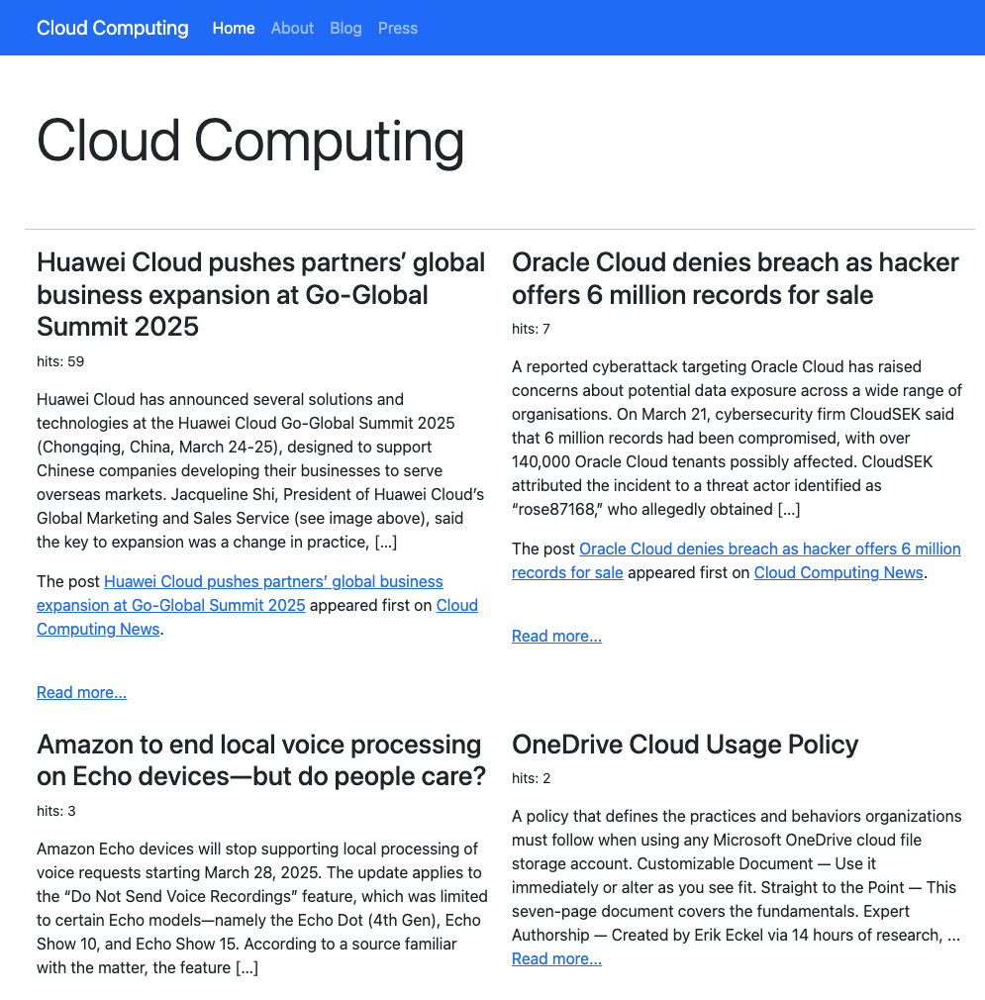
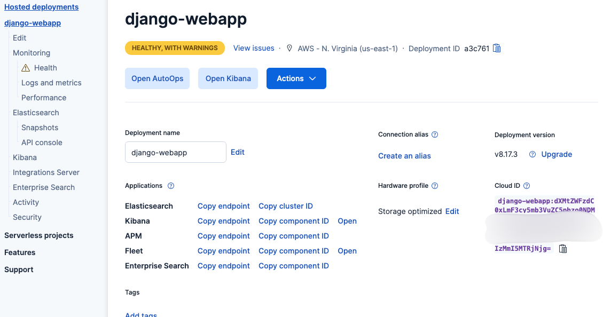
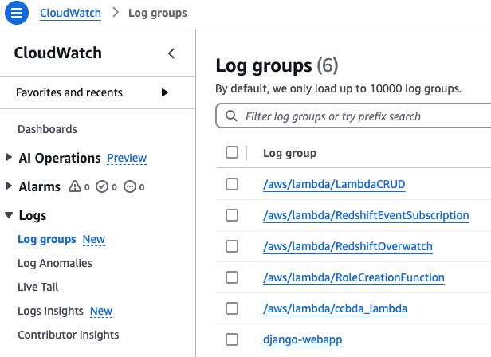
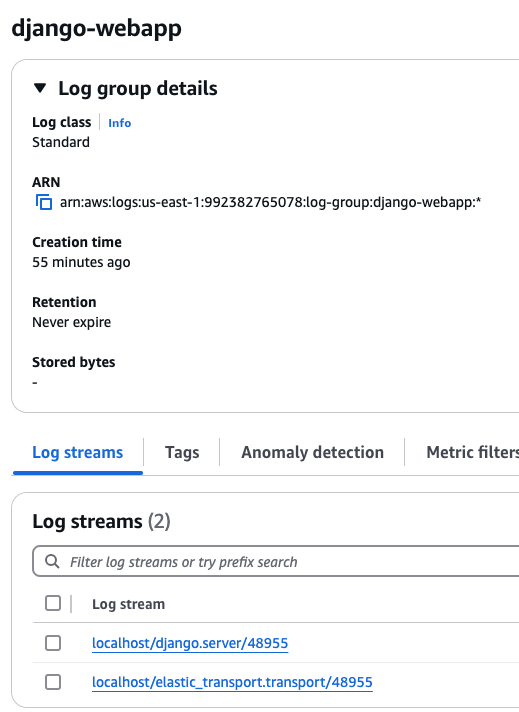
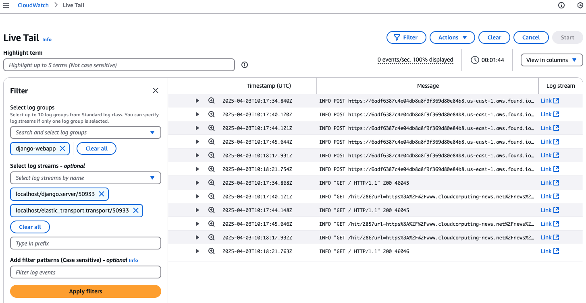
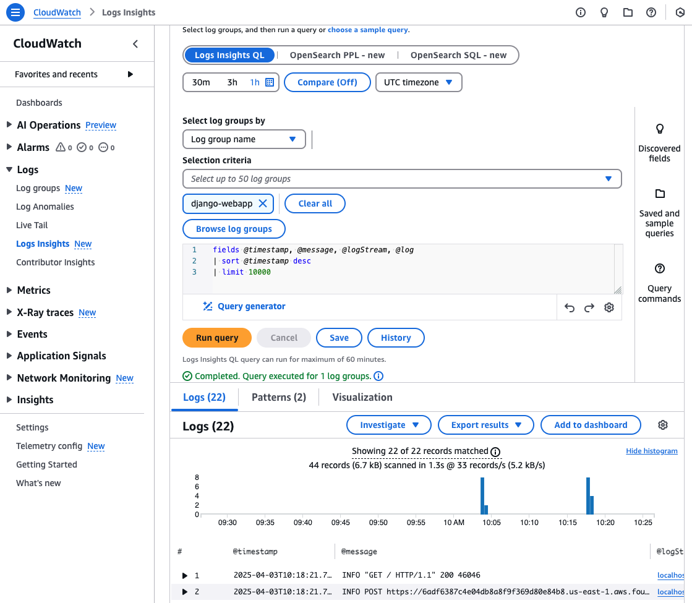
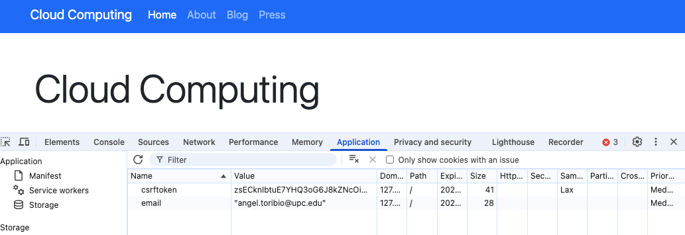
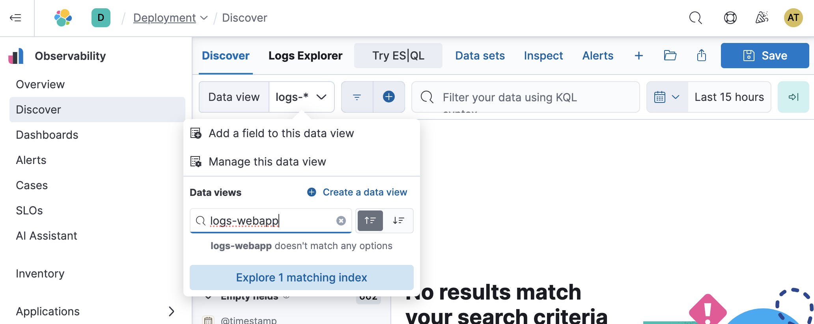
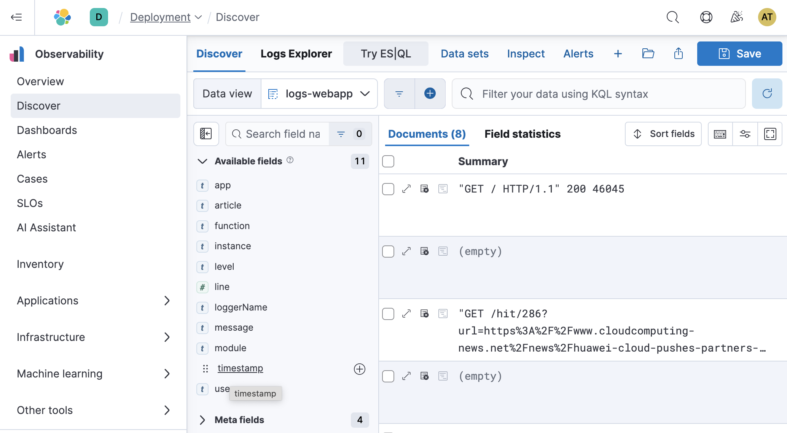

# Lab Session 7: Continuous Integration, Continuous Delivery, and Observability

This lab session focuses on three critical areas in modern software development: 
**Continuous Integration (CI)**, **Continuous Delivery (CD)**, **Observability**.

This lab session **builds upon the work from the previous session**, where we isolated the web application within a Docker container running locally. Make sure that you have available and working everything done in the previous session.

### Continuous Integration (CI)

**Continuous Integration (CI)** is a software development practice where code changes are frequently merged into a
shared repository. Every change is validated by automated builds and tests to catch errors as early as possible.

#### Key Concepts of CI:

- **Version Control**: Developers push their code to a version control system (e.g., Git).
- **Automated Build**: Every time code is pushed, the system triggers an automated build process (e.g., using Jenkins,
  GitLab CI/CD, or GitHub Actions).
- **Automated Testing**: Unit tests, integration tests, and other checks run automatically to verify the quality of the
  code.

### Continuous Delivery (CD)

**Continuous Delivery (CD)** extends CI by automatically deploying the code to various environments after it passes all
tests. The goal is to make the release process predictable and automated.

#### Key Concepts of CD:

- **Automated Deployment**: Code is deployed automatically to different environments (e.g., development, staging, and
  production).
- **Automated Tests**: After deployment, automated tests ensure the application works as expected in the new
  environment.
- **Feature Toggles**: A technique used in CD where new features are hidden behind feature flags/toggles until they are
  ready for release.

### Observability

**Observability** is the ability to measure the internal state of a system based on the data it produces (logs, metrics, 
 and traces). It helps teams monitor and debug production systems effectively.

#### Key Concepts of Observability:

- **Logs**: Detailed records of events that happened during the execution of the application.
- **Metrics**: Numerical data that represent performance characteristics like CPU usage, request latency, etc.
- **Tracing**: Tracking the path of a request through various services (e.g., with OpenTelemetry).

#### Observability Tools:

- **AWS CloudWatch**: A visualization and monitoring tool for the complete stack (applications, infrastructure, network, and services).
- **Prometheus**: A monitoring tool that collects and stores metrics as time-series data.
- **Grafana**: A visualization tool used to display data from Prometheus and other data sources.
- **Elasticsearch, Logstash, and Kibana (ELK)**: A set of tools for searching, analyzing, and visualizing log data.
- **Datadog**: A SaaS-based monitoring service that provides full observability.

#### Visualizing Logs with ELK:

- **Elasticsearch** stores logs and allows you to query and analyze them.
- **Kibana** is a web interface to visualize and analyze log data stored in Elasticsearch.

### Web application improvements

In addition to analyzing web application logs to detect errors, the core functionality of the web application is now
expanded to engage users more effectively. Once a user enters their name and email address into the form, the website
will dynamically generate and display a curated list of articles sourced from various reputable Cloud Computing news
websites via [RSS feeds](https://en.wikipedia.org/wiki/RSS). This content will serve as an engaging way to spark further
interest in the course and keep the user updated with the latest trends in the field.

Moreover, the web application will be able to track user interactions and behaviors, gathering valuable insights to
optimize and improve the website's user experience. These insights could be used to refine content delivery, enhance
user engagement, and tailor recommendations to each individual user based on their activity.



Download a new zip file of the web application code using the branch named
`observability` [https://github.com/CCBDA-UPC/django-webapp/](https://github.com/CCBDA-UPC/django-webapp/tree/observability).
It includes some code changes necessary for this lab session. The file `requirements.txt` is also updated.

# Pre-lab homework

Please, go to the [Elastic website](https://www.elastic.co/getting-started/) and request your 14-days trial by following
the instructions provided in the link.

Once you'll be logged in at https://cloud.elastic.co/home you'll see a hosted delployment. Click on **Manage** where
you'll be able to change the deployment name if you want, but most importantly, you'll be able to obtain the value for
the `ELK_CLOUD_ID` and `ELK_PASSWORD` new configuration variables. Copy the value under "Cloud ID" and reset your
password under the "Actions" blue button.



# Tasks for Lab session #7

* [Task 7.1: CI/CD build using GitHub Actions](#Task71)
* [Task 7.2: Observability using AWS CloudWatch, Elastic and Kibana](#Task72)

<a name="Task71"/>

## Task 7.1: CI/CD build using GitHub Actions

In this section, you will learn how to create CI/CD pipelines using GitHub Actions. This process continues
with the previous session using the created Docker image, pushing it to AWS Elastic Container Registry (AWS ECR) ,
and deploying the application to AWS Elastic Beanstalk.

A workflow is an automated process that runs one or more defined jobs. A workflow file contains various sections within
which each action in the pipeline is defined. These are:

- **name**: This is the workflow's name as will appear on your repository's ‘Actions’ section.
- **on**: This section specifies the workflow trigger. Here, you can have successful merges to the repository and pushes
  to the main or other branches among other actions.
- **jobs**: Here, all the jobs that are run in the workflow will be defined.

```yaml
name: Deploy to AWS ECS

on:
  push:
    branches: [ "main" ]

jobs:
  deploy:
    runs-on: ubuntu-latest

    steps:
```

### Example GitHub Actions workflow

The proposed workflow builds and pushes a new container image to AWS ECR,
and then deploys a new environment definition to AWS Elastic Beanstalk, when there is a push to the "main" branch, and
it is tagged with a version number such as `v1.3.4`.

```yaml
name: Build new image and deploy to AWS Elastic Beanstalk

on:
  push:
    tags:
      - "v[0-9]+.[0-9]+.[0-9]+"

permissions:
  contents: read

jobs:
  deploy:
    name: Deploy
    runs-on: ubuntu-latest
    environment: production

    steps:
      - name: Checkout
        uses: actions/checkout@v4

      - name: Configure AWS credentials
        uses: aws-actions/configure-aws-credentials@v1
        with:
          aws-access-key-id: ${{ secrets.AWS_ACCESS_KEY_ID }}
          aws-secret-access-key: ${{ secrets.AWS_SECRET_ACCESS_KEY }}
          aws-region: ${{ secrets.AWS_REGION }}
          aws-session-token: ${{ secrets.AWS_SESSION_TOKEN }}


      - name: Login to AWS ECR
        id: login-ecr
        uses: aws-actions/amazon-ecr-login@v1

      - name: Build, tag, and push image to AWS ECR
        id: build-image
        env:
          IMAGE_ADDR: ${{ steps.login-ecr.outputs.registry }}/${{ secrets.ECR_REPOSITORY }}:${{  github.ref_name }}
        run: |
          # Build a docker container and push it to ECR so that it can be deployed to Elastic Beanstalk.
          echo "image=$IMAGE_ADDR" >> $GITHUB_OUTPUT          
          docker build -t django-docker:${{  github.ref_name }} .
          docker tag django-docker:${{  github.ref_name }} $IMAGE_ADDR
          docker push $IMAGE_ADDR

      - name: Update Dockerrun
        uses: actions/github-script@v7
        id: update-dockerrun
        env:
          IMAGE_ADDR: ${{ steps.login-ecr.outputs.registry }}/${{ secrets.ECR_REPOSITORY }}:${{  github.ref_name }}
        with:
          result-encoding: string
          script: |
            try {
              const fpath = '.housekeeping/elasticbeanstalk/Dockerrun.aws.json'
              const fs = require('fs')
              const jsonString = fs.readFileSync(fpath)
              var apps = JSON.parse(jsonString)
              apps["Image"]["Name"] = process.env.IMAGE_ADDR
              fs.writeFileSync(fpath,JSON.stringify(apps))
            } catch(err) {
              core.error("Error while reading or parsing the JSON")
              core.setFailed(err)
            }

      - name: AWS Elastic Beanstalk environment
        id: eb-env
        run: |
          # Update  Dockerrun.aws.json
          cd .housekeeping/elasticbeanstalk
          zip -r ../${{github.ref_name}}.zip Dockerrun.aws.json
          aws s3 cp "../${{github.ref_name}}.zip" s3://elasticbeanstalk-us-east-1-${{ secrets.AWS_ACCOUNT_ID }}/${{ secrets.ELASTIC_BEANSTALK_APP_NAME }}/
          aws elasticbeanstalk create-application-version --application-name ${{ secrets.ELASTIC_BEANSTALK_APP_NAME }} --version-label ${{github.sha}} --description ${{github.ref_name}} --source-bundle S3Bucket="elasticbeanstalk-us-east-1-${{ secrets.AWS_ACCOUNT_ID }}",S3Key="${{ secrets.ELASTIC_BEANSTALK_APP_NAME }}/${{github.ref_name}}.zip"
          aws elasticbeanstalk update-environment --application-name ${{ secrets.ELASTIC_BEANSTALK_APP_NAME }} --environment-name ${{ secrets.ELASTIC_BEANSTALK_ENV_NAME }} --version-label ${{github.sha}}
          aws elasticbeanstalk wait environment-updated --application-name ${{ secrets.ELASTIC_BEANSTALK_APP_NAME }} --environment-name ${{ secrets.ELASTIC_BEANSTALK_ENV_NAME }}
```

Let's go through it section by section.

#### on: action trigger

The code below states that the action shall be executed when there is a push on the GitHub repo that has a tag matching
the regular expression.

```yaml
on:
  push:
    tags:
      - "v[0-9]+.[0-9]+.[0-9]+"
```

To achieve that, it is necessary to issue

```bash
_$ git commit -m "This fixes the bug!"
[cloud 7dfb8dd] This fixes the bug
 1 file changed, 1 insertion(+), 1 deletion(-)
_$ git tag "v1.0.19"
_$ git push
Enumerating objects: 9, done.
Counting objects: 100% (9/9), done.
Delta compression using up to 8 threads
Compressing objects: 100% (4/4), done.
Writing objects: 100% (5/5), 445 bytes | 445.00 KiB/s, done.
Total 5 (delta 2), reused 0 (delta 0), pack-reused 0 (from 0)
remote: Resolving deltas: 100% (2/2), completed with 2 local objects.
To https://github.com/CCBDA-UPC/2024-6-xx.git
```

#### Action execution

The action uses a `ubuntu` operating system environment that GitHub provides. Such environment has a clean file system
with some utilities pre-installed.

```yaml
permissions:
  contents: read

jobs:
  deploy:
    name: Deploy
    runs-on: ubuntu-latest
    environment: production
```

#### Execution steps

The first step is to pull the git repo into the above-mentioned server. You can find
each [action description and code](https://github.com/actions/checkout) adding `https://github.com/` in front of
`actions/checkout`.

```yaml
      - name: Checkout
        uses: actions/checkout@v4
```

Next, it retrieves the credentials to interact with AWS. The 'secrets' are stored in the GitHub settings section of the
repo https://github.com/CCBDA-UPC/2025-7-xx/settings: section 'Secrets and variables' -> 'Actions'.

```yaml
      - name: Configure AWS credentials
        uses: aws-actions/configure-aws-credentials@v1
        with:
          aws-access-key-id: ${{ secrets.AWS_ACCESS_KEY_ID }}
          aws-secret-access-key: ${{ secrets.AWS_SECRET_ACCESS_KEY }}
          aws-region: ${{ secrets.AWS_REGION }}
          aws-session-token: ${{ secrets.AWS_SESSION_TOKEN }}
```


Fill the GitHub secrets value corresponding to the previous lab session.

```python
AWS_REGION = us - east - 1
AWS_ACCESS_KEY_ID = < YOUR - AWS_ACCESS_KEY_ID >
AWS_ACCOUNT_ID = < YOUR - AWS_ACCOUNT_ID >
AWS_SECRET_ACCESS_KEY = < YOUR - AWS_SECRET_ACCESS_KEY >
AWS_SESSION_TOKEN = < YOUR - AWS_SESSION_TOKEN >
CONTAINER_NAME = django - webapp
ECR_REPOSITORY = django - webapp - docker - repo
ELASTIC_BEANSTALK_APP_NAME = django - webapp - eb
ELASTIC_BEANSTALK_ENV_NAME = team<YOUR-TEAM-NUMBER>
```

Once the credentials are set up in the environment it uses an AWS specific action to log into the AWS Elastic Container
Repository.

```yaml
      - name: Login to AWS ECR
        id: login-ecr
        uses: aws-actions/amazon-ecr-login@v1
```

Since the code has changed and Docker images are immutable it is necessary to build a new one. The variable
`github.ref_name` contains the value of the git tag: the version. The variable `steps.login-ecr.outputs.registry`
contains the `<registry-id>.dkr.ecr.us-east-1.amazonaws.com` value and `secrets.ECR_REPOSITORY`, following the previous
lab session, is instatiated to `django-webapp-docker-repo`.

The Docker commands that you see are the ones that you manually issued in the previous lab session.

```yaml
      - name: Build, tag, and push image to AWS ECR
        id: build-image
        env:
          IMAGE_ADDR: ${{ steps.login-ecr.outputs.registry }}/${{ secrets.ECR_REPOSITORY }}:${{ github.ref_name }}
        run: |
          # Build a docker container and push it to ECR so that it can be deployed to Elastic Beanstalk.
          echo "image=$IMAGE_ADDR" >> $GITHUB_OUTPUT          
          docker build -t django-docker:${{ github.ref_name }} .
          docker tag django-docker:${{  github.ref_name }} $IMAGE_ADDR
          docker push $IMAGE_ADDR
```

The step below is programmed in [Node.js](https://nodejs.org/en), and reads the file
`.housekeeping/elasticbeanstalk/Dockerrun.aws.json`,
parsing the JSON contents, replacing it with a URL that refers to the previously pushed Docker image, and finally
writing the new content in the ubuntu server's file system.

```yaml
      - name: Update Dockerrun
        uses: actions/github-script@v7
        id: update-dockerrun
        env:
          IMAGE_ADDR: ${{ steps.login-ecr.outputs.registry }}/${{ secrets.ECR_REPOSITORY }}:${{ github.ref_name }}
        with:
          result-encoding: string
          script: |
            try {
              const fpath = '.housekeeping/elasticbeanstalk/Dockerrun.aws.json'
              const fs = require('fs')
              const jsonString = fs.readFileSync(fpath)
              var apps = JSON.parse(jsonString)
              apps["Image"]["Name"] = process.env.IMAGE_ADDR
              fs.writeFileSync(fpath,JSON.stringify(apps))
            } catch(err) {
              core.error("Error while reading or parsing the JSON")
              core.setFailed(err)
            }
```

As you may remember the `eb create` command pushes a zip containing the file `Dockerrun.aws.json` to a specific AWS S3
bucket. The previous step updated the file contents and this one zips it and pushes it to the corresponding AWS S3
bucket.

Everything is ready to create a new AWS Elasticbeanstalk version in the AWS Elasticbeanstalk environment which will host
the recently created Docker image that it pulls from AWS ECR.

```yaml
      - name: AWS Elastic Beanstalk environment
        id: eb-env
        run: |
          # Update  Dockerrun.aws.json
          cd .housekeeping/elasticbeanstalk
          zip -r ../${{github.ref_name}}.zip Dockerrun.aws.json
          aws s3 cp "../${{github.ref_name}}.zip" s3://elasticbeanstalk-us-east-1-${{ secrets.AWS_ACCOUNT_ID }}/${{ secrets.ELASTIC_BEANSTALK_APP_NAME }}/
          aws elasticbeanstalk create-application-version --application-name ${{ secrets.ELASTIC_BEANSTALK_APP_NAME }} --version-label ${{github.sha}} --description ${{github.ref_name}} --source-bundle S3Bucket="elasticbeanstalk-us-east-1-${{ secrets.AWS_ACCOUNT_ID }}",S3Key="${{ secrets.ELASTIC_BEANSTALK_APP_NAME }}/${{github.ref_name}}.zip"
          aws elasticbeanstalk update-environment --application-name ${{ secrets.ELASTIC_BEANSTALK_APP_NAME }} --environment-name ${{ secrets.ELASTIC_BEANSTALK_ENV_NAME }} --version-label ${{github.sha}}
          aws elasticbeanstalk wait environment-updated --application-name ${{ secrets.ELASTIC_BEANSTALK_APP_NAME }} --environment-name ${{ secrets.ELASTIC_BEANSTALK_ENV_NAME }}
```

See that AWS ECR is storing different Docker images labeled with it's version ID.


As well as the AWS Elasticbeanstalk application versions. In case of emergency we could always manually recover a
previous version.


### Install and run

**IMPORTANT**: You need to have the AWS Elasticbeanstalk environment running as it was at the end of the previous lab
session. The above explained action assumes that the web application is sucessfully executing.

The new code version uses additional database tables that need to be created using `python manage.py migrate`. You can
execute the code in your laptop and type:

```bash
_$ cp production.env .env
_$ python manage.py makemigrations
Operations to perform:
  Apply all migrations: form
Running migrations:
  Applying form.0001_initial... OK
```

**Q7-11: Create an administrative Python script to have the AWS Elasticbeanstalk environment of the previous session up
and running.**

To create the workflow, add to your responses repo the file `.github/workflows/aws.yml` containing the complete workflow
listed above.

As soon as you have `.github/workflows/aws.yml` pushed to the repo as indicated above, go to the GitHub repo and click
on the `Actions` tab.


Click on the different execution boxes until you reach the listing of all the steps and the log output of each and every
operation.


In parallel, go to the AWS console and open two tabs to witness what happens:

- AWS Elasticbeanstalk environment.
- AWS EC2 instances

**Q7-12 Describe what you've seen in the AWS Elasticbeanstalk and EC2 consoles: logs, number of instances running,etc.
Anything that you consider meaningful and provide your explanation and thoughts.**

**Q7-13 Have you been able to execute the action? Share your thoughts about the complete action.**

### Yet a new administrative script

Store the script below under `.housekeeping/scripts/updateGitHubSecrets.py`

```python
import base64
from github import Github, Auth
import sys
from dotenv import dotenv_values
import boto3
from git import Repo

trans = {
    'access_key': 'AWS_ACCESS_KEY_ID',
    'secret_key': 'AWS_SECRET_ACCESS_KEY',
    'token': 'AWS_SESSION_TOKEN'
}

otherSecrets = [
    'AWS_REGION',
    'ECR_REPOSITORY',
    'CONTAINER_NAME',
    'ELASTIC_BEANSTALK_APP_NAME',
    'ELASTIC_BEANSTALK_ENV_NAME',
]

try:
    CONFIGURATION_FILE = sys.argv[1]
except:
    print('ERROR: filename missing\npython updateGitHubSecrets.py filename')
    exit()

repo = Repo('.')

github_repo = repo.config_reader().get('remote "origin"', 'url').replace('.git', '').replace('https://github.com/', '')

print(f'Updating secrets for repo "{github_repo}"')

config = dotenv_values(CONFIGURATION_FILE)

auth = Auth.Token(config['GITHUB_TOKEN'])
github_client = Github(auth=auth)

repo = github_client.get_repo(github_repo)

session = boto3.Session()
credentials = session.get_credentials().__dict__

for k, v in trans.items():
    print('\t', v)
    repo.create_secret(v, credentials[k], "actions")

sts = boto3.client("sts")
account_id = sts.get_caller_identity()["Account"]
repo.create_secret('AWS_ACCOUNT_ID', account_id, "actions")

for s in otherSecrets:
    print('\t', s)
    repo.create_secret(s, config[s], "actions")

# Update eb/Dockerrun.aws.json using Dockerrun.aws.json as template

print('\nUpdating Dockerrun.aws.json')

with open('.housekeeping/Dockerrun.aws.json', 'r') as f:
    s = f.read()

dockerrun = {
    'ECR_REPOSITORY': config['ECR_REPOSITORY'],
    'AWS_ACCOUNT_ID': account_id
}

dockerrun_content = s % dockerrun

try:
    contents = repo.get_contents("eb/Dockerrun.aws.json")
    f = base64.b64decode(contents.content).decode('utf8')
    if f != dockerrun_content:
        repo.update_file(contents.path, "updated Dockerrun.aws.json", dockerrun_content, contents.sha, branch='main')
except Exception as e:
    repo.create_file('eb/Dockerrun.aws.json', 'added Dockerrun.aws.json', dockerrun_content, branch='main')

with open('.housekeeping/elasticbeanstalk/Dockerrun.aws.json', 'w') as f:
    f.write(dockerrun_content)
```

**Q7-14 What does the above script do and how can you use it?**

## Task 7.2: Observability using AWS CloudWatch, Elastic and Kibana

**Observability** is a vital component of modern software systems, enabling developers and operations teams to monitor 
performance, diagnose issues, and ensure that applications function as expected. In this section, we’ll explore how to 
set up and use **AWS CloudWatch**, **Elasticsearch**, and **Kibana** to gain actionable insights from logs and telemetry 
data generated by the example web application. We’ll use **AWS CloudWatch** for ingesting and visualizing log records in
string format, while **Elasticsearch** and **Kibana** will handle more structured log data in JSON format. While it’s 
not necessary to use both environments, this will provide a useful comparison between them.

#### Key Concepts:

- **AWS CloudWatch** is the default logging and monitoring environment for all AWS services. It collects, processes, and 
analyzes metrics, logs, and events, allowing users to detect anomalies, set up alarms, automate actions, and visualize 
system performance via customizable dashboards.

- **Elasticsearch**: A powerful, distributed search and analytics engine commonly used to store, search, and analyze 
log and event data. It provides real-time querying and efficient storage for large datasets.
  
- **Kibana**: A visualization tool for interacting with data stored in Elasticsearch. It offers an intuitive interface 
to create dashboards, visualize metrics, and analyze logs.

#### Key CloudWatch Features:

- **Metrics Monitoring**: Tracks resource usage such as CPU, memory, and network performance.
- **Alarms**: Triggers notifications or actions when predefined thresholds are met.
- **Log Management**: Collects and analyzes logs from AWS services and applications.
- **Event-driven Automation**: Automates responses based on events using Amazon EventBridge.
- **Custom Dashboards**: Creates real-time visualizations of key metrics.
- **Anomaly Detection**: Leverages machine learning to identify abnormal patterns in metrics.

#### **Key Kibana Features**

- **Data Visualization**: Create visualizations like charts, graphs, and heatmaps to analyze data from Elasticsearch.
- **Dashboards**: Build interactive dashboards to display key metrics and logs in one view.
- **Search and Filtering**: Use advanced search and filtering to drill down into log data by time, error type, or resource.
- **Time Series Analysis**: Visualize metrics over time to spot trends and analyze performance.
- **Alerts and Notifications**: Set up custom alerts based on queries and receive notifications via email or Slack.
- **Discover**: Explore raw log data in real-time to quickly identify issues.
- **Machine Learning**: Automatically detect anomalies and outliers in your data with built-in ML features.
- **Canvas**: Create custom, dynamic reports and presentations using your Elasticsearch data.

Together, **Elasticsearch** and **Kibana** form the **ELK Stack** (Elasticsearch, Logstash, and Kibana), a popular 
solution for log aggregation, analysis, and visualization. You will have access to a 14-day trial to explore these tools.

#### Analyzing and Troubleshooting with Logs

Once you have logs flowing you can use this data to:

- **Identify performance bottlenecks** (e.g., high response times, database latency).
- **Trace errors and exceptions** (e.g., frequent exceptions or stack traces).
- **Monitor traffic spikes** (e.g., number of requests or user activity).
- **Identify trends in the use of your web application** (e.g., interest in Cloud Computing articles after singing in)

### Sending Logs to CloudWatch and Elasticsearch

Once Elasticsearch and Kibana are running, the next step is to configure your application to send logs to
**AWS CloudWatch** and **Elasticsearch**.

##### Install Required Libraries:

```bash
pip install watchtower elasticsearch logging
```

#### Adding new log handleres

The `watchtower.CloudWatchLogHandler` class is the default handler defined by the `watchtower` library. It allows
several parameters in its configuration. We are using "log_group" set to "django-webapp" to name the AWS CloudWatch 
log group appearing in the console, as shown below.



"log_stream_name" is creating the different log stream paths.



Since AWS CloudWatch is timestampping the logs we don't need to send the time stamp from our side and we are using a formatter based on "simple" named "simple_nots".

The `JsonFormatter` class is a new custom formatter that generates log records in JSON format rather than simple
string-based logs. This formatter is used by the "elk" log handler, which integrates with the ELK (Elasticsearch,
Logstash, Kibana) stack for log management. Please open the `settings.py` and add the formatter, hander and restructure
the log ingestion sending `django.server` messages to "cloudwatch" and `django` to "elk" handler.

Modify your `settings.py` configuration using the changes shown below.

```python
LOGGING = {
    ...
    "formatters": {
    ...
        "simple_nots": {
            "format": "{levelname} {message}",
            "style": "{",
        },
        "json-record-format": {
            "()": "ccbda.JsonFormatter",
            "basic": {
                "timestamp": "asctime",
                "loggerName": "name",
                "level": "levelname",
                "message": "message",
                "function": "funcName",
                "module": "module",
                "line": "lineno",
            },
            "extra": {
                "instance": AWS_EC2_INSTANCE_ID,
            }
        }
    }
...
    "handlers": {
    ...
        "elk": {
            "level": "DEBUG",
            "formatter": "json-record-format",
            "class": "ccbda.ElasticsearchHandler",
            "index": "logs-webapp",  # ELK index name
        },
        "cloudwatch": {
            "level": "DEBUG",
            "formatter": "simple_nots",
            "class": "watchtower.CloudWatchLogHandler",
            "log_group": "django-webapp",
            "log_stream_name":AWS_EC2_INSTANCE_ID+"/{logger_name}/{process_id}"
        }
    },
...
    "root": {
        "handlers": ["console", "cloudwatch"],
        "level": "INFO",
    },
    "loggers": {
        "django.server": {
            "handlers": ["console", "cloudwatch"],
            "level": os.getenv("DJANGO_LOG_LEVEL", "INFO"),
            "propagate": False,
        },
        "django": {
            "handlers": ["elk"],
            "level": os.getenv("DJANGO_LOG_LEVEL", "INFO"),
            "propagate": False,
        },
    },
}
```

It will also be necessary to include at the bottom of `settings.py` a list of RSS feed URLs and the credentials to use
ELK.

```python
RSS_URLS = [
    'https://www.cloudcomputing-news.net/feed/',
    'https://feeds.feedburner.com/cioreview/fvHK',
    'https://www.techrepublic.com/rssfeeds/topic/cloud/',
    'https://aws.amazon.com/blogs/aws/feed/',
    'https://cloudtweaks.com/feed/',
]

ELK_PASSWORD = os.environ.get('ELK_PASSWORD')
ELK_CLOUD_ID = os.environ.get('ELK_CLOUD_ID')
```

Modify the file `ccbda/__init__.py` file including the code below. The class `ElasticsearchHandler` rewrites some of the
`logging.handlers.BufferingHandler` python library. It opens a session with ELK and uses the ELK index the was
configured above. The function `emit` sends each log record immediatelly to ELK, while the function `flush` sends all
buffered records. The buffer size is the value of the parameter `capacity` that can be overriden in the configuration.
It is possible to avoid rewritting `emit` to wait until the buffer is full and the `flush` function is invoked.

```python
class ElasticsearchHandler(logging.handlers.BufferingHandler):
    def __init__(self, index="logs", capacity=100):
        # capacity: number of logging records buffered
        super().__init__(capacity=capacity)
        self.es_client = Elasticsearch(cloud_id=settings.ELK_CLOUD_ID, basic_auth=("elastic", settings.ELK_PASSWORD))
        self.index = index

    def emit(self, record):
        log_entry = self.format(record)
        # Send the log entry to Elasticsearch
        self.es_client.index(index=self.index, document=json.loads(log_entry))

    def flush(self):
        for record in self.buffer:
            log_entry = self.format(record)
            # Send the log entry to Elasticsearch
            self.es_client.index(index=self.index, document=json.loads(log_entry))
        self.buffer = []
```

The formatter obtains the `basic` configuration parameter (see the definition of the formatter above) and uses them to
extract some of the logger library default fields such as the timestamp, function, module, ... explained in laboratory
session 6. The `extra` configuration parameter (see the definition of the formatter above) includes additional record
fields to be added to each log.

```python
class JsonFormatter(logging.Formatter):
    def __init__(self, *args, **kwargs):
        self.fmt_dict = kwargs.get('basic', {"message": "message"})
        self.default_time_format = kwargs.get('time_format', "%Y-%m-%dT%H:%M:%S")
        self.default_msec_format = kwargs.get('msec_format', "%s.%03dZ")
        self.datefmt = None
        self.extra = kwargs.get('extra', {})

    def usesTime(self) -> bool:
        # Overwritten to look for the attribute in the format dict values instead of the fmt string.
        return "asctime" in self.fmt_dict.values()

    def formatMessage(self, record) -> dict:
        # Overwritten to return a dictionary of the relevant LogRecord attributes instead of a string.
        return {fmt_key: record.__dict__[fmt_val] for fmt_key, fmt_val in self.fmt_dict.items()}

    def format(self, record) -> str:
        # Mostly the same as the parent's class method, the difference being that a dict is manipulated and dumped as JSON instead of a string.

        record.message = record.getMessage()

        if self.usesTime():
            record.asctime = self.formatTime(record, self.datefmt)

        message_dict = self.formatMessage(record)

        p = os.path.relpath(record.pathname, settings.BASE_DIR).split('/')
        p.remove(record.filename)
        if 'site-packages' in p:
            add_chunk = False
            app_name = ''
            for item in p:
                if item == 'site-packages':
                    add_chunk = True
                    continue
                if add_chunk:
                    app_name += f'/{item}'
            message_dict['app'] = app_name
        else:
            message_dict['app'] = p[0]

        if isinstance(record.args, dict):
            for k, v in record.args.items():
                message_dict[k] = v

        for k, v in self.extra.items():
            message_dict[k] = v

        if record.exc_info:
            # Cache the traceback text to avoid converting it multiple times (it's constant anyway)
            if not record.exc_text:
                record.exc_text = self.formatException(record.exc_info)

        if record.exc_text:
            message_dict["exc_info"] = record.exc_text

        if record.stack_info:
            message_dict["stack_info"] = self.formatStack(record.stack_info)

        return json.dumps(message_dict, default=str)
```

The output of the formatter can be a record similar to:

```json
{
  "timestamp": "2025-03-31T15:45:10.621Z",
  "instance": "localhost",
  "loggerName": "django",
  "level": "INFO",
  "app": "form",
  "module": "views",
  "function": "hit",
  "line": 34,
  "user": "angel.toribio@upc.edu",
  "message": "",
  "article": "https://www.cloudcomputing-news.net/news/how-steatite-relieved-the-burden-on-its-it-team-with-a-move-to-the-cloud/"
}
```

### New functionality added to the web application

The `form/views.py` home page view now displays 14 feeds, in random order. Additionally, it now includes a function
that counts one more hit before redirecting to the article's URL. See that it also creates a log record including the 
visitor's e-mail address and the article's URL.

```python
def home(request):
    if Feeds.objects.all().count() == 0:
        Feeds().refresh_data()
    feeds = Feeds.objects.all().order_by('?')[:14]
    logger.info('', {
        "user": request.COOKIES.get('email'),
    })
    return render(request, 'form/index.html', {'feeds': feeds, 'email': request.COOKIES.get('email', '')})


def hit(request, id):
    article = Feeds.objects.get(pk=id)
    article.hits += 1
    article.save()
    url_article = parse_qs(urlparse(article.link).query).get('url', ['--missing--'])[0]
    logger.info('', {
        "user": request.COOKIES.get('email'),
        "article": url_article,
    })
    return HttpResponseRedirect(redirect_to=request.GET.get('url', '#'))
```

The `Feeds` model is implemented in `form/models.py`. It defines the fields that will be stored in the database and a
function `refresh_data` to fill the database table with the RSS feed information.

```python
class Feeds(models.Model):
    title = models.CharField(max_length=200)
    link = models.URLField()
    summary = models.TextField()
    author = models.CharField(max_length=120)
    hits = models.BigIntegerField(default=0)

    def refresh_data(self):
        for u in settings.RSS_URLS:
            response = requests.get(u)
            try:
                feed = feedparser.parse(response.content)
                for entry in feed.entries:
                    article = Feeds.objects.create(
                        title=entry.title,
                        link='',
                        summary='',
                        author=entry.author
                    )
                    base_link = reverse('form:hit', kwargs={'id': article.id})
                    article.link = urljoin(base_link, '?' + urlencode({'url': entry.link}))
                    summary = BeautifulSoup(entry.summary, 'html.parser')
                    for anchor in summary.find_all('a'):
                        anchor['href'] = urljoin(base_link, '?' + urlencode({'url': anchor['href']}))
                        anchor['target'] = '_blank'
                    article.summary = str(summary)
                    article.save()
                    logger.info(f'Create article "{entry.title}"')
            except Exception as e:
                logger.error(f'Feed reading error: {e}')
```

### Using AWS CloudWatch for Observability

By combining metrics, logs, and event management in one unified platform, it simplifies monitoring and troubleshooting, 
helping you maintain high availability, performance, and cost efficiency.

With **AWS CloudWatch**, you can improve operational efficiency, quickly detect and address issues, and optimize your 
AWS environment, all while ensuring a seamless experience for your users.

You can use "Live Tail" to observe the latests log records received applying some filters.



You can create custom queries on the log records.



**Q7-21: Play with AWS CloudWatch and the logs that you have obtained. Share your insights.**

### Using Kibana's Features for Observability

Using the configuration deployed in this lab session, ELK is only going to receive the logs sent to the `django` logger which in the code is
selected using the code: `logger = logging.getLogger('django')`.

Execute the web application that, after filling the form is setting a cookie named `email` to keep the e-mail address of the last user filling the form. If the cookie is not empty it doesn't show the form and, instead, it shows several news on Cloud Computing. You can change the user by removing the cookie appearing in the "Application" tab of the Google Chrome "Inspect" tool.



Once you have a some log records ingested, open **Kibana** and select the **ElasticSearch** index named `logs-webapp` as shown below. **IMPORTANT** select a big-enough time frame, usually it defaults to 15min, to be able to access the index records.



Once the index is selected drag and drop fields appearing in the grey column to the list of records.



**Q7-22: Play with Kibana and the logs that you have obtained. Share your insights.**


### Conclusion

By using **AWS CloudWatch**, **Elasticsearch** and **Kibana**, you can build a powerful observability platform for your
application. The steps outlined above provide the basic setup for collecting, storing, and visualizing logs. The 
observability tools help to gain insights from your logs, track performance, and troubleshoot issues in real-time.

As you continue to evolve your observability pipeline, you can also integrate metrics, traces, and other telemetry data
into your stack to build a more complete monitoring solution.

## How to submit this assignment:

**Q7-1: Assess the current version of the web application against each of the twelve factor application.**

**Q7-2: How long have you been working on this session? What have been the main difficulties that you have faced and how
have you solved them? Add your answers to README.md.**

Add all the web application files to your repository and comment what you think is relevant in your session's
*README.md*.

Make sure that you have updated your local GitHub repository (using the git commands add, commit, and push) with all the
files generated during this session.

Before the deadline, all team members shall push their responses to their private https://github.com/CCBDA-UPC/2024-7-xx
repository.


