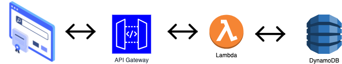
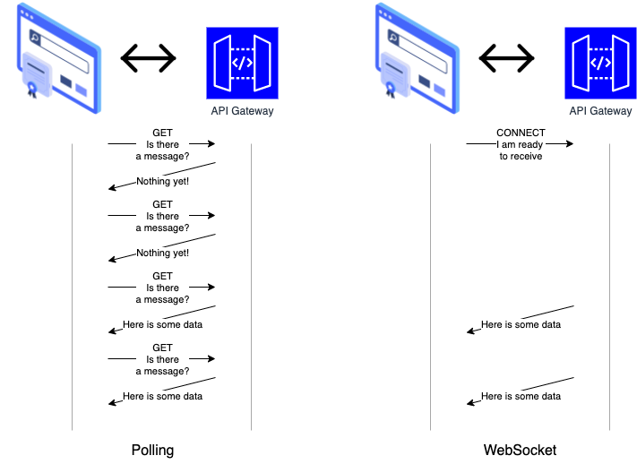

# Lab Session 8: Serverless applications

**Serverless applications** are applications that run without the need for server management by the developer. In a serverless model, cloud providers handle the infrastructure, scaling, and management of servers. Developers only focus on writing and deploying code, which is executed in response to events, such as HTTP requests, database changes, or file uploads.

#### Key features of serverless applications:
- **No Server Management**: Developers don’t need to provision or maintain servers.
- **Event-driven**: Functions are executed in response to specific events.
- **Scalability**: The cloud provider automatically scales resources based on demand.
- **Cost-efficient**: You pay only for the execution time of the functions, not for idle server resources.

### AWS Lambda

**AWS Lambda** is a fully managed **serverless computing service** provided by AWS. It allows developers to run code in response to events without provisioning or managing servers.

#### Key Features of AWS Lambda:

- **Serverless**: eliminating the need to maintain infrastructure and reducing overhead.

- **Event-Driven**: designed to be triggered by various AWS services or external events, such as:
     - **S3** events (e.g., file uploads)
     - **API Gateway** requests (for building APIs)
     - **DynamoDB** streams (e.g., when data is added/modified)
     - **CloudWatch Events** (e.g., scheduled jobs)
     - **SNS** (Simple Notification Service) messages
     - **Cognito** triggers (for user sign-up/sign-in events)
     - And many other sources (including custom event sources).

- **Scalability**: automatically scales the number of execution environments to match the incoming event load. If there are hundreds or thousands of events, Lambda can scale to handle them without any manual intervention. It scales **horizontally** by running multiple instances of your function in parallel when needed.

- **Pay-As-You-Go Pricing**: pay for the compute time used by the code than runs. The billing is based on the number of requests and the duration of the code execution (in milliseconds).

- **Stateless**: each invocation of an AWS Lambda function is stateless, meaning it doesn’t retain any state between executions. If you need to maintain state, you can use AWS services like **DynamoDB** or **S3** to store persistent data.

- **Customizable Execution Role**: using **IAM (Identity and Access Management)** for granting them permissions to interact with other AWS services securely.

- **Short-lived Execution**: functions can run for a maximum of 15 minutes per invocation. Best suited for tasks that can be completed quickly, such as real-time data processing, image resizing, API responses, etc.

- **Logging and Monitoring**: integrated with **Amazon CloudWatch**.

### AWS API Gateway

AWS API Gateway is a fully managed service provided by Amazon Web Services (AWS) that enables developers to create, publish, maintain, monitor, and secure APIs at any scale. API Gateway acts as an entry point for applications, enabling communication between client apps (mobile, web, etc.) and backend services (AWS Lambda, EC2, other HTTP services).

#### Key Features of AWS API Gateway:

- **Create and Manage APIs**: RESTful APIs, WebSocket APIs, or HTTP APIs to connect to services like AWS Lambda, HTTP endpoints, or other AWS services.
   
- **Support for Multiple Protocols**: HTTP, WebSocket, and REST APIs.
   
- **Security**: allows you to authenticate and authorize API calls through services like AWS IAM (Identity and Access Management), Amazon Cognito, and Lambda authorizers.

- **Rate Limiting and Throttling**: seting of rate limits and throttling policies to control traffic, protect backend resources, and prevent abuse.

- **Scaling**: automatically scales to handle varying amounts of traffic, ensuring that your APIs perform well under different load conditions.

- **Logging and Monitoring**: integrates with AWS CloudWatch for logging and monitoring API usage, errors, and performance metrics.
   
- **Caching** responses to reduce load on backend services, improving performance for repeated requests.

- **Deployments and Versioning**: management of different stages of an API (development, staging, production) and deploy changes in a controlled manner.

#### Use Cases of AWS API Gateway:
- **Serverless Applications**: Often used with AWS Lambda to create serverless APIs, where no infrastructure management is needed.
- **Microservices**: API Gateway can serve as the entry point to microservices, handling incoming requests and routing them to different backend services.
- **Mobile and Web Applications**: Provides a reliable way to manage API calls from mobile apps and websites.

### WebSockets

**WebSockets** are a communication protocol that enables **full-duplex** (two-way) communication channels over a single, long-lived connection between a client (usually a web browser) and a server. Unlike the traditional HTTP request-response model, which is **stateless** and works in a **request-response** pattern, WebSockets provide a persistent, open connection that allows continuous, real-time data exchange between the client and server.

#### Advantages of WebSockets:

- **Real-Time Communication**: WebSockets enable instant communication between the client and server, making them ideal for real-time applications.
- **Reduced Latency**: Since the connection is persistent, there’s no need to repeatedly open and close connections, which results in lower latency.
- **Efficiency**: WebSockets use less bandwidth and are more efficient than HTTP for frequent message exchanges, as they avoid the overhead of HTTP headers with every request.
- **Lower Overhead**: There’s less overhead compared to HTTP polling or long-polling because WebSockets maintain a single connection, and data can be sent immediately when available.

#### Limitations of WebSockets:

- **Browser and Network Compatibility**: WebSockets require support from the client (browser or app) and the server. Some firewalls or proxies might block WebSocket traffic.
- **Single Connection**: WebSockets typically use a single connection for each client, which can become limiting if you need to scale to millions of users.
- **No Built-In Message Queuing**: WebSockets don’t provide built-in message persistence, so you need to implement your own system for queuing or persisting messages.

#### How WebSockets Work:

- **Handshake**: a WebSocket connection starts with an HTTP handshake. The client sends an HTTP request to the server with an **Upgrade** header, indicating that it wants to establish a WebSocket connection.
   
   - Example WebSocket request:
     ```
     GET /chat HTTP/1.1
     Host: example.com
     Upgrade: websocket
     Connection: Upgrade
     Sec-WebSocket-Key: dGhlIHNhbXBsZSBub25jZQ==
     Sec-WebSocket-Version: 13
     ```

- **Connection Upgrade**: If the server supports WebSockets, it responds with a status code **101 Switching Protocols**, indicating that the protocol has been switched to WebSocket and the connection is now open.
   
   - Example WebSocket response:
     ```
     HTTP/1.1 101 Switching Protocols
     Upgrade: websocket
     Connection: Upgrade
     Sec-WebSocket-Accept: dGhlIHNhbXBsZSBub25jZQ==
     ```

- **Data Exchange**: After the handshake, the connection is upgraded to WebSocket, and both the client and the server can send messages back and forth in real time. WebSocket messages can be sent in text or binary format, making it flexible for various types of data.

- **Closing the Connection**: Either the client or the server can close the WebSocket connection at any time by sending a **close frame**. Once the connection is closed, no more messages can be sent or received.

#### Common Use Cases of WebSockets:

- Real-Time Messaging and Chat Applications.
- Online Gaming.
- Stock Market or Financial Applications for instant value update (e.g., stock prices, cryptocurrency rates).
- Live Sports Updates.
- Collaborative Applications with real-time updates (e.g., Google Docs)
- IoT (Internet of Things) communication between IoT devices (e.g., smart home devices, sensors) and control systems
- Push Notifications in web applications

### AWS Kinesis 

**AWS Kinesis** is a fully managed service designed to handle real-time streaming data. It allows you to collect, process, and analyze data streams at scale. It's commonly used for applications that need real-time data processing, such as data analytics, video processing, log analysis, or IoT data ingestion.

Some common use cases for Kinesis include:
- Real-time analytics on streaming data (e.g., monitoring and alerting).
- Real-time dashboards.
- Data processing pipelines.
- Machine learning applications (e.g., predictive analytics based on streaming data).

# Pre-lab homework

### **Understanding `kwargs` in Python:**

In Python, **`kwargs`** (short for **keyword arguments**) allows you to pass a variable number of named arguments to a function, which are then collected into a dictionary.

##### **Example:**
```python
def greet_user(**kwargs):
    print(kwargs)

greet_user(name="Alice", age=30)

params = {'name': 'Alice', 'age': 30}
greet_user(**params)
```
In both cases the output is
```python
{'name': 'Alice', 'age': 30}
```
### Geoapify

[Geoapify](https://www.geoapify.com/) is a geolocation and mapping service that provides APIs and tools for location-based applications. It allows developers to integrate various location-related functionalities into their applications, such as geocoding, reverse geocoding, route planning, map rendering, and place search. Geoapify offers a wide range of services and is known for its user-friendly APIs and the ability to scale based on user needs.

Geoapify provides services that are similar to Google Maps but with more customizable options, and often appeals to developers due to its more flexible and developer-friendly pricing model.

Create an account, and then create a project and get an API key. The Free plan allows 3.000 daily credits which shall be enough for this lab session.

# Tasks

## Task 8.1: Simple serverless web application

Despite the name, “serverless” doesn’t mean there are no servers, it just means you don’t manage them. The cloud provider handles all the infrastructure, scaling, patching, etc. You just write your code and deploy. We are going to begin with a simple web application that manages a database (CRUD operations) and shows the contents in the browser.

The final goal is to have a simple HTML page running some JavaScript that manages the visitor interaction and invokes the API Gateway which implements a CRUD REST API.



AWS is charging only for the execution of the Lamba function and the DynamoDB storage and interactions. That means there are no server charges when there are no visitors or server maintenance. If suddenly many visitors appear, the system immediately adapts to the new load since every REST API request is managed by a new independent execution of the Lambda function.

### CRUD REST API : Implementing the 4 Basic Operations in Software Development

**CRUD** stands for **Create, Read, Update, Delete**, which are the four fundamental operations used in databases and APIs to manage data.

| **Operation** | **Description** | **Example in SQL** | **Example in REST API** |
|--------------|---------------|-------------------|------------------|
| **Create**   | Adds new data | `INSERT INTO users (name, email) VALUES ('John', 'john@example.com');` | `POST /users` |
| **Read**     | Retrieves data | `SELECT * FROM users WHERE id = 1;` | `GET /users/1` |
| **Update**   | Modifies existing data | `UPDATE users SET name = 'Jane' WHERE id = 1;` | `PUT /users/1` |
| **Delete**   | Removes data | `DELETE FROM users WHERE id = 1;` | `DELETE /users/1` |

Such operations can be applied in different contexts.

- **REST APIs**: CRUD maps to HTTP methods (`POST`, `GET`, `PUT`, `DELETE`).
- **Databases**: CRUD operations are used to manipulate records (SQL, MongoDB, Firebase).
- **User Interfaces**: A CRUD-based UI allows users to **add, view, edit, and delete** items.

### Creating a DynamoDB table

The following commands create a DynamoDB table using **AWS CLI**. It first needs to define a shell variable with the name of the table and then creates the table with only one attribute named `thingID` of string type. The `REGION` shell variable will be used in the following steps.

```bash
_$ TABLE=ccbda-lambda-first
_$ REGION=us-east-1
_$ aws dynamodb create-table \
  --table-name ${TABLE} \
  --attribute-definitions \
        AttributeName=thingID,AttributeType=S \
  --key-schema \
        AttributeName=thingID,KeyType=HASH \
  --billing-mode PAY_PER_REQUEST \
  --region ${REGION}
{
    "TableDescription": {
        "AttributeDefinitions": [
            {
                "AttributeName": "thingID",
                "AttributeType": "S"
            }
        ],
        "TableName": "ccbda-lambda-first",
        "KeySchema": [
            {
                "AttributeName": "thingID",
                "KeyType": "HASH"
            }
        ],
        "TableStatus": "CREATING",
        "CreationDateTime": "2025-04-12T16:37:11.699000+02:00",
        "ProvisionedThroughput": {
            "NumberOfDecreasesToday": 0,
            "ReadCapacityUnits": 0,
            "WriteCapacityUnits": 0
        },
        "TableSizeBytes": 0,
        "ItemCount": 0,
        "TableArn": "arn:aws:dynamodb:us-east-1:<YOUR-ACCOUNT-ID>:table/ccbda-lambda-first",
        "TableId": "481c8722-4994-4652-a68a-c0246643e206",
        "BillingModeSummary": {
            "BillingMode": "PAY_PER_REQUEST"
        }
    }
}
```

### Deploying the CRUD Lambda function

Download the [serverless-app repository](https://github.com/CCBDA-UPC/serverless-app) as a ZIP file and add it to your project repository. 

Inside the `crud/lambda/` folder, you'll find an AWS Lambda function written in Python. This function establishes a connection to DynamoDB and waits to be invoked by the AWS API Gateway. Depending on the HTTP method (GET, POST, etc.) received, it will perform different operations on the database.

We will use `kwargs` to dynamically pass the values of parameters directly to the `boto3` operations in our Lambda function.
Check the [Boto3 DynamoDB documentation](https://boto3.amazonaws.com/v1/documentation/api/latest/reference/services/dynamodb.html)
for more information on the [`scan`](https://boto3.amazonaws.com/v1/documentation/api/latest/reference/services/dynamodb/client/scan.html), [`put_item`](https://boto3.amazonaws.com/v1/documentation/api/latest/reference/services/dynamodb/client/put_item.html), [`delete_item`](https://boto3.amazonaws.com/v1/documentation/api/latest/reference/services/dynamodb/client/delete_item.html), and [`update_item`](https://boto3.amazonaws.com/v1/documentation/api/latest/reference/services/dynamodb/client/update_item.html) functions.

```python
import boto3
import json
import logging
import os

REGION = os.environ['REGION']

logger = logging.getLogger()
logger.setLevel(os.environ['LOG_LEVEL'])

dynamodb = boto3.client('dynamodb', region_name=REGION)


def lambda_handler(event, context):
    operation = event['requestContext']['http']['method']
    logger.debug(f'operation {operation}')
    try:
        if operation == 'GET':
            return respond(dynamodb.scan(**event['queryStringParameters']))
        elif operation == 'POST':
            return respond(dynamodb.put_item(**json.loads(event['body'])))
        elif operation == 'DELETE':
            return respond(dynamodb.delete_item(**json.loads(event['body'])))
        elif operation == 'PUT':
            return respond(dynamodb.update_item(**json.loads(event['body'])))
        elif operation == 'OPTIONS':
            return respond('')
        else:
            return respond(None, f'Unsupported method "{operation}"')
    except Exception as e:
        respond(None, f'{type(e).__name__} at line {e.__traceback__.tb_lineno} of {__file__}: {e}')

def respond(res, err=None):
    response = {
        'statusCode': '200' if err is None else '400',
        'body': json.dumps(res) if err is None else err,
        'headers': {
            'Content-Type': 'application/json',
            "Access-Control-Allow-Headers": "Content-Type",
            'Access-Control-Allow-Origin': '*',
            "Access-Control-Allow-Methods": "GET, POST, DELETE, PUT, OPTIONS",
        },
    }
    logger.debug(f'response {json.dumps(response, indent=2)}')
    return response
```

The file `requirements.txt` in the `crud/lambda/` folder defines the Python environment for the above function to be executed.

We are going to use the **AWS CLI** to deploy the **Lambda function** and build the **API Gateway**. Open a terminal and set more shell variables to the corresponding value. Then we will create a string containing the environment values to be passed along to the Lambda function.

```bash
_$ ACCOUNT_ID=<YOUR-ACCOUNT-ID>
_$ ROLE=arn:aws:iam::<YOUR-ACCOUNT-ID>:role/LabRole
_$ LAMBDA=LambdaCRUD
_$ LOG_LEVEL=INFO
_$ ENVIRONMENT_VARIABLES=()
_$ for var in  REGION LOG_LEVEL; do
  ENVIRONMENT_VARIABLES+=($var=${!var})
done
_$ ENVIRONMENT=$(IFS=, ; echo "${ENVIRONMENT_VARIABLES[*]}")
_$ echo "ENVIRONMENT: ${ENVIRONMENT}"
ENVIRONMENT: REGION=us-east-1,LOG_LEVEL=INFO
```

Now, create a zip file with the Python code and its requirements. The command `aws lambda create-function` sends the zip file to AWS. In response, it obtains a JSON record with some values that we'll be needing to use for future steps, i.e. `LAMBDA_ARN` needs to be updated to the value of the response field `FunctionArn`.

```bash
_$ pushd lambda
_$ zip lambda_crud.zip lambda_crud.py requirements.txt
updating: lambda_crud.py (deflated 64%)
updating: requirements.txt (deflated 19%)
_$ aws lambda create-function \
   --function-name ${LAMBDA} \
  --zip-file fileb://lambda_crud.zip \
  --handler lambda_crud.lambda_handler \
  --runtime python3.13 \
  --role ${ROLE} \
  --environment "Variables={${ENVIRONMENT}}"
{
    "FunctionName": "LambdaCRUD",
    "FunctionArn": "arn:aws:lambda:us-east-1:<YOUR-ACCOUNT-ID>:function:LambdaCRUD",
    "Runtime": "python3.13",
    "Role": "arn:aws:iam::<YOUR-ACCOUNT-ID>:role/LabRole",
    "Handler": "lambda_crud.lambda_handler",
    "CodeSize": 1077,
    "Description": "",
    "Timeout": 3,
    "MemorySize": 128,
    "LastModified": "2025-04-12T14:58:40.007+0000",
    "CodeSha256": "XLzOJOsfZQPRh4gVKgDETC1A9v3QpXwlJAPu7NlWinU=",
    "Version": "$LATEST",
    "Environment": {
        "Variables": {
            "LOG_LEVEL": "INFO",
            "REGION": "us-east-1"
        }
    },
    "TracingConfig": {
        "Mode": "PassThrough"
    },
    "RevisionId": "62a5c252-e577-4fe0-a5f9-e44de63ec35e",
    "State": "Pending",
    "StateReason": "The function is being created.",
    "StateReasonCode": "Creating"
}
_$ LAMBDA_ARN="arn:aws:lambda:us-east-1:<YOUR-ACCOUNT-ID>:function:LambdaCRUD"
_$ popd
```

In Unix, using the command `jq` ([more info](https://jqlang.org/)) and the backquotes ``` we can execute the command and automatically extract the JSON field value to set the LAMBDA_ARN variable.

```bash
_$ LAMBDA_ARN=`aws lambda create-function \
   --function-name ${LAMBDA} \
  --zip-file fileb://lambda_crud.zip \
  --handler lambda_crud.lambda_handler \
  --runtime python3.13 \
  --role ${ROLE} \
  --environment "Variables={${ENVIRONMENT}}" \
  | jq -r '.FunctionArn'`

echo "LAMBDA_ARN: ${LAMBDA_ARN}"
LAMBDA_ARN: arn:aws:lambda:us-east-1:<YOUR-ACCOUNT-ID>:function:LambdaCRUD
```

Once the Lambda function is deployed you can go to the AWS Lambda console and see the outcome of the above commands.


#### Summary of AWS CLI for Lambda

- **Zip the Lambda code**:
   ```bash
   _$ zip function.zip lambda_function.py requirements.txt
   ```

- **Create the Lambda function**:
   ```bash
   _$ aws lambda create-function \
     --function-name ${LAMBDA} \
    --zip-file fileb://lambda_crud.zip \
    --handler lambda_crud.lambda_handler \
    --runtime python3.13 \
    --role ${ROLE} \
    --environment "Variables={${ENVIRONMENT}}"
   ```

- **Invoke the Lambda function**:
   ```bash
   _$ aws lambda invoke --function-name ${LAMBDA} output.txt
   ```

- **Update the Lambda function** (if needed):
   ```bash
   _$ aws lambda update-function-code --function-name ${LAMBDA} \
     --zip-file fileb://function.zip
   ```

- **Delete the Lambda function** (if needed):
   ```bash
   _$ aws lambda delete-function --function-name ${LAMBDA}
   ```

### API Gateway creation

To allow the Lambda function to be accessed by any API Gateway it is necessary to create a "statement" with a unique value for the parameter `statement-id`. The Unix command `uuidgen` creates a random value to be used by the command `aws lambda add-permission` which creates that premission. Please note the ``` backslashes used in the first command.

```bash
_$ STATEMENT_ID=`uuidgen`
_$ echo "STATEMENT_ID ${STATEMENT_ID}"
STATEMENT_ID: CDCFB599-79CC-4877-B480-6B97B4125D4D
_$ aws lambda add-permission \
  --function-name ${LAMBDA} \
  --principal apigateway.amazonaws.com \
  --statement-id "${STATEMENT_ID}" \
  --action lambda:InvokeFunction
{
    "Statement": "{\"Sid\":\"CDCFB599-79CC-4877-B480-6B97B4125D4D\",\"Effect\":\"Allow\",\"Principal\":{\"Service\":\"apigateway.amazonaws.com\"},\"Action\":\"lambda:InvokeFunction\",\"Resource\":\"arn:aws:lambda:us-east-1:<YOUR-ACCOUNT-ID>:function:LambdaCRUD\"}"
}
```

To create the API Gateway named "CrudHttpAPI" of HTTP type we use `aws apigatewayv2 create-api` that produces, amongst others, the "ApiId" field used to set the value of the variable `API_ID`.
You can use `jq` instead of doing it manually.

```bash
_$ aws apigatewayv2 create-api \
  --name "CrudHttpAPI" \
  --protocol-type HTTP
{
    "ApiEndpoint": "https://9h1wag0ywe.execute-api.us-east-1.amazonaws.com",
    "ApiId": "9h1wag0ywe",
    "ApiKeySelectionExpression": "$request.header.x-api-key",
    "CreatedDate": "2025-03-12T15:25:33+00:00",
    "Name": "CrudHttpAPI",
    "ProtocolType": "HTTP",
    "RouteSelectionExpression": "$request.method $request.path"
}
_$ API_ID=9h1wag0ywe
```

The following step uses `aws apigatewayv2 create-integration` to bind the created API Gateway with the Lambda function deployed before. Make sure that you save the value of the `INTEGRATION_ID` variable using the "IntegrationId" response field.

```bash
_$ aws apigatewayv2 create-integration \
    --api-id ${API_ID} \
    --integration-type AWS_PROXY \
    --integration-uri ${LAMBDA_ARN} \
    --integration-method ANY \
    --payload-format-version 2.0
{
    "ConnectionType": "INTERNET",
    "IntegrationId": "wp0uj9i",
    "IntegrationMethod": "ANY",
    "IntegrationType": "AWS_PROXY",
    "IntegrationUri": "arn:aws:lambda:us-east-1:<YOUR-ACCOUNT-ID>:function:LambdaCRUD",
    "PayloadFormatVersion": "2.0",
    "TimeoutInMillis": 30000
}
_$ INTEGRATION_ID=wp0uj9i
_$ echo "INTEGRATION_ID: ${INTEGRATION_ID}"
INTEGRATION_ID: wp0uj9i
```

Now, `aws apigatewayv2 create-route` creates different routes in the API Gateway, one for each HTTP **method** and **path**. In this example all methods use the same Lambda function, but usually different Lambda functions serve each HTTP method and path.

```bash
_$ aws apigatewayv2 create-route \
  --api-id ${API_ID} \
  --route-key "GET /" \
  --target "integrations/${INTEGRATION_ID}"
{
    "ApiKeyRequired": false,
    "AuthorizationType": "NONE",
    "RouteId": "6jrmmkf",
    "RouteKey": "GET /",
    "Target": "integrations/wp0uj9i"
}
_$ aws apigatewayv2 create-route \
  --api-id ${API_ID} \
  --route-key "POST /" \
  --target "integrations/${INTEGRATION_ID}"
{
    "ApiKeyRequired": false,
    "AuthorizationType": "NONE",
    "RouteId": "zay7v4g",
    "RouteKey": "POST /",
    "Target": "integrations/wp0uj9i"
}
_$ aws apigatewayv2 create-route \
  --api-id ${API_ID} \
  --route-key "OPTIONS /" \
  --target "integrations/${INTEGRATION_ID}"
{
    "ApiKeyRequired": false,
    "AuthorizationType": "NONE",
    "RouteId": "b2qe62a",
    "RouteKey": "OPTIONS /",
    "Target": "integrations/wp0uj9i"
}
_$ aws apigatewayv2 create-route \
  --api-id ${API_ID} \
  --route-key "PUT /" \
  --target "integrations/${INTEGRATION_ID}"
{
    "ApiKeyRequired": false,
    "AuthorizationType": "NONE",
    "RouteId": "hjwebad",
    "RouteKey": "PUT /",
    "Target": "integrations/wp0uj9i"
}
_$ aws apigatewayv2 create-route \
  --api-id ${API_ID} \
  --route-key "DELETE /" \
  --target "integrations/${INTEGRATION_ID}"
{
    "ApiKeyRequired": false,
    "AuthorizationType": "NONE",
    "RouteId": "9kyl2hi",
    "RouteKey": "DELETE /",
    "Target": "integrations/wp0uj9i"
}
```

As mentioned above, each API Gateway can have different stages: *production*, *development*, *testing*, etc. We are only going to create one stage named "production" that will need to be manually deployed. Changing `--not-auto-deploy` to `--auto-deploy` will make it redeploy as soon as there is a change in the configuration or the Lambda function.

```bash
_$ STAGE="production"
_$ aws apigatewayv2 create-stage \
  --api-id ${API_ID} \
  --stage-name ${STAGE} \
  --no-auto-deploy
{
    "AutoDeploy": false,
    "CreatedDate": "2025-03-12T15:30:24+00:00",
    "DefaultRouteSettings": {
        "DetailedMetricsEnabled": false
    },
    "LastUpdatedDate": "2025-03-12T15:30:25+00:00",
    "RouteSettings": {},
    "StageName": "prod",
    "StageVariables": {},
    "Tags": {}
}
```

Finally, `aws apigatewayv2 create-deployment` allows the API Gateway to be deployed and ready to be used. The "**CrudHttpAPI**" API Gateway URL is composed using the value of different variables set up above: `https://${API_ID}.execute-api.${REGION}.amazonaws.com/${STAGE}/`

```bash
_$ aws apigatewayv2 create-deployment \
   --api-id ${API_ID} \
   --stage-name ${STAGE}
{
    "AutoDeployed": false,
    "CreatedDate": "2025-03-12T15:40:58+00:00",
    "DeploymentId": "01jigd",
    "DeploymentStatus": "DEPLOYED"
}
_$ URL="https://${API_ID}.execute-api.${REGION}.amazonaws.com/${STAGE}/"
_$ echo "URL: ${URL}"
URL: https://9h1wag0ywe.execute-api.us-east-1.amazonaws.com/production/
```
We can test if it responds to the GET method using `curl`:

```bash
_$ curl "${URL}?TableName=${TABLE}"
{
  "Items": [],
  "Count": 0,
  "ScannedCount": 0,
  "ResponseMetadata": {
    "RequestId": "UG9KFPA1TJOKE98VNIM6DVT70NVV4KQNSO5AEMVJF66Q9ASUAAJG",
    "HTTPStatusCode": 200,
    "HTTPHeaders": {
      "server": "Server",
      "date": "Sat, 12 Apr 2025 15:18:00 GMT",
      "content-type": "application/x-amz-json-1.0",
      "content-length": "39",
      "connection": "keep-alive",
      "x-amzn-requestid": "UG9KFPA1TJOKE98VNIM6DVT70NVV4KQNSO5AEMVJF66Q9ASUAAJG",
      "x-amz-crc32": "3413411624"
    },
    "RetryAttempts": 0
  }
}
```
Go to the AWS API Gateway console and see the outcome of the above commands.


### Test the REST API

[**Postman**](https://www.postman.com) is a popular API development and testing tool that allows developers to send HTTP requests to web servers and view responses. It provides an easy-to-use interface for testing RESTful APIs, making it simple to construct and send requests, view responses, and automate tests. Postman supports features like request chaining, environment variables, collections, and collaboration, making it a powerful tool for API development and debugging.

Use this [URL](https://www.postman.com/ccbda-upc-edu/serverless/request/ck4fxrd/testing?action=share&creator=43659146&ctx=documentation&active-environment=43659146-8433b233-679d-4f13-a332-b972334ca409) to access the Postman web interface where there are some REST API calls to test the above deployed CRUD API Gateway. You can also download the Postman desktop app and import the testing collection of operations into your laptop. 

The testing collection is using two variables defined in the Postman environment named "CRUD". Make sure that the Postman environment named "CRUD" is selected before testing the HTTP operations.


The variable in the Postman environment named "CRUD".


### Use the REST API

Once the API is tested, you can see it working inside a web page. The files in the `crud` folder of the zip file that you downloaded, are a mininmal web page using the REST API built above. But before opening in your browser the file "index.html", you need to change the value of the variable `apiUrl` to the current value of the "**CrudHttpAPI**" API Gateway.

The JavaScript code uses jQuery to create a "GET" request as soon as the web page loads and a "POST" request when the visitor submits the form.

```javascript
(function ($) {
    $.ajax({
        type: 'GET',
        url: apiUrl,
        data: {'TableName': TableName},
        crossDomain: true,
        success: function (result) {
            $.each(result.Items, function (i, item) {
                $('#items').append('<li>' + item.thingID.S + '</li>');
            });
        },
        error: function (xhr, status, error) {
            $('#error').toggle().append('<div>' + error + '</div>');
        }
    });

    // Form submit
    $("#form").submit(function (event) {
        event.preventDefault();
        thingID = $('#thingID').val();
        payload = {
            'TableName': TableName,
            'Item': {
                'thingID': {
                    'S': thingID
                }
            }
        }
        $.ajax({
            type: 'POST',
            url: apiUrl,
            crossDomain: true,
            contentType: 'application/json',
            data: JSON.stringify(payload),
            cache: false,
            success: function (result) {
                $('#thingID').val('');
                $('#items').append('<li>' + thingID + '</li>');
            },
            error: function (xhr, status, error) {
                $('#error').toggle().append('<div>' + status + ',' + error + '</div>');
            }
        });
    });
})(jQuery);
```

To always update the values of the variables that the script uses we can add the command:

```bash
_$ echo -e "var apiUrl = '${URL}';\nvar TableName = '${TABLE}';" > variables.js; cat variables.js
var apiUrl = 'https://9h1wag0ywe.execute-api.us-east-1.amazonaws.com/production/';
var TableName = 'ccbda-lambda-first';
```

Open the "index.html" file using your browser and start to create items in the list.


### Observability

You may have noticed that the Lambda function includes some logging calls. Open the AWS CloudWatch console and check the outcome.


**Q8.11: Play with the application and with AWS CloudWatch logs that you have obtained. Share your insights.**

### Automatic deployment

Inside the `crud` directory you can find the file `deploy.sh` which is a bash shell script that performs all the steps 
explanied above.

```bash
#!/bin/bash

set -e # exit on first error

source $1

ENVIRONMENT_VARIABLES=()
for var in REGION LOG_LEVEL; do
  ENVIRONMENT_VARIABLES+=($var=${!var})
done
ENVIRONMENT=$(IFS=, ; echo "${ENVIRONMENT_VARIABLES[*]}")

echo "ENVIRONMENT: ${ENVIRONMENT}"

aws dynamodb create-table \
  --table-name ${TABLE} \
  --attribute-definitions \
        AttributeName=thingID,AttributeType=S \
  --key-schema \
        AttributeName=thingID,KeyType=HASH \
  --billing-mode PAY_PER_REQUEST \
  --region ${REGION}

pushd lambda
zip lambda_crud.zip lambda_crud.py requirements.txt
LAMBDA_ARN=`aws lambda create-function \
   --function-name ${LAMBDA} \
  --zip-file fileb://lambda_crud.zip \
  --handler lambda_crud.lambda_handler \
  --runtime python3.13 \
  --role ${ROLE} \
  --environment "Variables={${ENVIRONMENT}}" \
  | jq -r '.FunctionArn'`

echo "LAMBDA_ARN: ${LAMBDA_ARN}"
popd

STATEMENT_ID=`uuidgen`
echo "STATEMENT_ID: ${STATEMENT_ID}"

aws lambda add-permission \
    --function-name ${LAMBDA} \
    --principal apigateway.amazonaws.com \
    --statement-id "${STATEMENT_ID}" \
    --action lambda:InvokeFunction

API_ID=`aws apigatewayv2 create-api \
  --name "CrudHttpAPI" \
  --protocol-type HTTP \
   | jq -r '.ApiId'`

echo "API_ID ${API_ID}"

INTEGRATION_ID=`aws apigatewayv2 create-integration \
    --api-id ${API_ID} \
    --integration-type AWS_PROXY \
    --integration-uri ${LAMBDA_ARN} \
    --integration-method ANY \
    --payload-format-version 2.0 \
    | jq -r '.IntegrationId' `

echo "INTEGRATION_ID: ${INTEGRATION_ID}"


for ROUTE in GET POST OPTIONS PUT DELETE; do
    aws apigatewayv2 create-route \
        --api-id ${API_ID} \
        --route-key "${ROUTE} /" \
        --target "integrations/${INTEGRATION_ID}"
done


STAGE="production"
aws apigatewayv2 create-stage \
     --api-id ${API_ID} \
     --stage-name ${STAGE} \
     --no-auto-deploy

aws apigatewayv2 create-deployment \
    --api-id ${API_ID} \
    --stage-name ${STAGE}


URL="https://${API_ID}.execute-api.${REGION}.amazonaws.com/${STAGE}/?TableName=${TABLE}"
echo "URL: ${URL}"
curl $URL

echo -e "{\"url\":\"${URL}\",\"table\":\"${TABLE}\"}" > variables.json; cat variables.json

```

To run the script it is necessary to create a configuration file with the names of the variables and make the script executable.

```bash
_$ cat .env
TABLE=ccbda-lambda-first
REGION=us-east-1
ACCOUNT_ID=<YOUR-ACCOUNT-ID>
ROLE=arn:aws:iam::<YOUR-ACCOUNT-ID>:role/LabRole
LAMBDA=LambdaCRUD
LOG_LEVEL=INFO
_$ ./deploy.sh .env
```

**Q8.12: Assess the current version of the web application against each of the twelve factor application.**

**Q8.13: Create a new shell script that removes all the assets that have been created.**


# Task 8.2: Simple serverless using WebSockets

Think of it like checking your mailbox every 5 minutes to see if there’s a letter. Even if there’s nothing new, you keep walking out to check. That’s what polling does—your app keeps asking the server, “Anything new yet?” over and over.

Now imagine the mailman just rings your doorbell as soon as something arrives. You don’t have to check constantly—updates come to you instantly. That’s **WebSocket**. It creates a live, open connection where data can flow both ways whenever needed.



**AWS API Gateway** supports the HTTP/REST APIs and also the WebSocket API. In a WebSocket API on AWS, `$connect`, `$disconnect`, and `$default` are special **routes** that handle key moments in the WebSocket connection lifecycle.

When a client **first connects**, the `$connect` route gets triggered. This is where you might authenticate the user and store their connection ID so you can send them messages later.

When the client **leaves or disconnects**, whether they close their browser or lose connection, the `$disconnect` route runs. That’s your chance to clean up—like removing their connection ID from your database.

While the connection is open, the client can **send messages**. If the message matches a custom route (like `sendMessage`), that one gets triggered. But if it doesn’t match anything, AWS uses the `$default` route. It’s like a fallback, catching anything unexpected or unrecognized.

So in short:  
- `$connect` is the welcome handler,  
- `$disconnect` is the cleanup crew,  
- `$default` is the "I don't know what this is, but here you go" handler.

### WebSocket implementation

In the zip that you downloaded for the previous section go to the folder `websockets/lambda/websocket` to find three files named `lambda_connect.py`, `lambda_disconnect.py`, and `lambda_default.py`.

The connection handler receives from the API Gateway a `connectionId` that is stored in a DynamoDB table. It also needs the URL to which it belongs.

```python
from datetime import datetime, timezone
import json
import logging
import boto3
import os
import library_functions as library

DYNAMO_TABLE = os.environ['DYNAMO_TABLE']
REGION = os.environ['REGION']

logger = logging.getLogger()
logger.setLevel(os.environ['LOG_LEVEL'])

def lambda_handler(event, context):
    logger.debug(f'event {json.dumps(event, indent=2)}')
    connection_id = event['requestContext']['connectionId']
    url = library.get_url(event, REGION)
    logger.info(f'New connection: {url} {connection_id}')
    try:
        dynamodb = boto3.client('dynamodb', region_name=REGION)
        dynamodb.put_item(TableName=DYNAMO_TABLE,
                          Item={
                              'connectionid': {'S': connection_id},
                              'url': {'S': url},
                              'when': {'S': datetime.now(timezone.utc).isoformat()}
                          })
    except Exception as e:
        logger.error(f'PutItem {str(e)}')
        return library.handle_response(json.dumps('Error connecting!'), 400)
    return library.handle_response(json.dumps('Connection sucessful!'))
```

By using both values, any Lambda function will be able to send information directly to the browser as shown below:

```python
apigw = boto3.client('apigatewaymanagementapi', endpoint_url=url)
try:
    apigw.post_to_connection(
        ConnectionId=connectionid,
        Data=message
    )
```

The `lambda_disconnect.py` function simply removes the corresponding record from the DynamoDB table. The `lambda_default.py` waits for a "hello!" message from the browser and responds sending some configuration parameters, in this case to the sender of the message.

```python
import json
import logging
import boto3
import os
import library_functions as library

API_KEY = os.environ['API_KEY']
REGION = os.environ['REGION']
CENTER = os.environ['CENTER'].split(':')
TOP_LEFT = os.environ['TOP_LEFT'].split(':')
BOTTOM_RIGHT = os.environ['BOTTOM_RIGHT'].split(':')

logger = logging.getLogger()
logger.setLevel(os.environ['LOG_LEVEL'])


def lambda_handler(event, context):
    connection_id = event['requestContext']['connectionId']
    logger.info(f'event {json.dumps(event, indent=2)}')

    if event['body'] == 'hello!':
        config = {
            'type': 'init',
            'apiKey': API_KEY,
            'center': CENTER,
            'bounds': [TOP_LEFT, BOTTOM_RIGHT],
        }
        message = json.dumps(config)
        logger.debug(f'send_message_to_client "{connection_id}" message {message}')
        apigw = boto3.client('apigatewaymanagementapi', endpoint_url=library.get_url(event,REGION))
        try:
            apigw.post_to_connection(
                ConnectionId=connection_id,
                Data=message
            )
        except apigw.exceptions.GoneException:
            logger.info(f'Connection "{connection_id}" is no longer valid.')
        except Exception as e:
            logger.error(f'Error sending "{message}" to connection "{connection_id}" {str(e)}')
        return library.handle_response(json.dumps('Init message sent.'))
    else:
        return library.handle_response(json.dumps('I cannot respond'), 400)
```

The file `library_functions.py` includes the two functions that all three Lamba funtions use. `get_url()` uses the event data and the region to compose the URL. While `handle_response()` provides a JSON response that the API Gateway will use to provide the corresponding HTTP formatted response for the browser.

```python
def get_url(event, region):
    return f'https://{event['requestContext']['apiId']}.execute-api.{region}.amazonaws.com/{event['requestContext']['stage']}/'

def handle_response(res, status=200):
    return {
        'statusCode': status,
        'body': res,
        'headers': {
            'Content-Type': 'application/json',
            "Access-Control-Allow-Headers": "Content-Type",
            'Access-Control-Allow-Origin': '*',
            "Access-Control-Allow-Methods": "GET, POST, DELETE, PUT, OPTIONS",
        },
    }
```

Once the browser has opened the connection it is ready to receive messages whenever they are available. For that matter, there is another Lambda function in the folder `kinesis` inside the file `lambda_kinesis.py`. That Lambda function is triggered whenever new data appears in AWS Kinesis.

The function iterates over the AWS Kinesis records received, it creates a message to be sent, and it looks for all the websockets open connections, to send the new message to every browser.


```python
import boto3
import json
import logging
import os
import base64

REGION = os.environ['REGION']
DYNAMO_TABLE = os.environ['DYNAMO_TABLE']

logger = logging.getLogger()
logger.setLevel(os.environ['LOG_LEVEL'])

def lambda_handler(event, context):
    for record in event['Records']:
        try:
            record_data = base64.b64decode(record['kinesis']['data']).decode('utf-8')
            logger.debug(f'event {json.dumps(event, indent=2)}')
            message = json.dumps({
                'type': 'show',
                'aircrafts': json.loads(record_data)
            })
            dynamodb = boto3.client('dynamodb', region_name=REGION)
            response = dynamodb.scan(TableName=DYNAMO_TABLE)
            for item in response['Items']:
                connectionid = item['connectionid']['S']
                url = item['url']['S']
                logger.debug(f'send_message_to_client "{connectionid}" message {message}')
                apigw = boto3.client('apigatewaymanagementapi', endpoint_url=url)
                try:
                    apigw.post_to_connection(
                        ConnectionId=connectionid,
                        Data=message
                    )
                except apigw.exceptions.GoneException:
                    logger.error(f'Connection "{connectionid}" is no longer valid.')
                except Exception as e:
                    logger.error(f'Error sending "{message}" to connection "{connectionid}" {str(e)}')
        except Exception as e:
            logger.error(f'Error reading records {str(e)}')
```

All the above functions try to create a simplified version of [FlightRadar24](https://www.flightradar24.com/). It can be used as model to create interactive dashboards where many visitors can keep track on the processing of several sources of Big Data.


### Deployment automation

Inside the folder `websockets` there is a file named `deploy.sh` that is similar to the one on the previous section.

```bash
#!/bin/bash

set -e # exit on first error
source $1

ENVIRONMENT_VARIABLES=()
for var in API_KEY REGION CENTER TOP_LEFT BOTTOM_RIGHT DYNAMO_TABLE LOG_LEVEL; do
  ENVIRONMENT_VARIABLES+=($var=${!var})
done
ENVIRONMENT=$(IFS=, ; echo "${ENVIRONMENT_VARIABLES[*]}")
echo "ENVIRONMENT: ${ENVIRONMENT}"

aws kinesis create-stream \
    --stream-name ${STREAM_NAME} \
    --shard-count 1

STREAM_ARN=`aws kinesis describe-stream \
    --stream-name ${STREAM_NAME} \
    | jq -r '.StreamDescription.StreamARN'`
echo "STREAM_ARN: ${STREAM_ARN}"

aws dynamodb create-table \
  --table-name ${DYNAMO_TABLE} \
  --attribute-definitions \
        AttributeName=connectionid,AttributeType=S \
  --key-schema \
        AttributeName=connectionid,KeyType=HASH \
  --billing-mode PAY_PER_REQUEST \
  --region ${REGION}

pushd lambda/kinesis
zip lambda_kinesis.zip lambda_kinesis.py library_functions.py requirements.txt
LAMBDA_ARN=`aws lambda create-function \
   --function-name ${LAMBDA_KINESIS} \
  --zip-file fileb://lambda_kinesis.zip \
  --handler lambda_kinesis.lambda_handler \
  --runtime python3.13 \
  --role ${ROLE} \
  --environment "Variables={${ENVIRONMENT}}" \
  | jq -r '.FunctionArn'`
echo "LAMBDA_ARN: ${LAMBDA_ARN}"

aws lambda create-event-source-mapping \
    --function-name ${LAMBDA_KINESIS} \
    --event-source  ${STREAM_ARN} \
    --batch-size 100 \
    --starting-position LATEST
popd


API_ID=`aws apigatewayv2 create-api \
  --name "WebSocketAPI" \
  --protocol-type WEBSOCKET \
  --route-selection-expression "\$request.body.action" \
   | jq -r '.ApiId'`
echo "API_ID ${API_ID}"

pushd lambda/websocket
for ROUTE in connect disconnect default; do
    echo "ROUTE: ${ROUTE}"

    zip lambda_websocket_${ROUTE}.zip lambda_${ROUTE}.py library_functions.py requirements.txt
    LAMBDA_ARN=`aws lambda create-function \
    --function-name ${LAMBDA_WEBSOCKET}_${ROUTE} \
    --zip-file fileb://lambda_websocket_${ROUTE}.zip \
    --handler lambda_${ROUTE}.lambda_handler \
    --runtime python3.13 \
    --role ${ROLE} \
    --environment "Variables={${ENVIRONMENT}}" \
    | jq -r '.FunctionArn'`
    echo "LAMBDA_ARN: ${LAMBDA_ARN}"

    STATEMENT_ID=`uuidgen`
    echo "STATEMENT_ID ${STATEMENT_ID}"
    aws lambda add-permission \
      --function-name ${LAMBDA_WEBSOCKET}_${ROUTE} \
      --principal apigateway.amazonaws.com \
      --statement-id "${STATEMENT_ID}" \
      --action lambda:InvokeFunction \
      --source-arn "arn:aws:execute-api:${REGION}:${ACCOUNT_ID}:${API_ID}/*/\$${ROUTE}"

    INTEGRATION_ID=`aws apigatewayv2 create-integration \
    --api-id ${API_ID} \
    --integration-type AWS_PROXY \
    --integration-uri arn:aws:apigateway:${REGION}:lambda:path/2015-03-31/functions/${LAMBDA_ARN}/invocations \
    --integration-method POST \
    | jq -r '.IntegrationId' `
    echo "INTEGRATION_ID: ${INTEGRATION_ID}"

    aws apigatewayv2 create-route \
      --api-id ${API_ID} \
      --route-key \$${ROUTE} \
      --target "integrations/${INTEGRATION_ID}"
done
popd

STAGE="production"
aws apigatewayv2 create-stage \
     --api-id ${API_ID} \
     --stage-name ${STAGE} \
     --no-auto-deploy

aws apigatewayv2 create-deployment \
    --api-id ${API_ID} \
    --stage-name ${STAGE}

URL="wss://${API_ID}.execute-api.${REGION}.amazonaws.com/${STAGE}/"

echo "URL: ${URL}"

echo -e "{\"url\":\"${URL}\"}" > variables.json; cat variables.json
```

See that the API Gateway now uses `--protocol-type` set to `WEBSOCKET` for WebSocket APIs. The parameter `--route-selection-expression` defines the routing logic based on the WebSocket messages.

To execute the script is necessary to have a `.env` file. The API Key is from [Geoapify](https://www.geoapify.com/).

```bash
_$ cat .env
ACCOUNT_ID=<YOUR-ACCOUNT-ID>
ROLE=arn:aws:iam::<YOUR-ACCOUNT-ID>:role/LabRole
REGION=us-east-1
AWS_ACCESS_KEY_ID=<YOUR-AWS-KEY>
AWS_SECRET_ACCESS_KEY=<YOUR-AWS-SECRET>
AWS_SESSION_TOKEN=<YOUR-AWS-TOKEN>
LAMBDA_WEBSOCKET=WebSocket
LAMBDA_KINESIS=Kinesis
DYNAMO_TABLE=flightRadar
API_KEY=<YOUR-GEOAPIFY-KEY>
STREAM_NAME=flightRadar
LOG_LEVEL=INFO
AIRPORT=BCN
CENTER=41.29707:2.078463
TOP_LEFT=41.56630517082504:1.7208344642261142
BOTTOM_RIGHT=41.02671881757673:2.4390623709499297
_$ ./deploy.sh .env
```

See that the URL of the API Gateway is stored in the `variables.json` that is used by the client-side JavaScript code.

#### Client-Side (Web Browser) using JavaScript :

The JavaScript below creates a wrapper function with triggers on different websocket events: `onopen`, `onclose`, `onerror` and `onmessage`. When the websocket is stablished with the API Gateway, the browser requests the initial configuration by sending a "hello!" message.

The browser is ready to receive messages that can be of type `init`, `reset` or `show`. The `init` message initializes the map and receives the Geoapify API Key that won't be wise to store in the browser code. It also receives the center ponint where aircraft are flying around and the bounding box of the area being monitored. The `reset` message, changes the map viewpoint. The `show` message sends the coordinates and some aircraft data for the airplanes being monitored.

```javascript
function WrapperWS(url) {
    var flyingIcon = L.icon({
        iconUrl: 'img/green.svg',
        iconSize: [30, 30],
        iconAnchor: [15, 30],
        popupAnchor: [0, -30],
    });
    var landedIcon = L.icon({
        iconUrl: 'img/orange.svg',
        iconSize: [30, 30],
        iconAnchor: [15, 30],
        popupAnchor: [0, -30],
    });

    if ("WebSocket" in window) {
        var ws = new WebSocket(url);

        ws.onopen = function (evt) {
            ws.send("hello!")
            console.log("Waiting for the configuration...", evt);
        };

        ws.onclose = function (evt) {
            console.log("Closing connection. Bye!", evt);
        };

        ws.onerror = function (evt) {
            console.log("Error: " + evt.data);
        };

        ws.onmessage = function (evt) {
            var event = JSON.parse(evt.data);
            console.log('message received', event);
            if (!event.hasOwnProperty("type")) {
                console.log('Error: Incorrect event structure');
                return;
            }
            switch (event.type) {
                case 'init':
                    apiKey = event.apiKey;
                    map = L.map('map').setView(event.center).fitBounds(event.bounds);
                    L.rectangle(event.bounds, {color: "#ff7800", opacity: 0.3, weight: 1}).addTo(map);
                    L.tileLayer(`https://maps.geoapify.com/v1/tile/osm-carto/{z}/{x}/{y}.png?apiKey=${apiKey}`, {
                        attribution: '&copy; 2025 <a href="https://www.geoapify.com/">Geoapify</a>',
                        maxZoom: 15
                    }).addTo(map);
                    break;
                case 'reset':
                    map.setView(event.center).fitBounds(event.bounds);
                    L.rectangle(event.bounds, {color: "#ff7800", opacity: 0.3, weight: 1}).addTo(map);
                    break;
                case 'show':
                    if (map === undefined) return; // Ignore message. Can't show anything before the map is initialized
                    map.eachLayer((layer) => {
                        if (layer.options.aircraftid === undefined) return;
                        if (layer.options.aircraftid in event.aircrafts) {
                            being_tracked.push(layer.options.aircraftid);
                            const aircraft = event.aircrafts[layer.options.aircraftid]
                            if (layer.position != aircraft.position) {
                                layer.setLatLng(aircraft.position)
                                layer.setIcon(aircraft.flying ? flyingIcon : landedIcon)
                                layer.setPopupContent(popupText(aircraft))
                            }
                        }
                    });
                    for (const [id, aircraft] of Object.entries(event.aircrafts)) {
                        if (!being_tracked.includes(id)) {
                            L.marker(aircraft.position, {
                                alt: id,
                                aircraftid: id,
                                icon: aircraft.flying ? flyingIcon : landedIcon
                            }).addTo(map).bindPopup(popupText(aircraft));
                            console.log(id, 'new', aircraft.flying);
                        }
                    }
                    break;
                default:
                    console.log('Error: Incorrect event type');
            }
        };
    }
}
```

The file `index.html` in the directory `websocket` includes the JavaScript code above, creates the global variables and reads the `variables.json` configuration file to then launch the wrapper.

```xhtml
<script src="script.js"></script>
<script>
    var apiKey, map;
    var being_tracked = [];
    configure();
</script>
```

#### How to Test:

Open your browser with the `index.html` file, open the console and observe the messages appearing.

Now, you need to provide some data by running the Python application `sendFlights.py` inside the `websocket` folder.


Q823: Assess the current version of the web application against each of the twelve factor application.

Q824: How long have you been working on this session? What have been the main difficulties that you have faced and how have you solved them? Add your answers to README.md.

## How to submit this assignment:

Make sure that you have updated your local GitHub repository (using the git commands add, commit, and push) with all the files generated during this session.

Before the deadline, all team members shall push their responses to their private https://github.com/CCBDA-UPC/2024-8-xx repository.

Add all the web application files to your repository and comment what you think is relevant in your session's *README.md*.